# Lab 01: Create and Deploy an Azure Document Intelligence Custom Model

### Estimated Duration: 120 Minutes

## 📘 Scenario

Contoso wants to stop reading invoices by hand. In this lab you build the processing half of the solution: a Document Intelligence model reads each invoice, a BPA pipeline runs the model on every uploaded file, and Azure AI Search indexes the results. In Lab 2, an AI agent will answer questions using this index, so everything you build here is used again.

## 📖 Overview

A custom Document Intelligence model learns to find the values your business cares about on its own document types. You label a few sample documents, train the model, and it can then extract those values from new documents. You need only five examples of the same form to start; this lab uses six training images and two test images.

## 🎯 Objectives

In this lab, you will complete the following tasks:

- Task 1: Creating an Azure Document Intelligence Resource
- Task 2: Train and Label data
- Task 3: Build a new pipeline with the custom model module in BPA
- Task 4: Configure Managed Identity Access for Azure AI Search in the storage account
- Task 5: Configure Azure AI Search and Query the Index

### Task 1: Creating an Azure Document Intelligence Resource
 
In this task you create a custom extraction project in Azure Document Intelligence Studio, connect it to the lab's Azure AI services resource, and create a storage account to hold the training data.
 
> **Why:** A project groups everything the custom model needs in one place: the service that trains it and the storage that holds the labeled examples.

1. Open a new tab and navigate to **Document Intelligence Studio** using the provided link.

   ```
   https://documentintelligence.ai.azure.com/studio
   ```

1. You will be navigated to **Azure Content Understanding Studio** page, select **Sign In** option from the top right corner.

   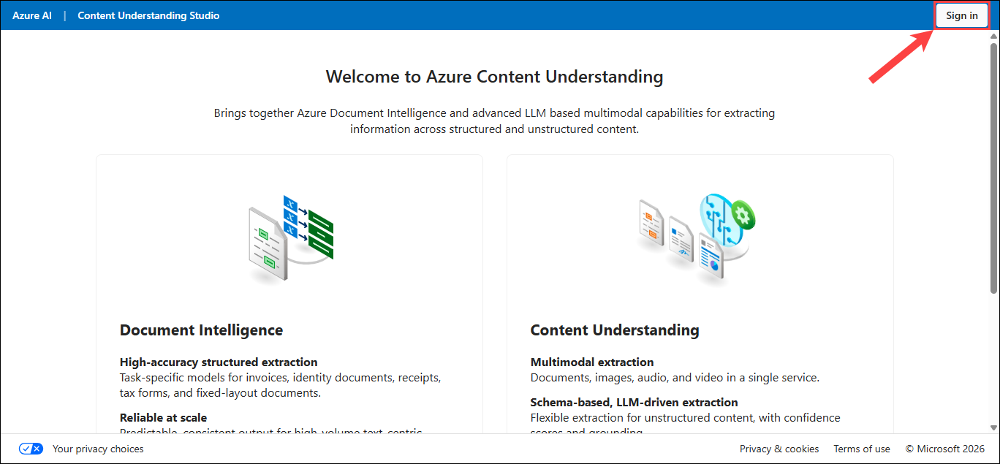

1. Select your already signed in **ODL_User <inject key="Deployment ID" enableCopy="false"/>** account.

   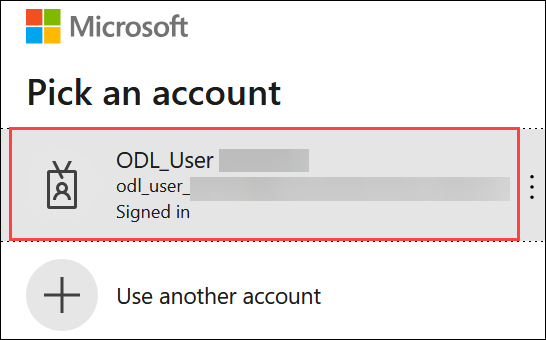

   > **Note**: If you have already signed in to the Azure Portal in the previous tasks, you can skip the below steps and proceed to step 6. Otherwise, follow these steps to sign in before proceeding further.

1. If you see the **Sign in to Microsoft Azure** tab, enter the following email/username and click on **Next (2)**.
   
   * **Email/Username:** <inject key="AzureAdUserEmail"></inject> **(1)**

      

1. Now enter the following temporary password and click on **Sign in (2)**.
   
   * **Temporary Access Pass:** <inject key="AzureAdUserPassword"></inject> **(1)**

      

1. In the **Azure Content Understanding Studio** page, scroll down and from **Document Intelligence** section choose **Get started with Document Intelligence**.

   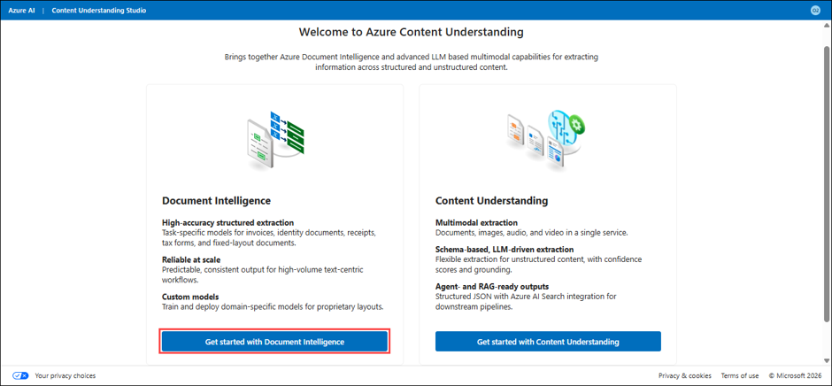 

1. In Document Intelligence Studio, scroll down to **Custom Models**, under **Custom extraction model**, choose **Get started**.

   .png)

1. If asks to Sign in, use the same **ODL_User <inject key="Deployment ID" enableCopy="false"/>** to login used to login Azure.

   

1. On the **Custom extraction model** page, click **+ Create a project** under **My Projects**.

   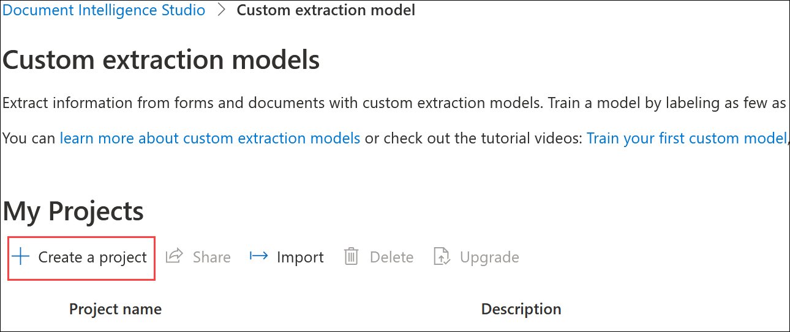

1. On the **Custom extraction models** tab, under **Enter project details**, enter the following details and click on **Continue** **(3)**.
    
   - Project name: **testproject** **(1)**.

   - Description: **Custom model project** **(2)**.

     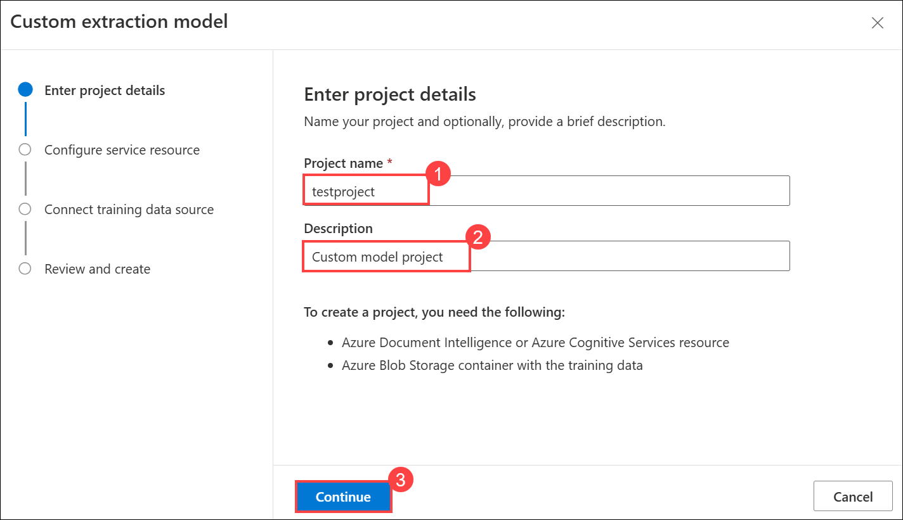

1. On the **Configure service resource** tab, enter the following details and click on **Continue (5)**.

   - Subscription: Select your **Default Subscription** **(1)**.

   - Resource group: **business-process-<inject key="Deployment ID" enableCopy="false"/>** **(2)**.

   - Document Intelligence or Cognitive Service Resource: Select the available Azure AI services multi-service account: **cogservicesbpa{suffix}** **(3)**.

   - API version: **2024-11-30 (4.0 General Availability)** **(4)**.

      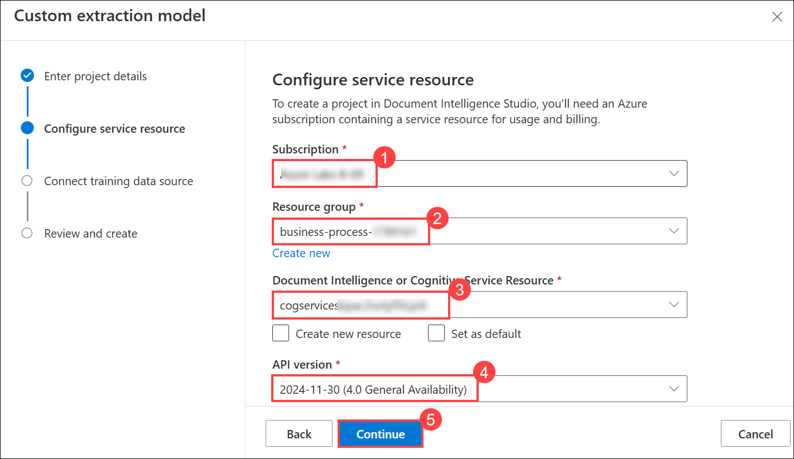

1. On the **Connect training data source** tab, enter the following details and click on **Continue** **(8)**.

    - Subscription: Select your **Default Subscription** **(1)**.
   
    - Resource group: **business-process-<inject key="Deployment ID" enableCopy="false"/>** **(2)**.
   
    - Check the box to **Create new storage account** **(3)**
   
    - Storage account name: **formrecognizer<inject key="Deployment ID" enableCopy="false"/>** **(4)**.
   
    - Location: **East US** **(5)**.
   
    - Pricing tier: **Standard_LRS Standard** **(6)**.
   
    - Blob container name: **custommoduletext** **(7)**.
   
      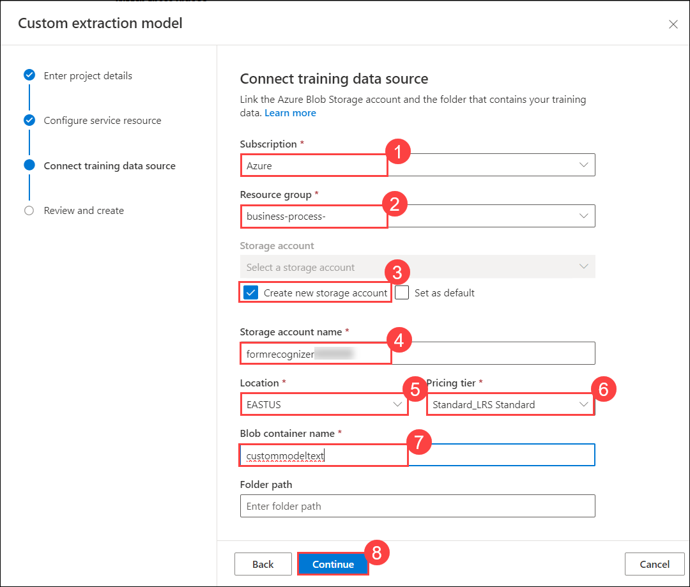

1. On the **Review and create** tab, validate the information and click **Create project**.

   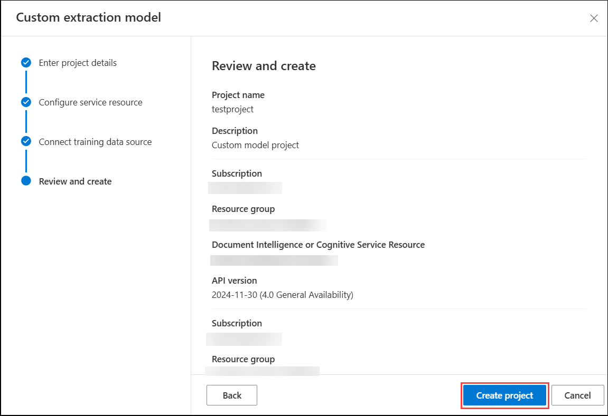

> **Congratulations** on completing the task! Now, it's time to validate it. Here are the steps:
> - Hit the Validate button for the corresponding task. If you receive a success message, you can proceed to the next task. 
> - If not, carefully read the error message and retry the step, following the instructions in the lab guide.
> - If you need any assistance, please contact us at cloudlabs-support@spektrasystems.com. We are available 24/7 to help

  <validation step="60c13090-77ec-4831-9df3-a8cf1c72a307" />

### Task 2: Train and Label data

In this task you upload six training images, label the company name on each, train the model, and test it on two images it has not seen.
 
> **Why a custom model:** Use a prebuilt model when Document Intelligence already supports your document type (invoices, receipts, IDs). Use a custom model when your documents or the values you need are specific to your business. Here you train one to learn the skill of labeling and training; the same steps apply to any internal form.

1. On the **Label data** page of your custom extraction model project, click **Browse for files** to upload your sample documents.

   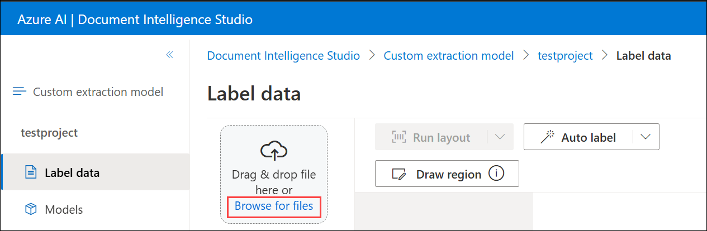

1. On the file explorer, paste the following path `C:\LabFiles\Azure-OpenAI-and-Form-Recognizer-Workshop\Custom Model Sample` **(1)** hit **enter**, select all train JPEG files **train1 to train6** **(2)**, and click **Open** **(3)**.

   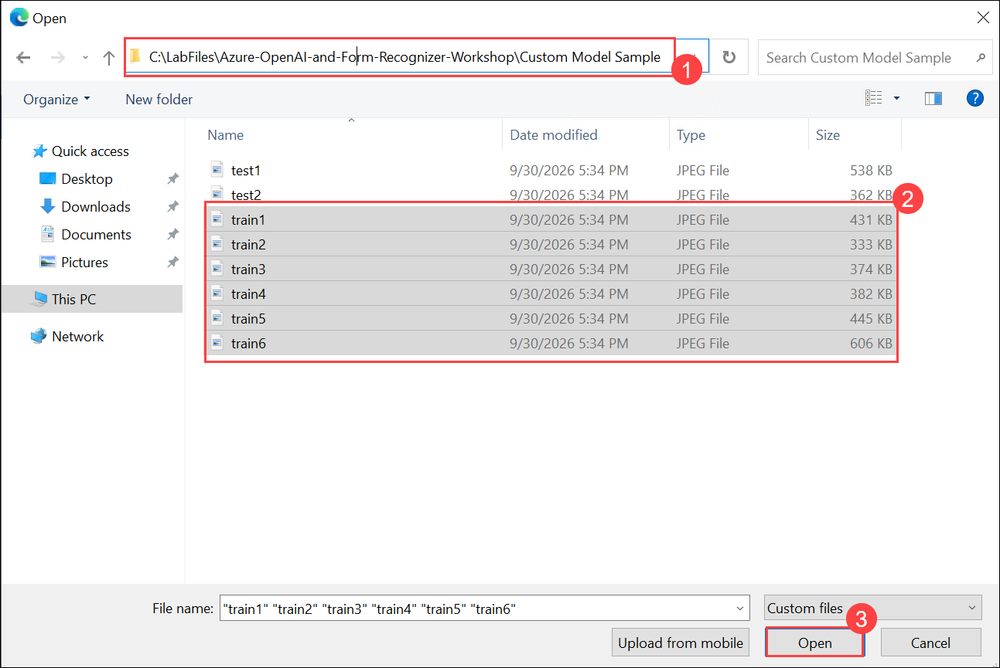

1. Once uploaded, in the **Start labeling now** pop-up, select **Run now** under the **Run layout** column.

   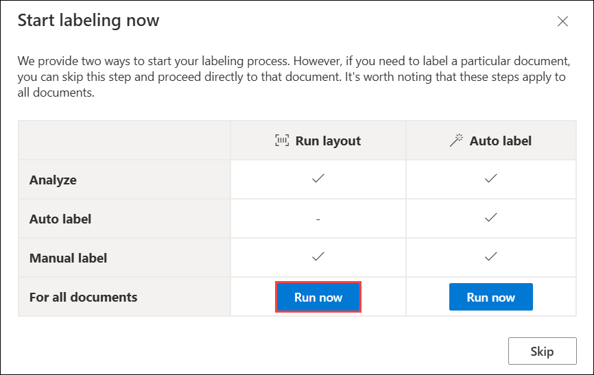

1. On the **Label data** page, click **+ Add a field** **(1)**, then select **Field** **(2)** from the dropdown. Enter the field name as `Organization_sample` **(3)** and press **Enter**.

   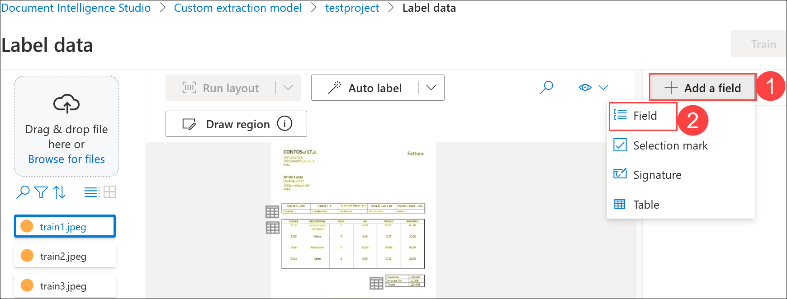

   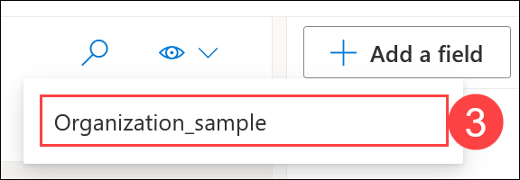

1. On the **Label data** page, select the text **CONTOSO** **(1)** from the document preview. From the label dropdown, choose **Organization_sample** **(2)**. Repeat for all **6** documents.

   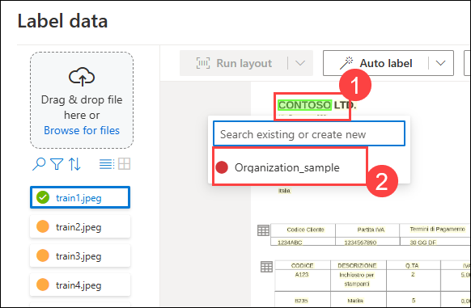

1. On the **Label data** page, after labeling all six documents **(1)**, click on **Train (2)** in the top right corner.

   

1. On the **Train a new model** page, specify the following details:

   - Model ID: **customfrs** **(1)** 
   - Model description: **custom model** **(2)** 
   - Build mode: **Template** **(3)**
   - Click on **Train** **(4)**.

      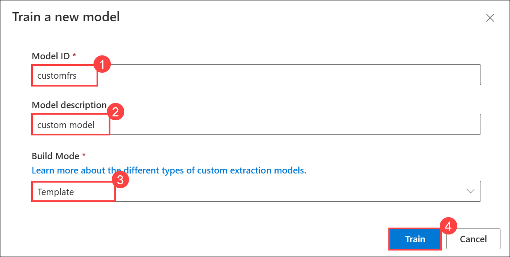

1. On the **Training in progress** dialog opens. click on **Go to Models**

   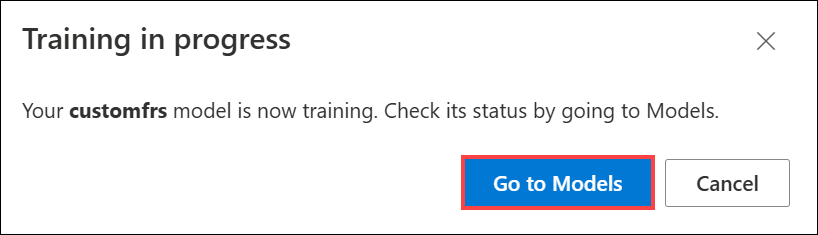

1. On the **Models** page, wait until the **Status** of your model changes to **succeeded** **(1)**. Then, select the model **customfrs** **(2)** and click on **Test** **(3)** from the top menu.

   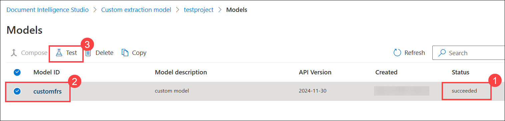

1. From the **Test** **(1)** page and click **Browse for files (2)**.

   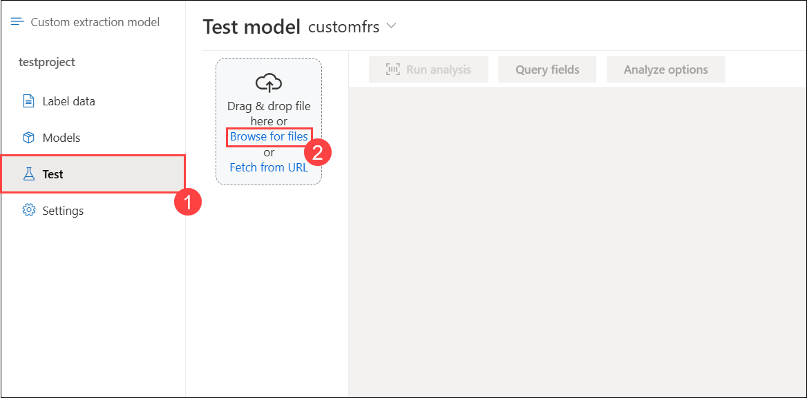

1. On the file explorer, paste the following path `C:\LabFiles\Azure-OpenAI-and-Form-Recognizer-Workshop\Custom Model Sample` **(1)** hit **enter**, select all test JPEG files **test1 and test2** **(2)**, and click **Open** **(3)**.

   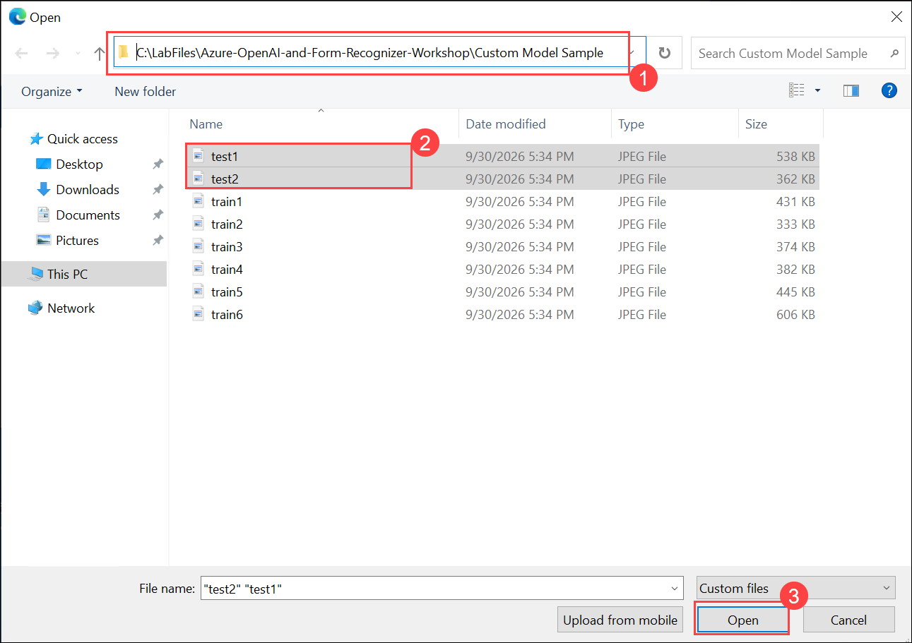

1. On the **Test model** page, Once uploaded, select **test2.jpeg (1)** model, and click on **Run analysis** **(2)**, Now you can see on the right-hand side that the model was able to detect the field **Organization_sample** **(3)** we created in the last step along with its confidence score(*may vary from screenshot)*.

   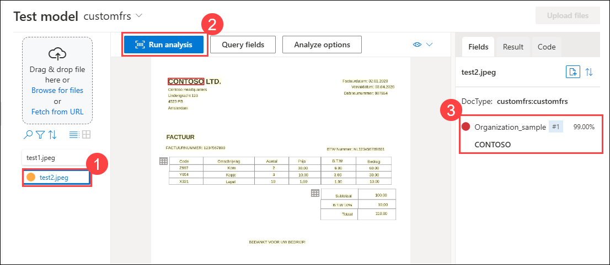

### Task 3: Build a new pipeline with the custom model module in BPA

In this task you build a pipeline in the Business Process Automation (BPA) Accelerator that runs your custom model, then upload eight new invoices for it to process.
 
> **Why a pipeline:** Testing one image in Studio is a manual check. A pipeline processes every file that arrives, with no one opening the Studio, which is how invoice processing runs in practice.

1. On the Azure Portal, navigate to the Resource groups and select the resource group **business-process-<inject key="Deployment ID" enableCopy="false"/>**.

   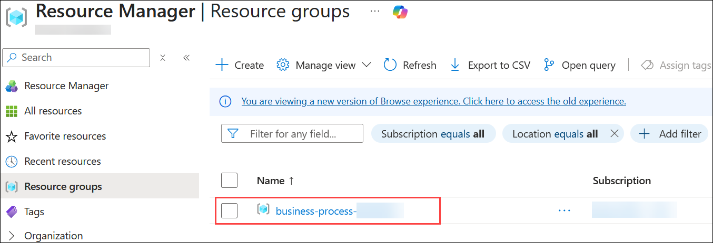

1. On the **Resource group** page, search **webappbpa (1)**, and then select  **webappbpa{suffix} (2)** from the results, ensuring the Resource type **Static Web App (3)**.

   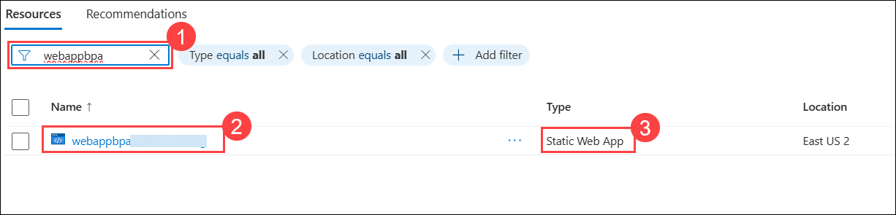

1. On the **Overview** page of **Static Web App** page, click on **View app in browser**.

      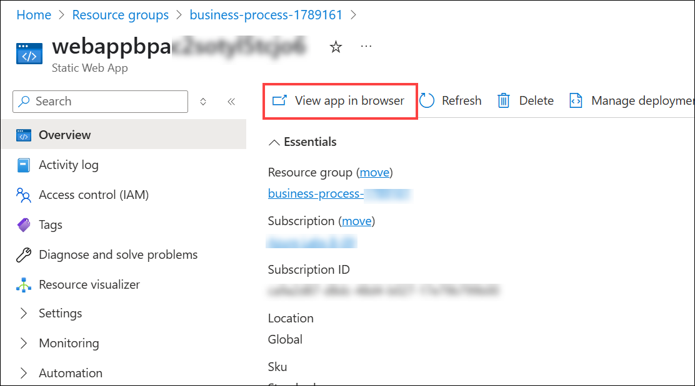

1. Once the **Business Process Automation Accelerator** page loads successfully, scroll down to the section titled **"What would you like to do?"** Under this section, click on the **Create/Update/Delete Pipelines**. 

   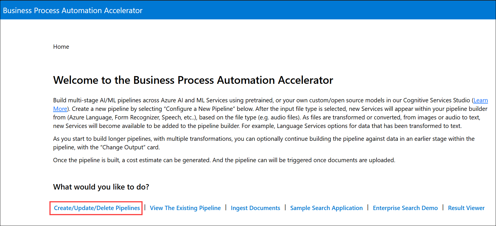

1. On the **Create Or Select A Pipeline** page, Enter New Pipeline Name as **workshop** **(1)**, and click on the **Create Custom Pipeline** **(2)**. 

   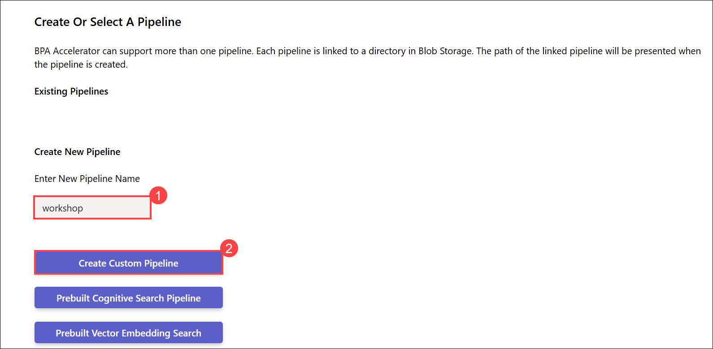

1. On the **Select a document type to get started** page, select **Image Document**

   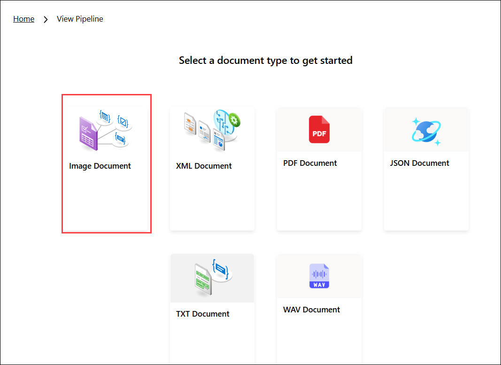

    > **Why we select Image Document:** The invoices are JPG images. The document type tells the pipeline what kind of file to expect.

1. On the **Select a stage to add it to your pipeline configuration** page, click on **Form Recognizer Custom Model (Batch)**.

   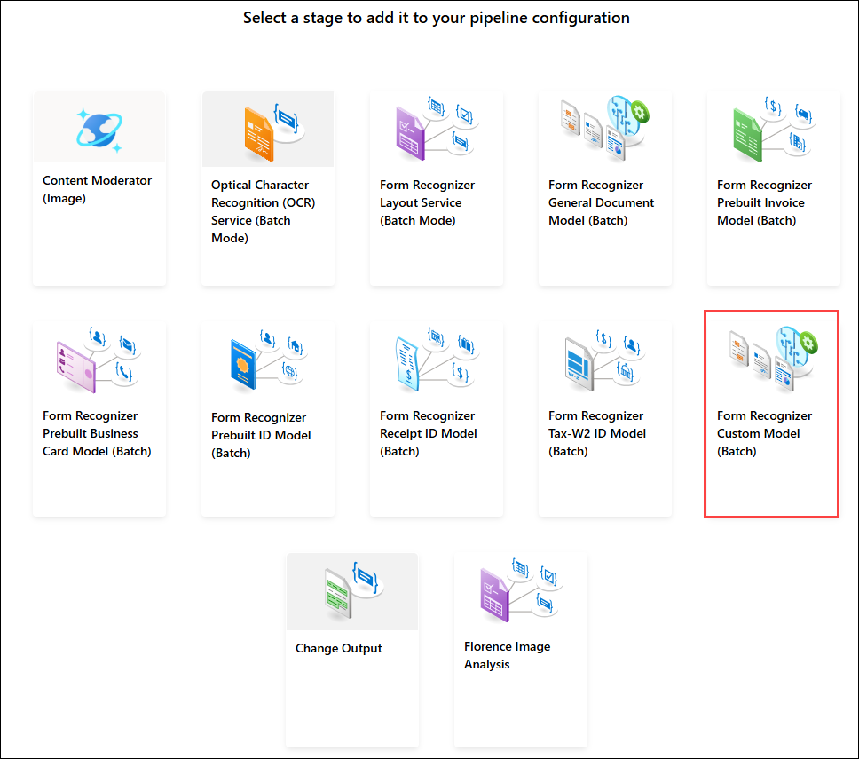

1. On the **Model ID** pop-up. Enter the Form Recognizer Custom Model ID as **customfrs** in the **Model ID** field **(1)**, and then click on **Submit** **(2)**.

   

1. On the **Select a stage to add it to your pipeline configuration** page, scroll down to review the **Pipeline Preview**, and click on **Done**.

   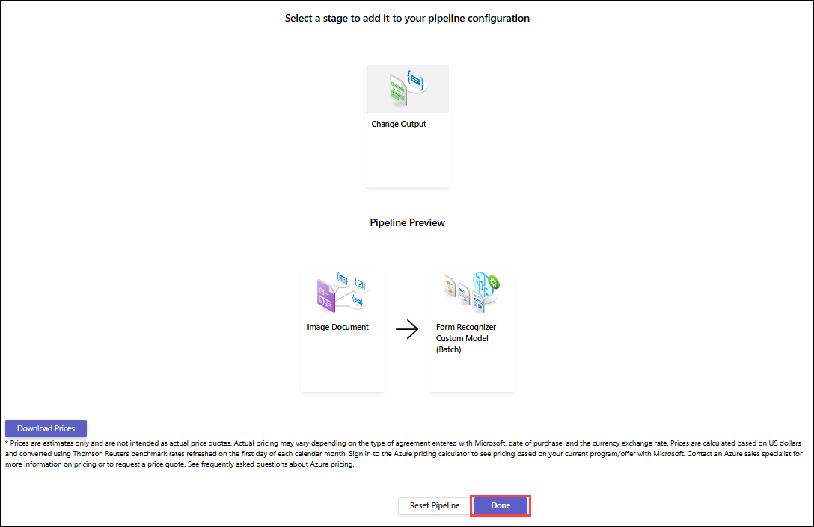

1. On the **Pipelines workshop** page, click on **Home**. 

   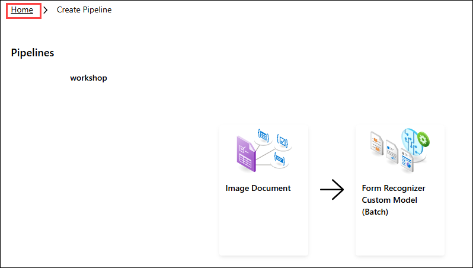

1. On the **Business Process Automation Accelerator** page, scroll down to the **What would you like to do?** section, then click on **Ingest Documents**.

   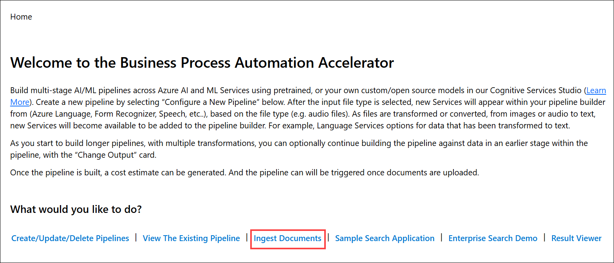

1. On the **Upload a document to Blob Storage** page, from the drop-down, **Select A Pipeline** with the name **workshop** **(1)**, and click on **Upload or drop a file right here (2)**.

   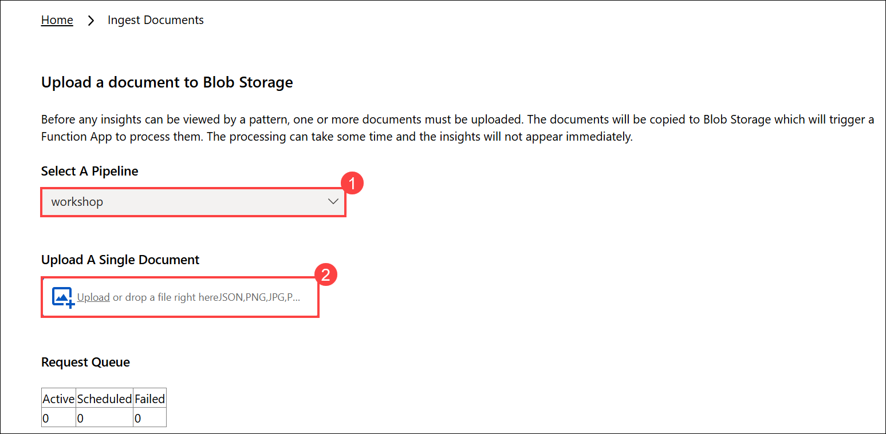

1. For documents, paste the following path `C:\LabFiles\Azure-OpenAI-and-Form-Recognizer-Workshop\Lab 1 Step 3.7` **(1)** and hit enter. Select the invoice files one by one **(2)** and click **Open** **(3)**. You can upload multiple invoices one by one.

   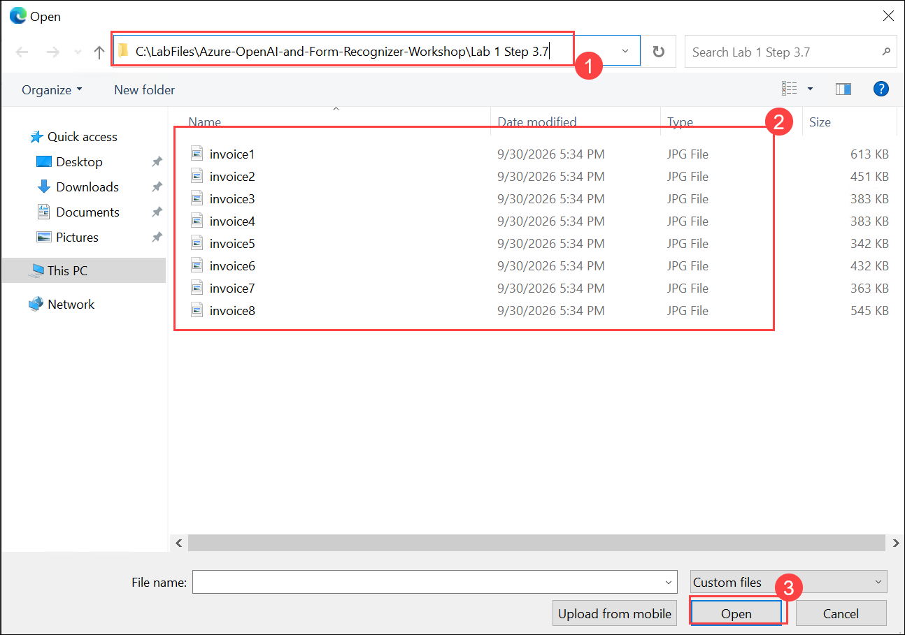

   > **Why these invoices:** They use the same layouts as the training images but contain different invoice numbers, customers and totals. The model has never seen them, which is the real test of a pipeline.

1. Check that the invoices were uploaded. In the Azure portal, open the storage account **bpa{suffix} (1)** → **Containers (2)** → **documents (3)** → **workshop (4)**, and check that it contains the files **(5)**, **invoice1.jpg** to **invoice8.jpg**.

   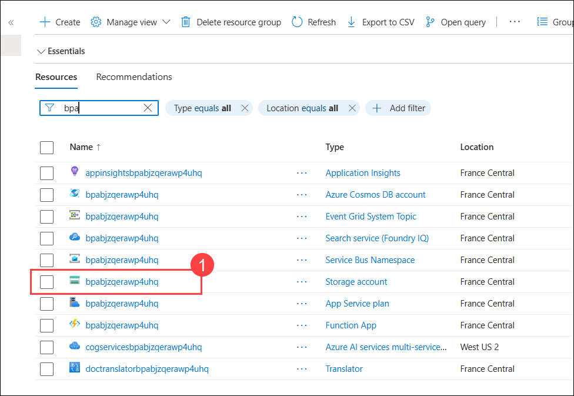

   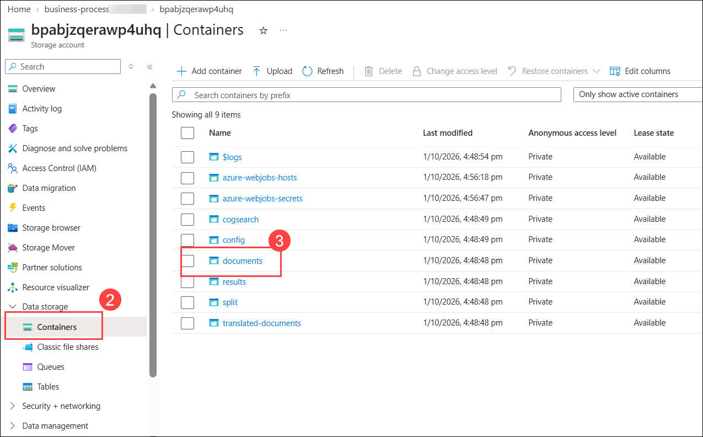

   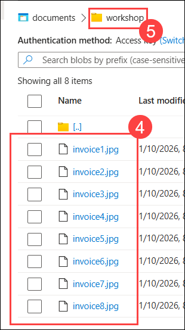

    > **Why:** The web app stores each uploaded file here before the pipeline processes it. Checking this first tells you whether a problem is in the upload or in the processing.

1. Wait two to three minutes. Open the storage account **bpa{suffix}** → **Containers** → **results** → **workshop** **(1)**, and check that it contains **eight** JSON files **(2)**.

   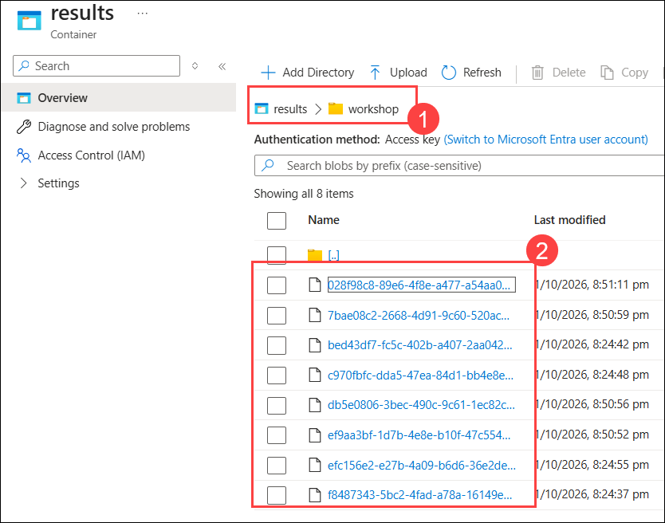

   > **Note:** Each file is named with a unique ID, not the invoice name. The original file name is stored inside the JSON, in the `filename` field.
   
   > **Why wait:** Task 5 indexes these files once. Any file that arrives after indexing is not included.

### Task 4: Configure Managed Identity Access for Azure AI Search in the storage account

In this task you allow the Azure AI Search service to read the pipeline results in storage by assigning its managed identity the **Storage Blob Data Reader** role.
 
> **Why:** A managed identity lets one Azure service access another without storing keys or passwords. Granting only the Reader role means search can read the results but cannot change them.

1. On the Azure Portal, in the top search bar, search for **Storage accounts** **(1)** and select **Storage accounts** **(2)** from the search results.

   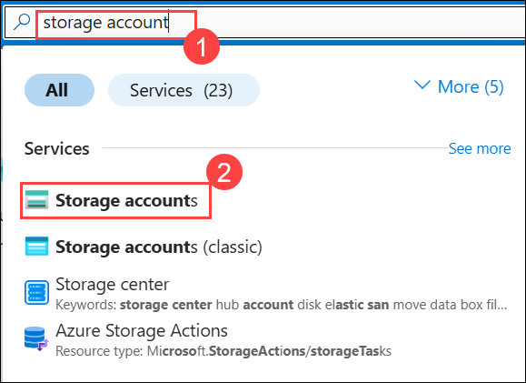

1. On the **Storage accounts** page, select the storage account named similar to **bpa{suffix}**.

   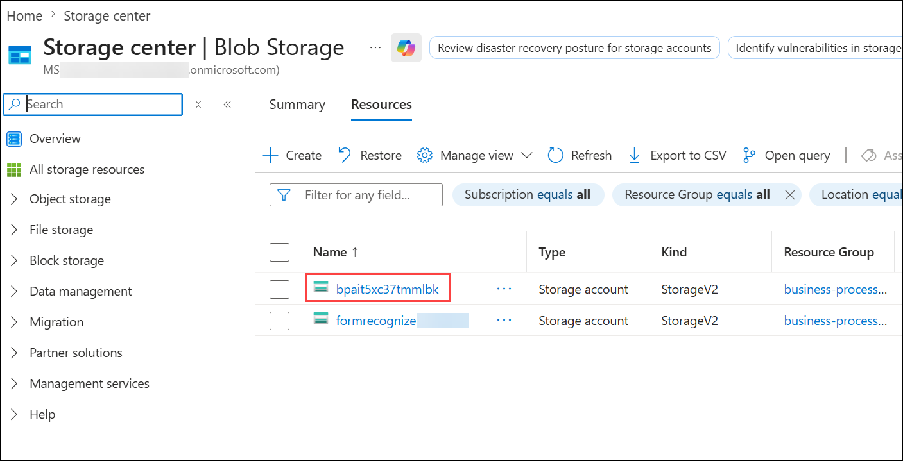

1. On the left-side navigation menu, select **Access control (IAM)** **(1)**. Then click on **+ Add** **(2)** and select **Add role assignment** **(3)**.

   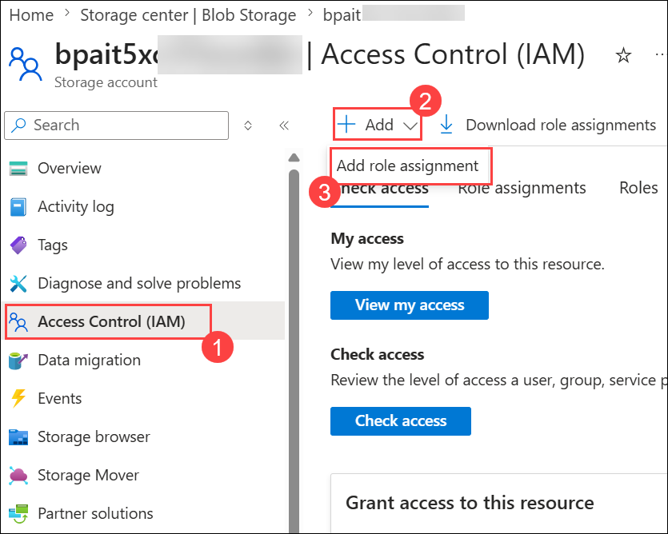

1. On the **Add role assignment** page, search for **Storage Blob Data Reader** **(1)**, select the role **Storage Blob Data Reader** **(2)**, and click on **Next** **(3)**.

   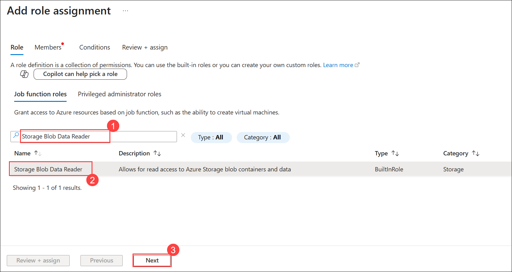

1. Under the **Members** tab, for **Assign access to**, select **Managed identity** **(1)**.Click on **+ Select members** **(2)**.On the **Select managed identities** pane, enter the following details:

   - Subscription: Select your default subscription.
   - Managed identity: Select **Search service (Foundry IQ)** **(3)**.
   - Select the Azure AI Search service named similar to **bpa{suffix}** **(4)**.
   - Click on **Select** **(5)**.
   - Click on **Review + assign** **(6)**.

      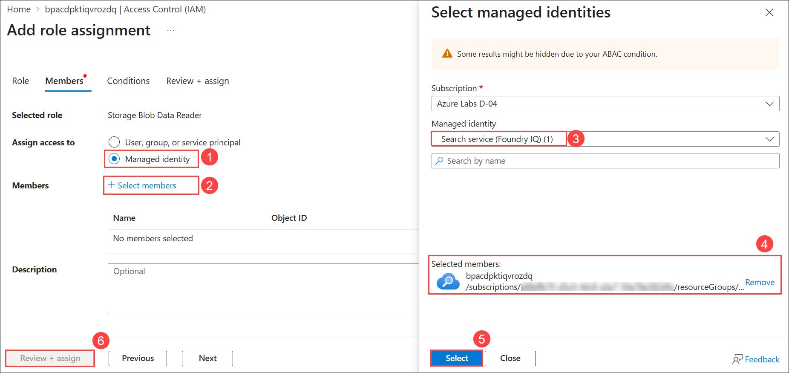

1. On the **Review + assign** page, review the configuration settings and click on **Review + assign** to complete the role assignment.

   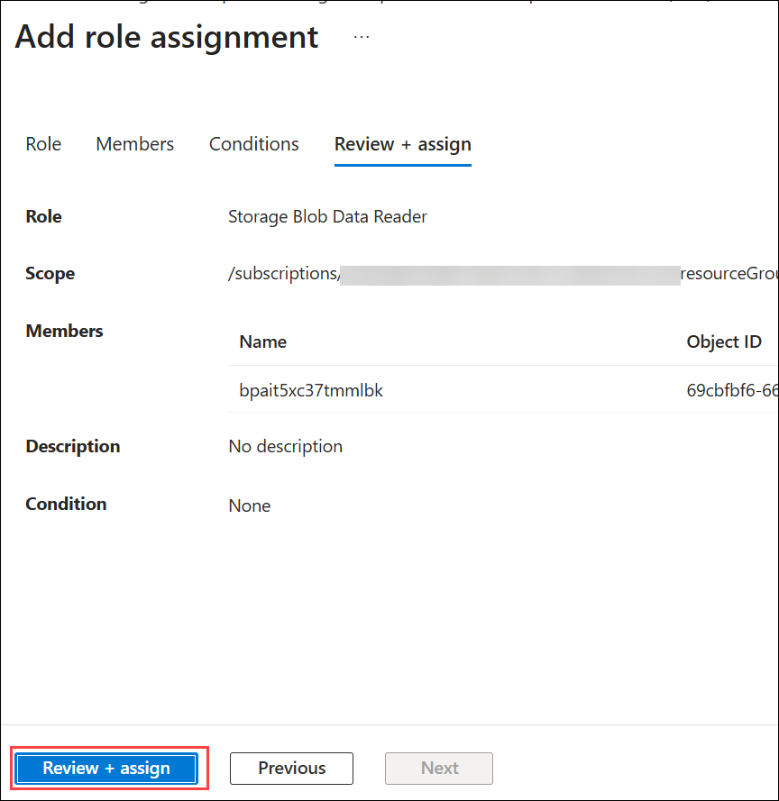

### Task 5: Configure Azure AI Search and Query the Index

In this task you index the eight JSON result files in Azure AI Search, then make the full invoice text available as a top-level field with a semantic configuration. Lab 2's agent needs both to retrieve the invoices.
 
> **Why:** The pipeline stores each invoice's text deep inside nested JSON. Search can index nested data, but the Lab 2 knowledge base can only return plain top-level text fields. Without the extra steps in this task, the agent finds the invoices but cannot read them.

### Create the index with the Import data wizard

1. Navigate back to the resource group page, select **Search service** with a name similar to **bpa{suffix}**.

   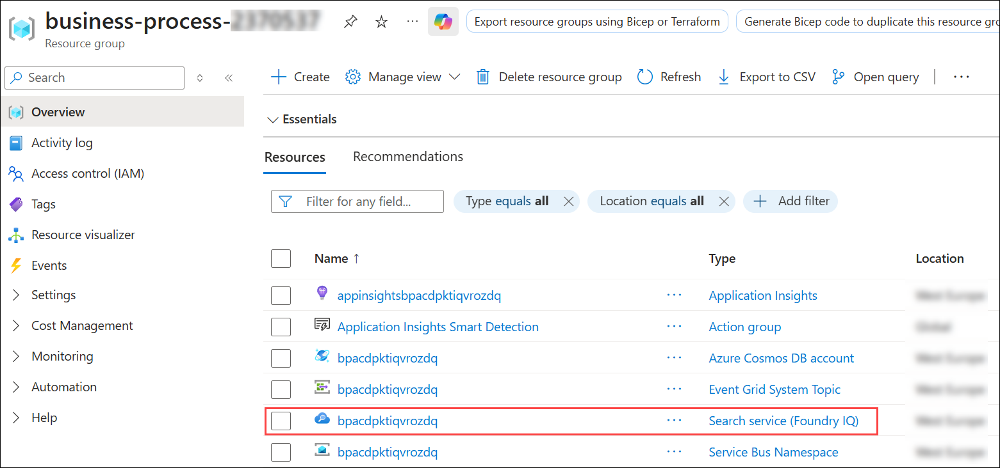

1. On the **Search service** page, click on **Import data**.

   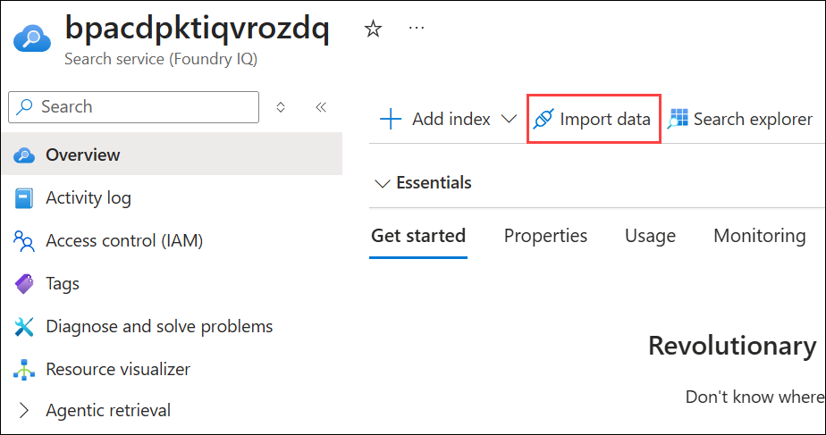

1. Select **Azure Blob Storage (1)** as the data source and click on **Keyword Search (2)**.
  
   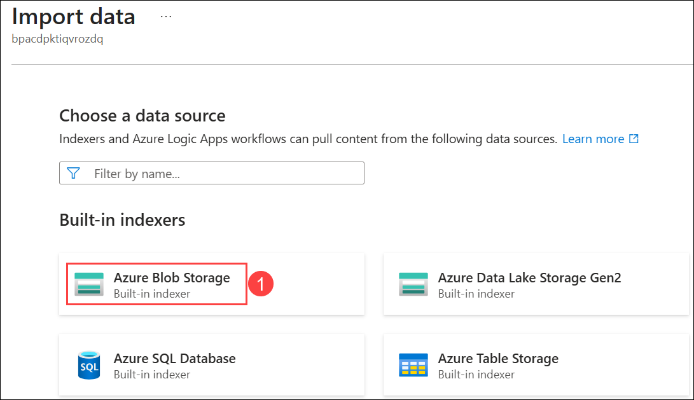

   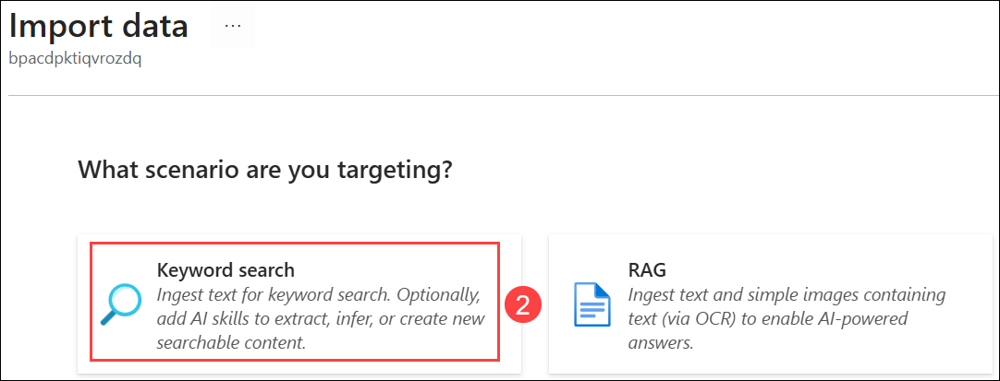

1. Enter the following details for **Connect to your data**.

   - Subscription: Select **Existing Subscription** **(1)**.
   - Storage Account: Select **bpa{suffix}** **(2)**.
   - Blob Container: Select **results** **(3)**.
   - Blob folder: Provide namme as **workshop** **(4)**.
   - Parsing mode: **JSON (5)**.
   - Click **Next (6)**.

       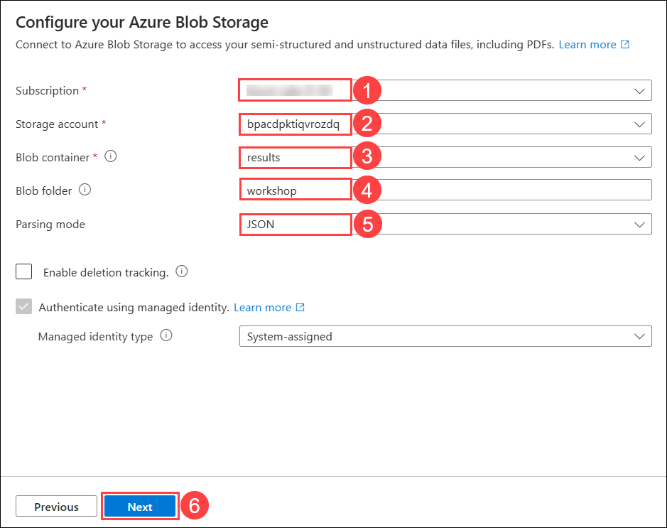

1. Click **Next** on **Apply AI enrichment** screen.

   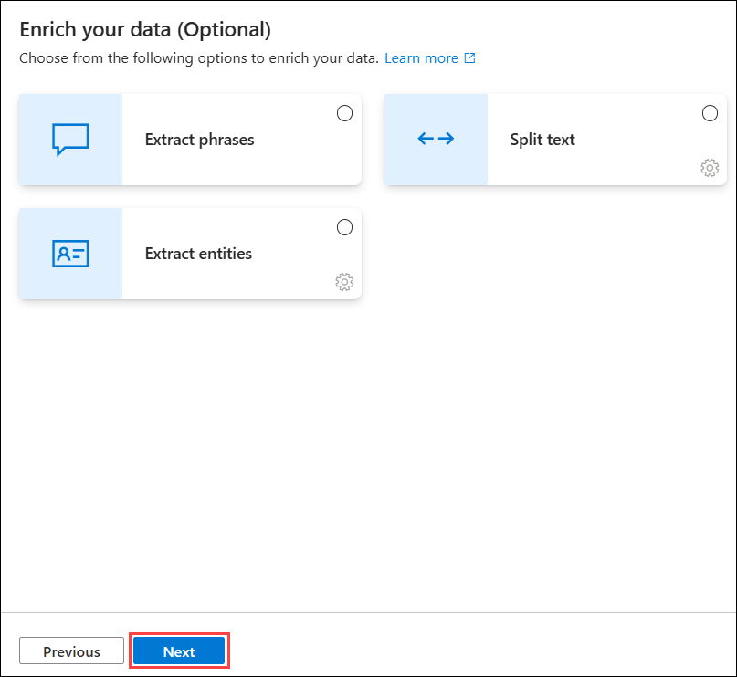
   
1. Click **Add field (1)** on Preview mappings screen, scroll down and select **index (2)** on **source column** then, click on (...) **ellipses icon (3)** on right of the column and select **Configure field (4)**.

   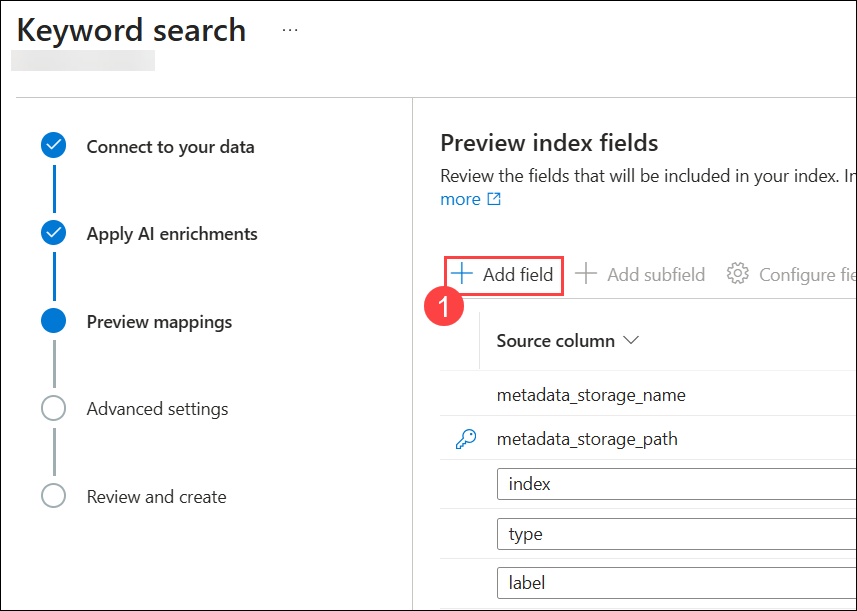

   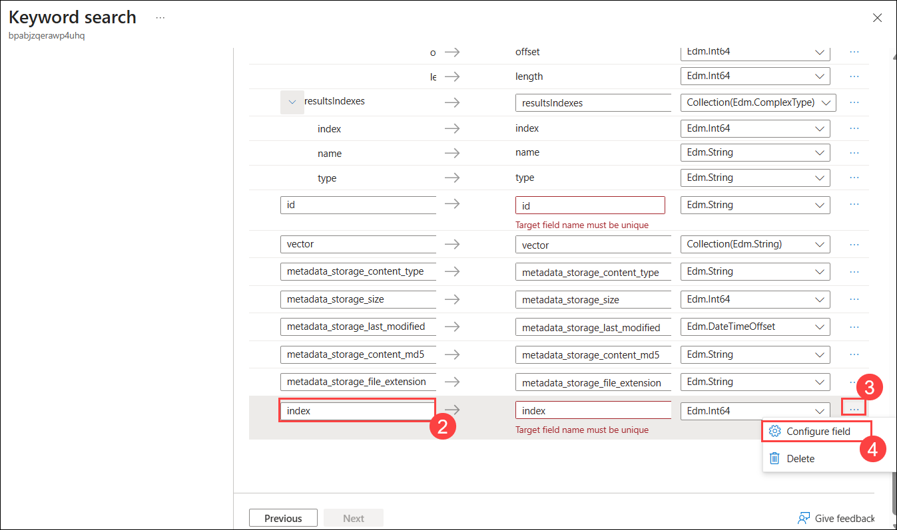

1. Enter the following details in the Configure field

   - Field name: **azureblob_index (1)**
   - Type: **Edm.String (2)**
   - Configure attributes: Select **Retrievable (3)** and **Searchable (4)**
   - Click on **Save (5)**

     

1. Now scroll up, and expand **aggregatedResults (1)** → **customFormRec (2)**. Select the ellipsis **(…) (2)** next to **pages** and select **Delete (4)**.

   

    > **Why:** `pages` holds layout details (word positions, page angle) that search does not need. It can also stop an invoice from indexing: if one page reports a decimal angle such as -0.04, that invoice fails with a data type error.

1. Expand **aggregatedResults (1)** → **customFormRec (2)** → **documents (3)** → **fields (4)** → **Organization_sample (5)**. For **valueString**, type, and valueString & content, select the ellipsis **(…) (6)**, then **Configure field (7)**.

   

   

    > **Why facetable:** Facets let you group and count results by a value, for example how many invoices each organization issued.


1. Enter the following details in the Configure field

   - Field name: **type (1)**
   - Type: **Edm.String (2)**
   - Configure attributes: Select **Facetable (3)**
   - Click on **Save (4)**

      

1. Scroll down and click on **Next**.

   >**Note:** If any field with values as id is giving error, delete that field by clicking (...) ellipses icon  on the right side.

1. On the Advanced settings screen, leave all fields as default and click **Next**.
    
   
   
1. On the Review and create screen, enter the object name prefix as **azureblob-indexer (1)** and click **Create (2)**.

   

1. Once the search index is created successfully, click **Go to Search explorer**.

   

### Add a top-level field for the invoice text
 
1. Select the **Fields (1)** tab and select **Add field (2)**. Enter the following and select **Save (6)**:

    - **Field name:** `content` **(3)**
    - **Type:** Edm.String **(4)**
    - **Attributes:** Retrievable and Searchable **(5)**
    
      

      

    > **Why:** this field will hold each invoice's full text at the top level of the index, where the knowledge base can read it.

1. In the search service, select **Indexers (1)** and open **azureblob-indexer-indexer (2)**. Select **Edit JSON (3)**.

   

   

1. Find the existing `"fieldMappings"` **(1)** list and add this entry inside it, before the first existing mapping and select **Save (3**):

   ```json
    { "sourceFieldName": "/aggregatedResults/customFormRec/content", "targetFieldName": "content" },
   ```
 
      

      > **Why:** A field mapping copies a value from the source file into an index field. The path points at the invoice text in each JSON file and copies it into the new `content` field.
   
      > **Important:** Add the line inside the existing list. Do not add a second `"fieldMappings"` section; the portal keeps only one, and your mapping would be lost.
 
1. On the indexer page, select **Reset (1)** and confirm, then select **Run (2)**.

   

    > **Why reset:** the indexer remembers which files it has already processed. Without a reset, it skips all eight files and the new field stays empty.

1. Wait for the run to finish. In **Execution history**, check that it shows **8/8 succeeded**.

   

### Point the semantic configuration at the invoice text
 
1. From the Azure AI Search service, from the **Indexes (1)**, open the index **azureblob-indexer (2)** and select the **Semantic configurations (3)** tab.

1. Click on the **Add title field (4)** for **azureblob-indexer-semantic-configuration**.

   

   

1. Set the **Title field** to `title` **(1)** and **Content fields** to `content` **(2)** only. Remove any other content fields, then select **Save (3)** and **Save (4)** again.

   

    > **Why:** semantic ranking reorders search results by meaning, not just matching words. The Lab 2 knowledge base uses this configuration to find the most relevant invoices, so it must point at the field that holds the invoice text.

### Query the index

1. From the **Search explorer (1)** tab, in the query box, type **`*` (2)**, and select **Search (3)**. This returns every document in the index. In the results, look for the **@odata.count (4)** field near the top - this shows the total number of matching documents.

   

1. Near the query box, select **View (1)** (or the toggle) and switch to **JSON view (2)**.

1. In the JSON view box, replace the query with below **(3)**. Select **Search (4)**. This returns the first 2 indexed documents in JSON format **(5)**.

   ```json
   {
      "search": "INV-2058",
      "count": true,
      "select": "title, content",
      "top": 2
   }
   ```

   

1. Check that the US invoice for Northwind Traders is the first result.

> **Congratulations** on completing the task! Now, it's time to validate it. Here are the steps:
> - Hit the Validate button for the corresponding task. If you receive a success message, you can proceed to the next  task. 
> - If not, carefully read the error message and retry the step, following the instructions in the lab guide.
> - If you need any assistance, please contact us at cloudlabs-support@spektrasystems.com. We are available 24/7 to help

  <validation step="52b89379-3a35-4829-b65b-466fadb99e86" />

## 🧾 Summary

In this lab you:
 
- Created a Document Intelligence custom extraction project.
- Labeled and trained a custom model, and tested it on unseen images.
- Built a BPA pipeline that ran the model on eight new invoices.
- Gave Azure AI Search secure, read-only access to storage with a managed identity.
- Indexed the invoice results and prepared the invoice text for the Lab 2 agent.

### Now, click on **Next >>** from the lower right corner to move on to the next lab.


