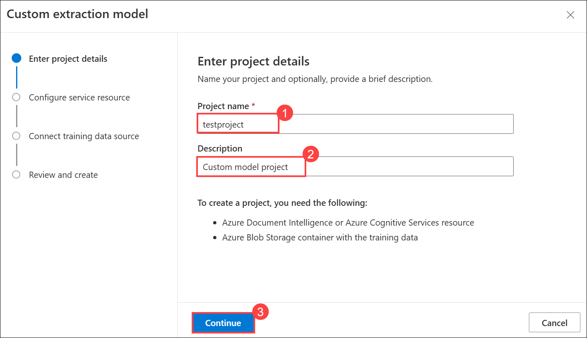
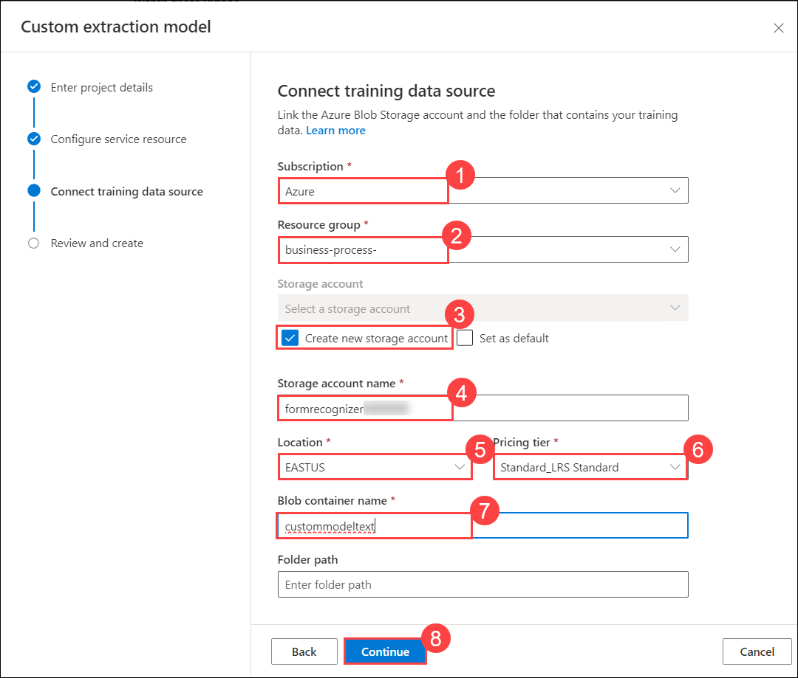
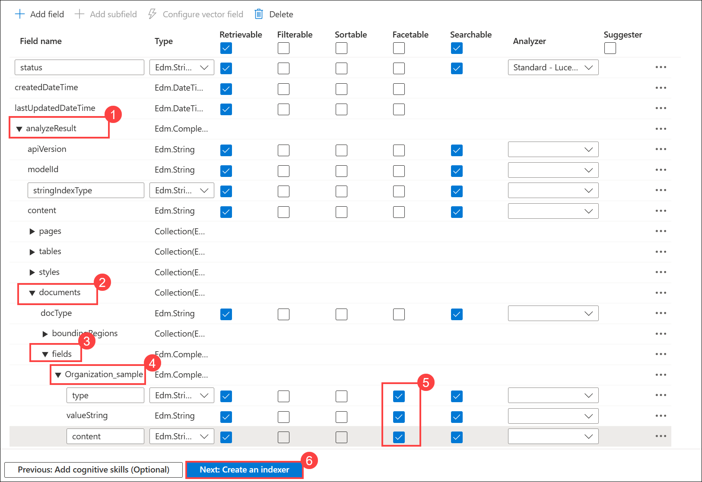

# Lab 01: Create and Deploy an Azure AI Document Intelligence Custom Model

### Estimated Duration: 90 Minutes

In this lab, you will create (train) an Azure AI Document Intelligence custom model using a sample training dataset. Custom models extract and analyze distinct data and use cases from forms and documents specific to your business. To create a custom model, you label a dataset of documents with the values you want to extract and train the model on the labeled dataset. You only need five examples of the same form or document type to get started. For this lab, you will use the dataset provided at [Custom Model Sample Files](/SampleInvoices/Custom%20Model%20Sample/).

## Lab Objectives

In this lab, you will complete the following tasks:

* Task 1: Creating an Azure AI Document Intelligence Resource
* Task 2: Train and Label data
* Task 3: Build a new pipeline with the custom model module in BPA
* Task 4: Configure Azure AI Search 

## Task 1: Creating an Azure AI Document Intelligence Resource

1. Open a new tab and navigate to **Document Intelligence Studio** using [Document Intelligence](https://documentintelligence.ai.azure.com/studio). 

1. On the **Sign in to Microsoft Azure** tab, you will see the login screen. Enter the following email/username **(1)**, and click on **Next (2)**. 

   * **Email/Username:** <inject key="AzureAdUserEmail"></inject>

      

1. Now enter the following password **(1)** and click on **Sign in (2)**.
   
   * **Password:** <inject key="AzureAdUserPassword"></inject>

      

1. In Document Intelligence Studio, scroll down to **Custom Models**, under **Custom extraction model**, choose **Get started**.

   .png)

1. On the **Custom extraction model** page, click **+ Create a project** under **My Projects**.

   

1. On the **Custom extraction model** tab, under **Enter project details**, enter the following details and click on **Continue** **(3)**.
    
   - Project name: **testproject** **(1)**.

   - Description: **Custom model project** **(2)**.

     

1. On the **Configure service resource** tab, enter the following details and click on **Continue (5)**.

   - Subscription: Select your **Default Subscription** **(1)**.

   - Resource group: **business-process-<inject key="Deployment ID" enableCopy="false"/>** **(2)**.

   - Document Intelligence or Cognitive Service Resource: Select the available Azure AI Search (Cognitive Service) **cogservicesbpass{suffix}** **(3)**.

   - API version: **2024-11-30 (4.0 General Availability)** **(4)**.

        

1. On the **Connect training data source** tab, enter the following details and click on **Continue** **(8)**.

    - Subscription: Select your **Default Subscription** **(1)**.
   
    - Resource group: **business-process-<inject key="Deployment ID" enableCopy="false"/>** **(2)**.
   
    - Check the box to **Create new storage account** **(3)**
   
    - Storage account name: **formrecognizer<inject key="Deployment ID" enableCopy="false"/>** **(4)**.
   
    - Location: **East US** **(5)**.
   
    - Pricing tier: **Standard_LRS Standard** **(6)**.
   
    - Blob container name: **custommoduletext** **(7)**.
   
      

1. On the **Review and create** tab, validate the information and click **Create project**.

     

## Task 2: Train and Label data

In this task, you will upload 6 training documents to train the model.

1. On the **Label data** page of your custom extraction model project, click **Browse for files** to upload your sample documents.

     

1.  On the file explorer, paste the following path `C:\Users\Public\Desktop\Data\Custom Model Sample` **(1)** hit **enter**, select all train JPEG files **train1 to train6** **(2)**, and click **Open** **(3)**.

     

1. Once uploaded, in the **Start labeling now** pop-up, select **Run now** under the **Run layout** column.

     

1. On the **Label data** page, click **+ Add a field** **(1)**, then select **Field** **(2)** from the dropdown. Enter the field name as `Organization_sample` **(3)** and press **Enter**.

     

     

1. On the **Label data** page, select the text **CONTOSO LTD.** **(1)** from the document preview. From the label dropdown, choose **Organization_sample** **(2)**. Repeat for all six documents.

     

1. On the **Label data** page, after labeling all six documents, click on **Train** in the top right corner.

     

1. On the **Train a new model** page, specify the Model ID as **customfrs** **(1)**, Model description as **custom model** **(2)**, from the drop-down select **Template** **(3)** as Build Mode and click on **Train** **(4)**.

     

1. On the **Training in progress** dialog opens. click on **Go to Models**

   

1. On the **Models** page, wait until the **Status** of your model changes to **succeeded** **(1)**. Then, select the model **customfrs** **(2)** and click on **Test** **(3)** from the top menu.

     

1. From the left-side menu, navigate to the **Test model** page and click **Browse for files**.

     

1. On the file explorer, paste the following path `C:\Users\Public\Desktop\Data\Custom Model Sample` **(1)** hit **enter**, select all test JPEG files **test1 and test2** **(2)**, and click **Open** **(3)**.

     

1. On the **Test model** page, Once uploaded, select **test2.jpeg (1)** model, and click on **Run analysis** **(2)**, Now you can see on the right-hand side that the model was able to detect the field **Organization_sample** **(3)** we created in the last step along with its confidence score.

     

## Task 3: Build a new pipeline with the custom model module in BPA

After you are satisfied with the custom model's performance, you can retrieve the model ID and use it in a new BPA pipeline with the Custom Model module in the next step.

1. On the Azure Portal, navigate to the Resource groups and select the resource group **business-process-<inject key="Deployment ID" enableCopy="false"/>**.

    

1. On the **Resource group** page, search, and select the **Static Web App** resource type with the name similar to **webappbpa{suffix}**.

   

1. On the **Overview** page of **Static Web App** page, click on **View app in browser**.

      

1. Once the **Business Process Automation Accelerator** page loads successfully, scroll down to the section titled **"What would you like to do?"** Under this section, click on the **Create/Update/Delete Pipelines**. 

   

1. On the **Create Or Select A Pipeline** page, Enter New Pipeline Name as **workshop** **(1)**, and click on the **Create Custom Pipeline** **(2)**. 

   

1. On the **Select a document type to get started** page, select **PDF Document**

   

1. On the **Select a stage to add it to your pipeline configuration** page, click on **Form Recognizer Custom Model (Batch)**.

   

1. On the **Model ID** pop-up. Enter the Form Recognizer Custom Model ID as **customfrs** in the **Model ID** field **(1)**, and then click on **Submit** **(2)**.

   

1. On the **Select a stage to add it to your pipeline configuration** page, scroll down to review the **Pipeline Preview**, and click on **Done**.

   

1. On the **Piplelines workshop** page, click on **Home**. 

     

1. On the **Business Process Automation Accelerator** page, scroll down to the **What would you like to do?** section, then click on **Ingest Documents**.

     

1. On the **Upload a document to Blob Storage** page, from the drop-down, **Select a Pipeline** with the name **workshop** **(1)**, and click on **Upload or drop a file right here (2)**.

     

1. For documents, paste the following path `C:\Users\Public\Desktop\Data\Lab 1 Step 3.7` **(1)** and hit enter. Select the invoice files **(2)** and click **Open** **(3)** You can upload multiple invoices one by one.

     

## Task 4: Configure Azure AI Search 

1. Navigate back to the resource group page, select **Search service** with a name similar to **bpa{suffix}**.

   

1. On the **Search service** page, click on **Import data**. From the **Data Source** dropdown, select **Azure Blob Storage**.

   

1. On the **Import data** page, under the **Connect to your data** tab, enter the following details:

   - Data Source: Select **Azure Blob Storage** **(1)**

   - Data source name: Enter **workshop** **(2)**.

   - Parsing mode: Select **JSON** **(3)**.

   - Subscription: Select the default Subscription. **(4)**

   - Click on **Choose an existing connection** **(5)** under Connection string.
  
     

1. On the **Storage accounts** page, select the storage account named similar to **bpass{suffix}**. 

     

1. Select **results** **(1)** container from the **Containers** page and click on **Select** **(2)**. It will redirect back to the **Connect to your data** page.

        
  
1. On the **Connect to your data** page, enter the **workshop** **(1)** as **Blob folder** and click on **Next: Add cognitive skills (Optional) (2)**.

   

1. On the **Add cognitive skills (Optional)** page, leave all settings as default and click **Skip to: Customize target index**.

    

1. On the **Import data** page, enter **Index name** as **azureblob-index** **(1)**, select the check box of all fields **Retrievable** **(2)**, and **Searchable** **(3)**.

      

1. Expand the **analyzeResult** **(1)** -> **documents** **(2)** -> **fields** **(3)** under it, expand **Organization_sample (4)**. Make the three fields Facetable **(type, valueString & content)** **(5)** and click on **Next: Create an indexer** **(6)**.

   

1. On the **Create an indexer** page, enter the Name as **azureblob-indexer** **(1)** and click on **Submit** **(2)**.
   
   

## Task 5: Use Sample Search Application [Read Only]

1. Navigate back to the **Business Process Automation Accelerator** home page, under the section **What would you like to do?**, click on **Sample Search Application**.

   

1. On the **Sample Search Application** page, in the search bar, enter **invoice1** **(1)** and click on **Search** **(2)** to view results.

   

## Summary

In this lab, you’ll build a custom model with Azure AI Document Intelligence by training it on a sample dataset, enabling automated document processing tailored to your data.

Now, click on **Next >>** from the lower right corner to move on to the next lab.

