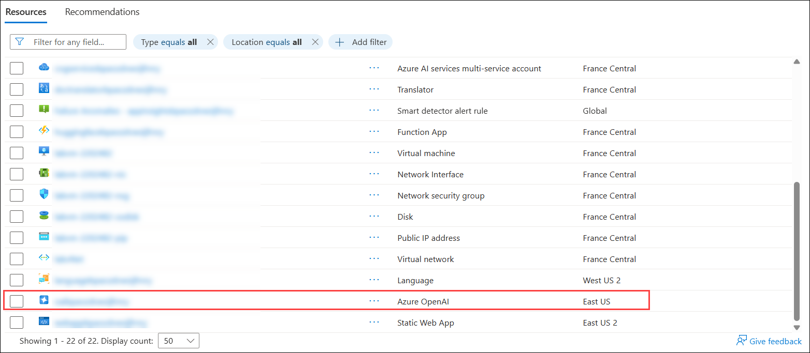
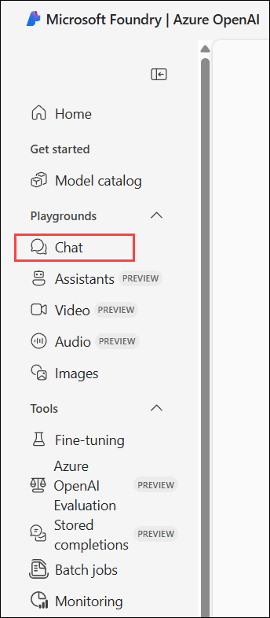
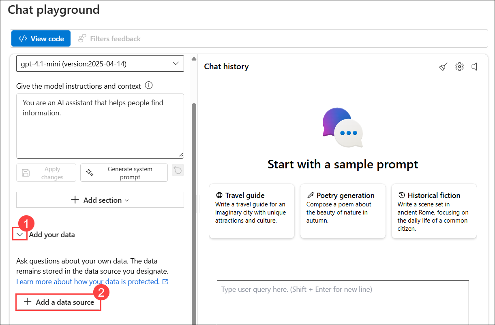
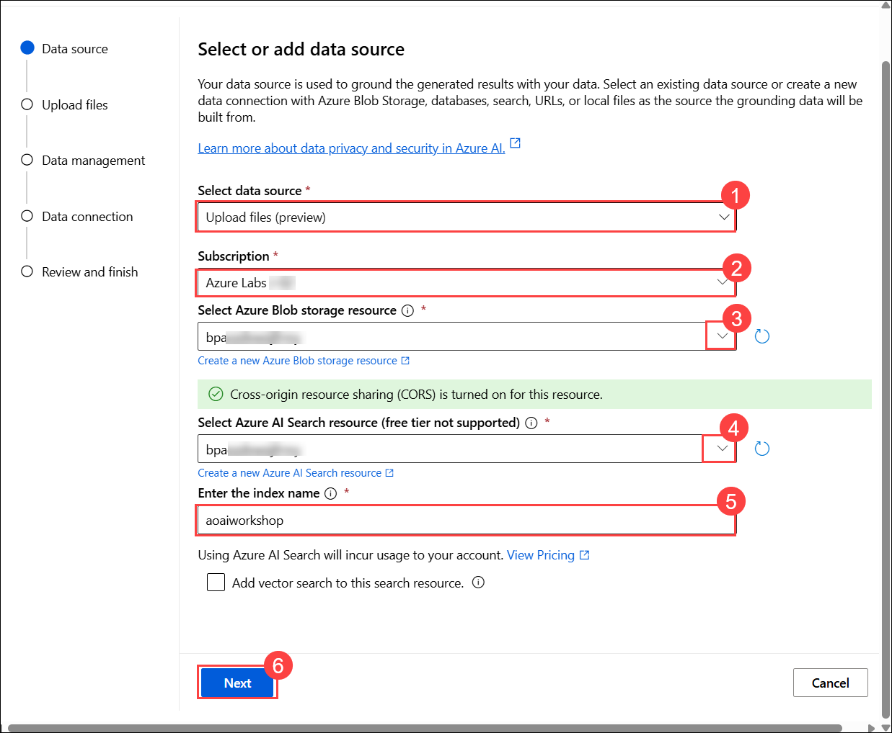
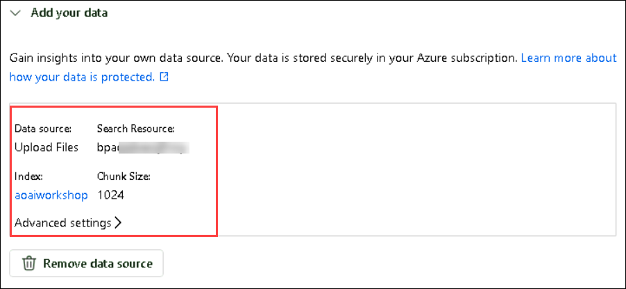

# Use Azure OpenAI with your own data

### Overview
In this lab, you will be using your own data with Azure OpenAI Large Language Models (LLMs), which will be made searchable using Azure AI Search. You will be using the Porsche Owner's Manual PDF provided under the [Lab 2](/SampleInvoices/Lab%202/) folder.

### Goal

* How to leverage the ChatGPT LLM to extract a concise summary from your own document repository using OpenAI.

### Pre-requisites
* Access to Azure OpenAI chat playground.
* Sample data to test with OpenAI.

### Instructions

### Task 1: Navigate to Azure OpenAI Playground

Access the Azure OpenAI Studio and navigate to the "Bring your own data" section.

1. Navigate back to the Resource groups and select the resource group **business-process-<inject key="Deployment ID" enableCopy="false"/>**.

   

2. On the Resource group, search, and select the **Azure OpenAI (1)** resource type with a name unique to your deployment.

   

3. On the **Azure OpenAI** page, click on **Go to Azure AI Foundry Portal**.

   

4. On the **Azure AI Foundry Portal**, you should be able to see the Chat Playground service.

   

5. On **Chat playground** pane, select **Add your data (1)** tab and click on **+ Add a data source (2)**.

   

### Task 2: Upload your own data

In this task, we will be using Porsche's owner manual for the Taycan, Panamera, and Cayenne models.

1. Fill the following details in **Select or add data source**.
    
    - Select data source: **Upload files (preview)** **(1)**

    - Subscription: Select your subscription from the drop-down section **(2)**

    - Select Azure Blob storage resource: Choose the already created storage account from the drop-down **(uniqueId)<inject key="Deployment ID" enableCopy="false"/>** **(3)**. If asked, enable CORS.

    - Select Azure AI Search resource: Select the search service from the drop-down **(uniqueId)<inject key="Deployment ID" enableCopy="false"/>** **(4)**.

    - Enter the index name: Give an index name as **aoaiworkshop** **(5)**

    - Verify all the details and click on **Next** **(6)**.

    

2. On the **Data Management** page, click on **Browse for a file** **(1)**, enter the following `C:\Users\Public\Desktop\Data\Lab 2` **(2)** path, and hit Enter. Select the **Panamera-from-2021-Porsche-Connect-Good-to-know-Owner-s-Manual** **(3)** PDF file and click on **Open** **(4)**.

   

3. You will be redirected to **Data management**. Click on **Upload files** **(1)**, and then click on **Next** **(2)**.

   

4. On the **Data Management** page, from the drop-down select **keyword (1)** as Search type and click on **Next (2)**.

   

5. In the **Data connection** page, select **API Key** **(1)** and click on **Next (2)**.

   

6. On the **Review and finish** page, click on **Save and close**.

   

   <validation step="8f37ff68-c140-4a17-8af7-92838fba1d91" />

> **Congratulations** on completing the task! Now, it's time to validate it. Here are the steps:
> - Hit the Validate button for the corresponding task. If you receive a success message, you can proceed to the next task.
> - If not, carefully read the error message and retry the step, following the instructions in the lab guide.
> - If you need any assistance, please contact us at cloudlabs-support@spektrasystems.com. We are available 24/7 to help

### Task 3: Interact with Azure OpenAI ChatGPT LLM using your own data

Test and interact with the ChatGPT model using your uploaded data to generate relevant responses.

1. Under the **Assistant Setup** pane, wait until your data upload is finished.

   

   

2. Under the **Chat Session** pane, you can start testing out your prompts by entering the query like this.

    ```
   how to operate Android Auto in Porsche Taycan? give step-by-step instructions
    ```

      

3. You can also configure the responses of your bot by selecting the **Give the model instructions and context** under **Setup**. Replace the value with `Your name is Alice. You are an AI assistant that helps people find information about Porsche cars. Your responses should not contain any harmful information` and click on **Apply Changes**. Here we have edited the default system message.

   

4. On **Update system message?** pop-up, click on **Continue**.

   

5. Under the **Chat Session** pane, you can start testing out your prompts by entering the query like this.

    ```
     What is your name
    ```
   
   

6. In the **Configuration** pane, click on **Parameters**. You can try and experiment with different parameter configurations to see how they change the behavior of the model.

    

## Review

In this lab, you have accomplished the following:

* How to leverage the ChatGPT LLM to extract a concise summary from your own document repository using OpenAI.

## Summary

In this lab, you will learn to navigate the Azure OpenAI Playground, upload and configure a Porsche Owner's Manual PDF in Azure OpenAI Studio, and interact with the ChatGPT model using your own data to generate and test responses to queries about Porsche cars.

## You have successfully completed the lab.
