# Lab 02: Use Azure OpenAI with your own data

### Overview
In this lab, you will be using your own data with Azure OpenAI Large Language Models (LLM), which will be made searchable using Azure AI Search. You will be using the Porsche Owner's Manual pdf provided to you.

### Goal
How to leverage the ChatGPT LLM to extract a concise summary from your own document repository using OpenAI.

### Pre-requisites
* Access to Microsoft Foundry portal.
* Sample data to test with OpenAI.

### Task 1: Navigate to Microsoft Foundry Playground

Access the Microsoft Foundry portal and upgrade the pre-deployed Azure OpenAI resource.

1. Navigate to **Resource groups**, and then select the **business-process-<inject key="Deployment ID" enableCopy="false"/>** resource group.

   

1. Navigate back to the **Resource group** window, search for the **Storage account** resource, and then select the Azure Storage account with a name similar to **bpa{suffix}**.

   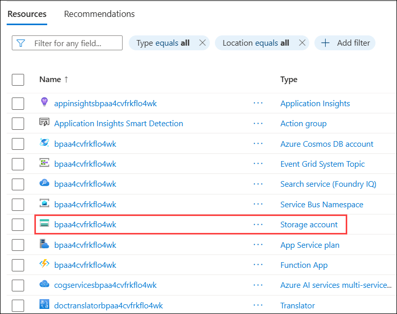

1. Navigate to **Access Control (IAM)** **(1)** from the left navigation pane, click **+ Add** **(2)**, and then select **Add role assignment** **(3)** to assign a role to a user, group, or managed identity.

   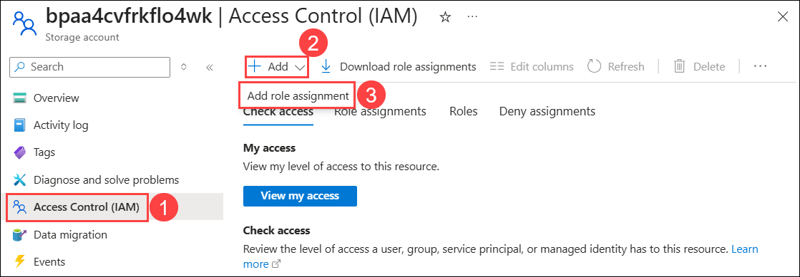

1. On the **Role** tab, search for **Storage Blob Data Reader** **(1)**, select the **Storage Blob Data Reader** role **(2)**, and then click **Next** **(3)** to continue configuring the role assignment.
 
   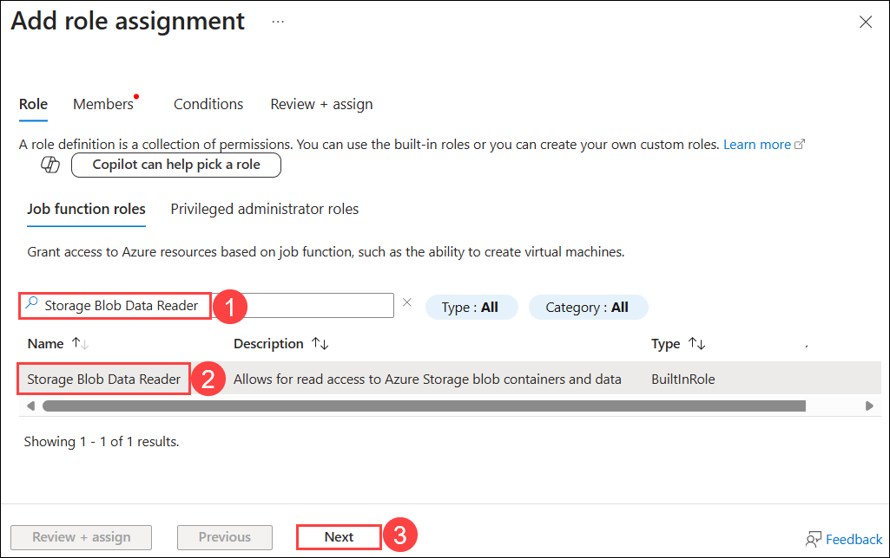

1. On the **Members** tab, select **Managed identity** **(1)**, click **+ Select members** **(2)**, choose **Search service (Foundry IQ)** as the managed identity type **(3)**, verify that the required managed identity is selected **(4)**, and then click **Select** **(5)** to add it to the role assignment.

   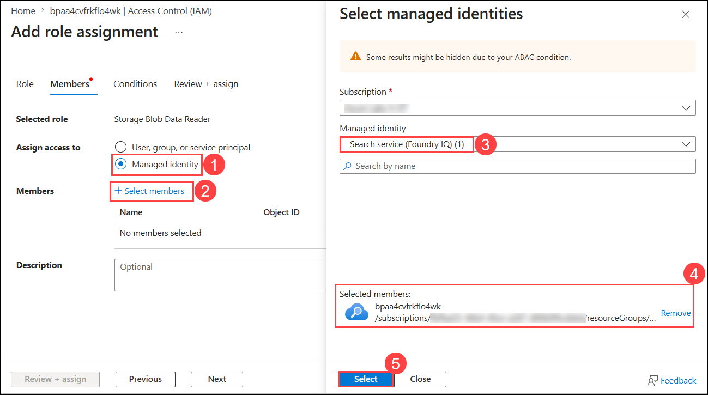

1. After verifying the selected managed identity, click **Review + assign** to review the role assignment configuration before assigning the **Storage Blob Data Reader** role.

   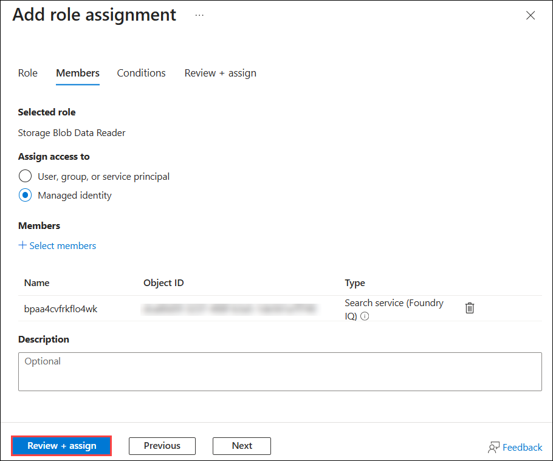

1. Review the role assignment details, verify that the **Storage Blob Data Reader** role, scope, and managed identity are correct, and then click **Review + assign** to complete the role assignment.
 
   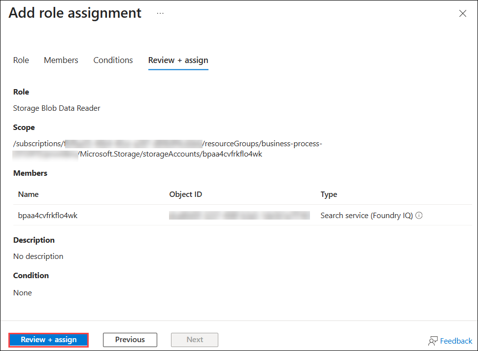

1. Navigate back to **Resource group** page, search for and select the **Azure OpenAI** resource with the name prefix **oaibpa** that was provisioned during the deployment.

   

1. In the left pane, select **Identity (1)**. Under **System assigned**, toggle the status to **On (2)**, and select **Save (3)**.

   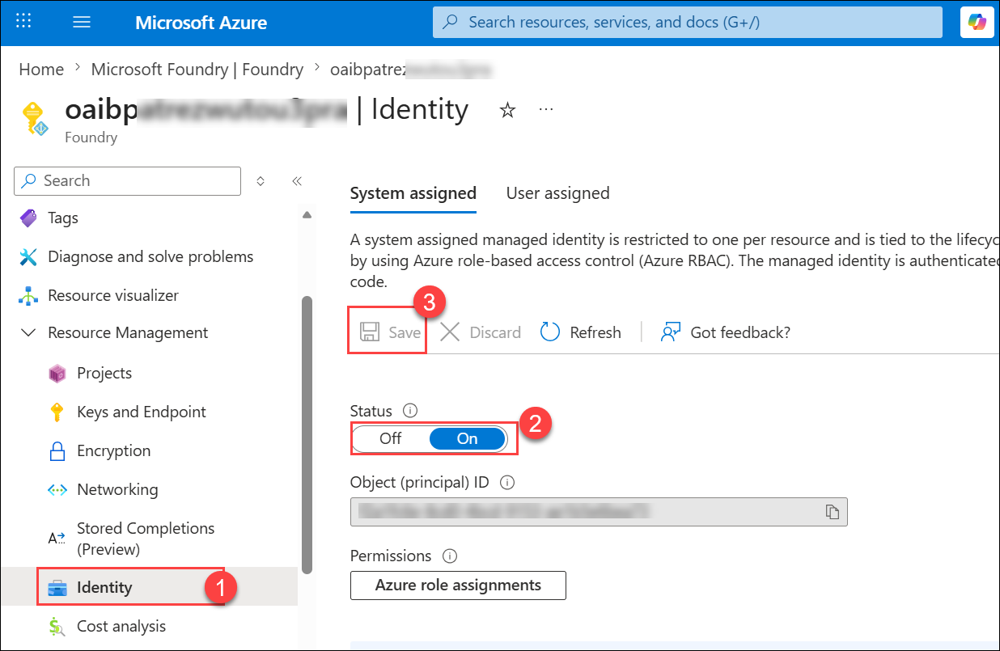

1. On the confirmation prompt, select **Yes**.

1. Navigate back to the **Overview** page of the resource. If the page does not immediately reflect the change, refresh the browser and wait a minute for the update to propagate.

1. On the **Overview** page, locate the banner **"Want to try the latest industry models and Agents?"** and select **Get started**.

   

1. Review the upgrade details, and confirm **Confirm** to proceed.

   

1. In the **Select a project name** step, keep project name as default, and then click **Next** to continue with the Azure AI Foundry project setup.

   

1. In the **Upgrade** step, review the upgrade information, and then click **Upgrade** to convert the Azure OpenAI resource into an **Azure AI Foundry** resource and complete the upgrade process.

   

1. In the **Foundry** resource, navigate to **Access control (IAM)** **(1)**, click **+ Add** **(2)**, and then select **Add role assignment** **(3)** to assign a role to a user, group, or managed identity for the Azure AI Foundry resource.

   

1. On the **Role** tab, search for **Foundry User** **(1)**, select the **Foundry User** role **(2)**, and then click **Next** **(3)** to continue configuring the role assignment.

   

1. On the **Members** tab, select **User, group, or service principal** **(1)**, click **+ Select members** **(2)**, search for the <inject key="AzureAdUserEmail"></inject> **(3)**, select the ODL user from the search results **(4)**, and then click **Select** **(5)** to add the user to the role assignment.

   

1. After verifying that the correct user has been added under **Members**, then click **Review + assign** twice to assign the **Foundry User** role.

   

1. On the **Overview** page of the **Foundry** resource, click **Go to Foundry portal** to open the resource in the Azure AI Foundry portal and continue with the configuration.

   

1. Navigate to the **Microsoft Foundry portal** and ensure the **New Foundry** toggle (top right) is switched **On**.

1. On the top navigation menu, ensure that you are in the **proj-default** project **(1)**. Then, on the same page, select **Test in playground** **(2)**.

   

   >**Note:** On the **All set. Let's build your agents.** pop-up, select **Let's go**. Close all other pop-ups.

1. Select your deployed chat model from the **Deployment** dropdown. Ensure that **gpt-5.4-mini** is selected as the deployed model.

   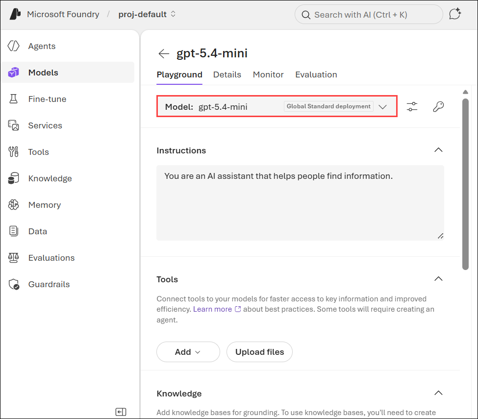

### Task 2: Upload your own data

In this task, we will use Porsche's owner manuals for the Taycan, Panamera, and Cayenne models.

1. On the **gpt-5.4-mini** playground page, select **Save as agent** (top right).

   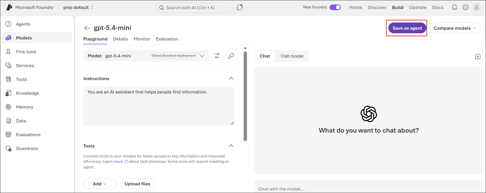

1. In the **Create an agent** dialog, enter the agent name as **PorscheManualsAssistant (1)**, and select **Create and open playground (2)**.

   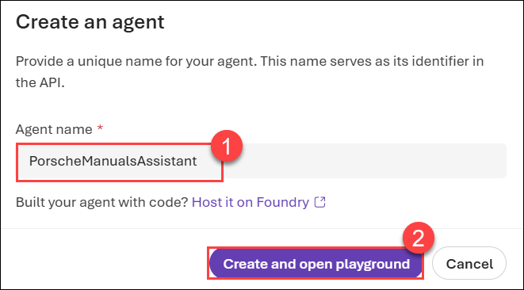

1. Before building the knowledge source, upload the manual to Blob Storage so it can be picked up by the indexing pipeline:

    a. In the **Azure Portal**, navigate to your storage account with prefix **bpa**.

      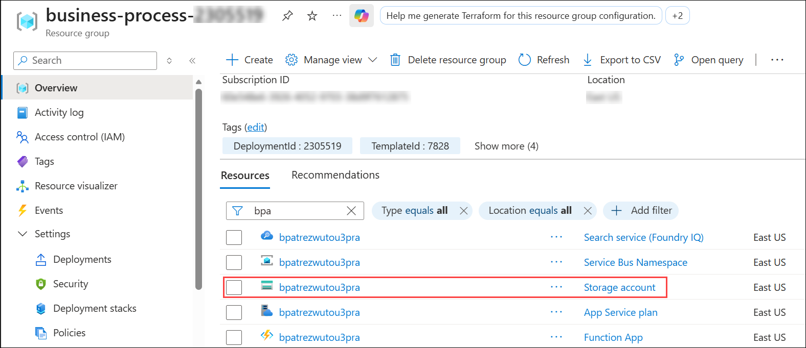

    b. Select **Containers (1)** from the left pane, and select a container to hold the manuals that is **documents (2)**.

      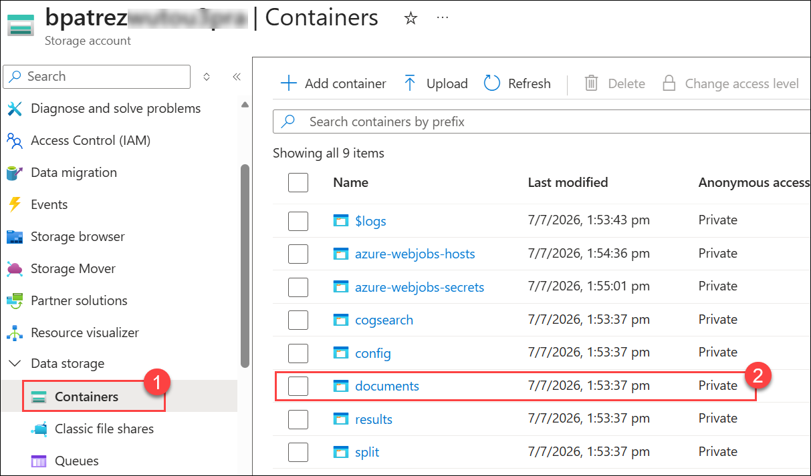

    c. In the **documents** container, click **Upload** **(1)**, and then select **Browse for files** **(2)** to choose the document that you want to upload to the Azure Blob Storage container.

      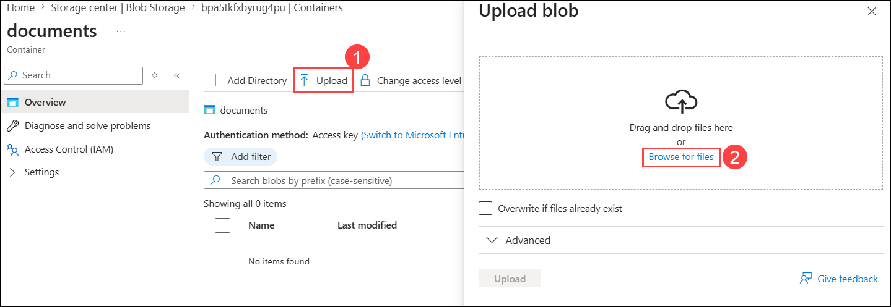

    d. Browse to `C:\LabFiles\Azure-OpenAI-and-Form-Recognizer-Workshop\SampleInvoices\Lab 2` **(1)** on the JumpVM, select **Panamera-from-2021-Porsche-Connect-Good-to-know-Owner-s-Manual.pdf** **(2)** and then **Select** **(3)**.

      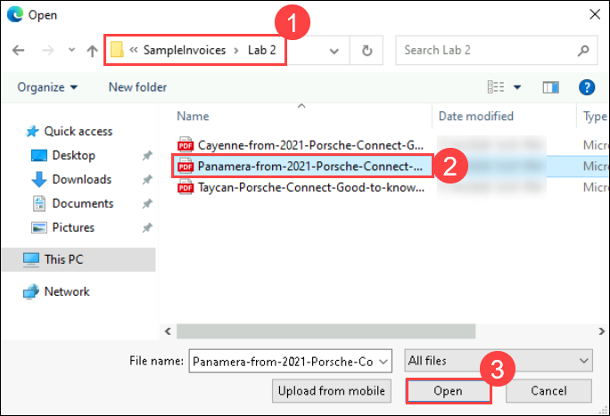

    d. After verifying that the required file is selected, click **Upload** to upload the document to the **documents** blob container.

      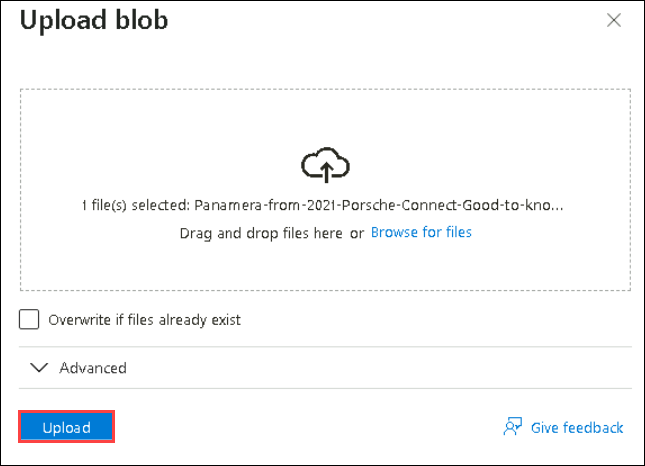

1. Navigate to your **bpa**-prefixed **Search service** resource, and select **Import data** from the top menu.

   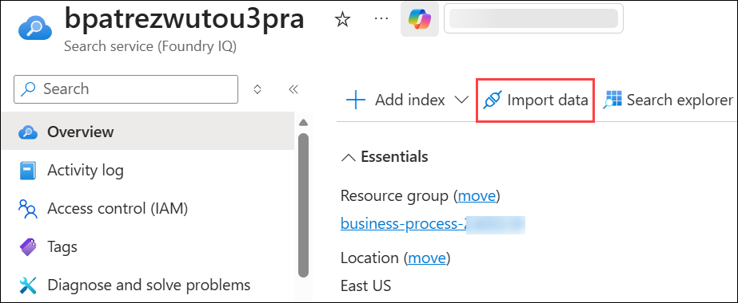

1. On the **Choose a data source** page, select **Azure Blob Storage**.

   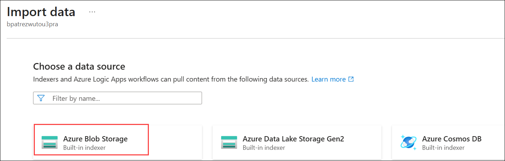

1. On **What scenario are you targeting?**, select **RAG**.

1. On **Connect to your data**, configure the following, then select **Next**:

    - **Subscription (1)**: Your lab subscription

    - **Storage account (2)**: Your **bpa**-prefixed storage account

    - **Blob container (3)**: **documents**

    - **Parsing mode (4)**: **Default**

    - Select **Next (5)**
    
      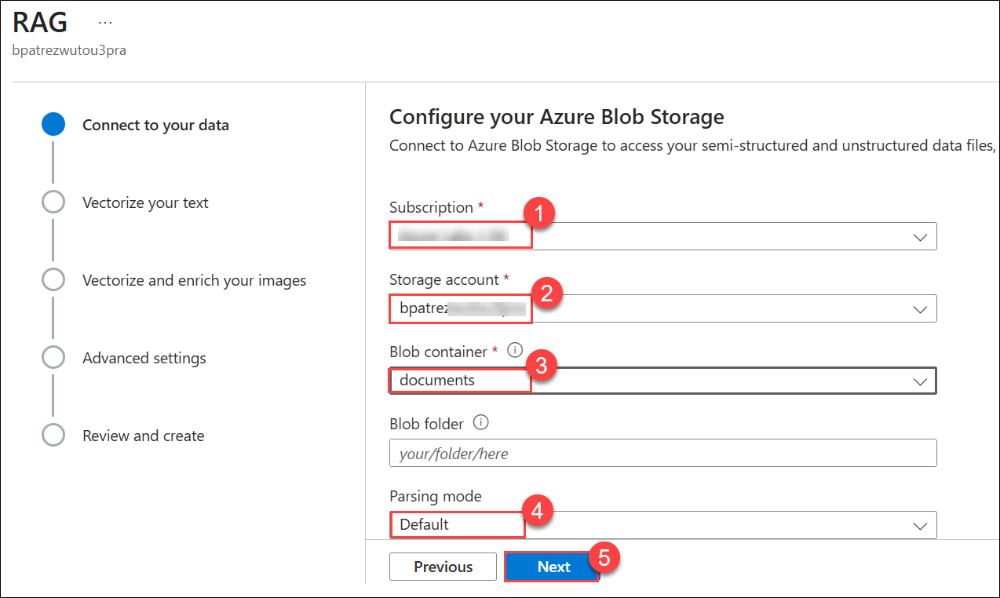

1. On the **Vectorize your text** step, configure the embedding settings as follows:

    - Verify that **Kind** is set to **Microsoft Foundry** **(1)**.

    - Select the available **Subscription** **(2)**.

    - Choose the **Microsoft Foundry project** **proj-default** **(3)**.

    - Select the **text-embedding-ada-002** model deployment **(4)**.

    - Under **Authentication type**, select **API key** **(5)**.

    - Select the acknowledgment checkbox to accept the additional cost notice **(6)**.

    - Click **Next** **(7)** until you reach to the **Review and create** step.

      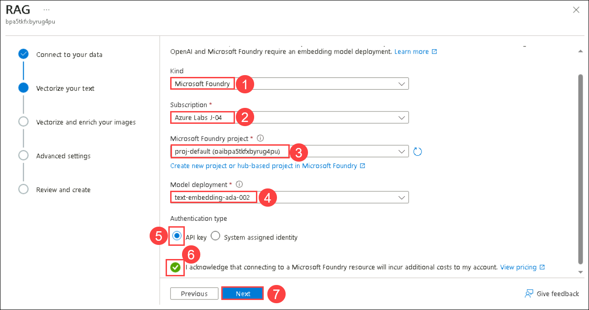

1. On the **Review and create** step, verify that the **Objects name prefix** is set to **aoaiworkshop** **(1)**, review the configuration settings, and then click **Create** **(2)** to create the index, indexer, data source, and skillset for the RAG solution.

    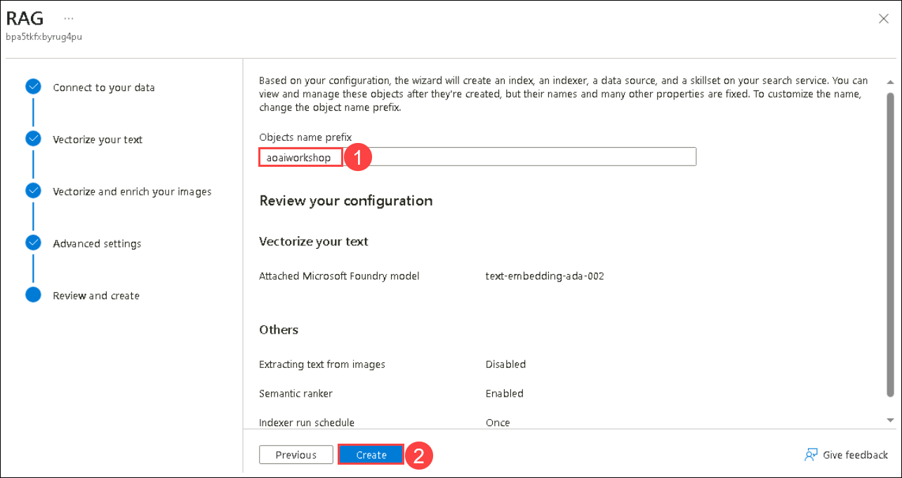

1. Wait for the indexer to finish running. You can check progress under **Indexers** in the left pane of the Search resource.

1. In the Microsoft Foundry portal, select **Knowledge** **(1)** from the left navigation pane,. Under **Foundry IQ resource**, select Search service resource starting with **bpa** **(2)**, and then click **Connect** **(3)** to connect the project to the Foundry IQ resource.

   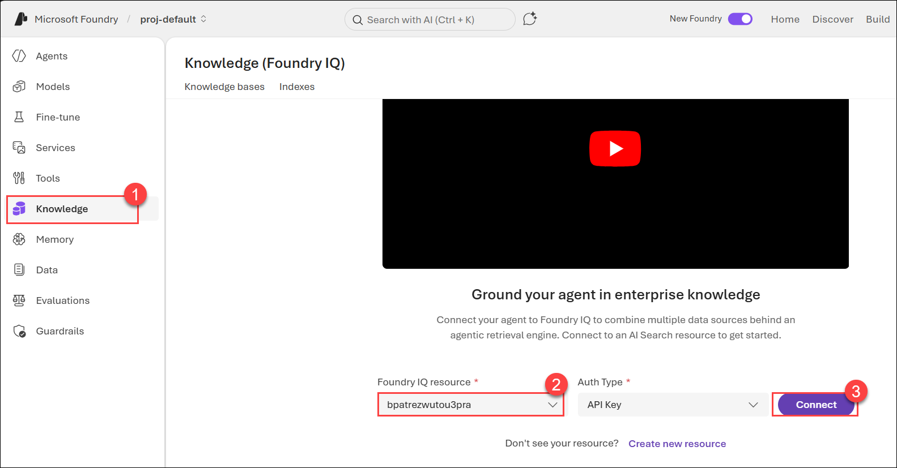

1. On the **Knowledge (Foundry IQ)** page, select **Create a knowledge base**.

   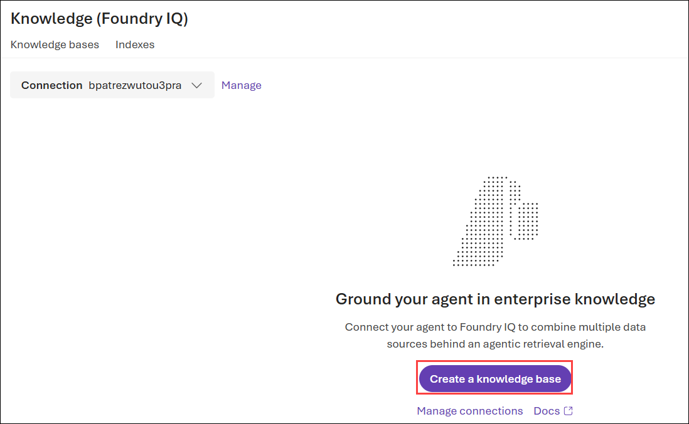

1. On the **Create a new knowledge base** page, keep the options as default. Scroll down to **Knowledge sources**, select the **Add sources (1)** drop-down, and select **Azure AI Search Index (2)**.

   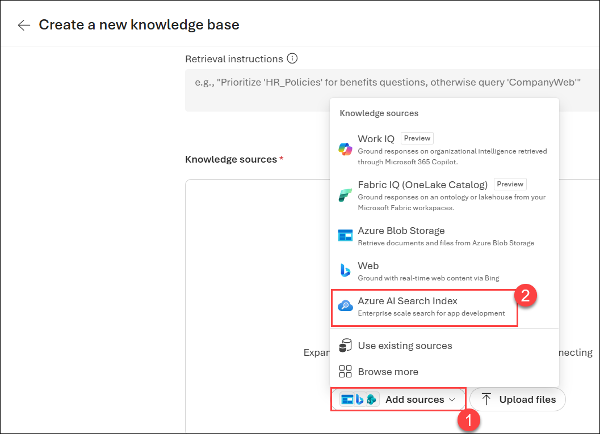

1. In the **Create a knowledge source** pane, enter **`porsche-manuals-source`** in the **Name** field **(1)**. Under **Select search index**, choose **`aoaiworkshop`** **(2)**, and then click **Create** **(3)**.

   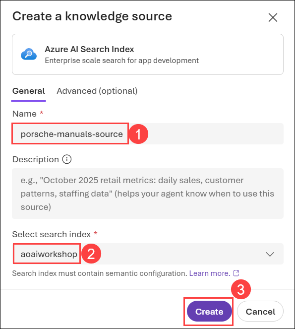

1. Verify that the **porsche-manuals-source** knowledge source shows an **Active** status **(1)**. Then, click **Save knowledge base** **(2)** to create the knowledge base.

   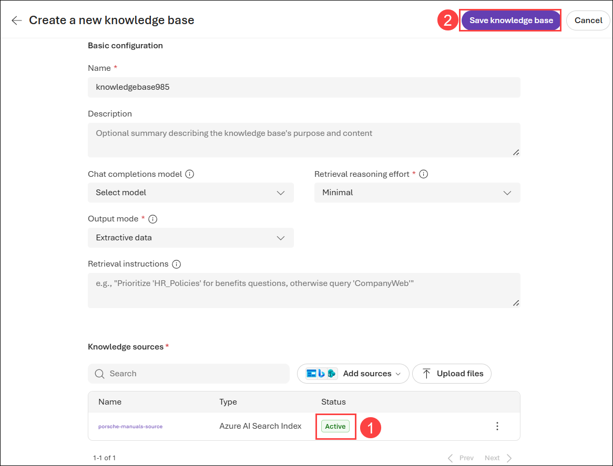

1. Click **Save** **(1)** to save the knowledge base configuration. Then, click **Use in an agent** **(2)** and select your agent (for example, **PorscheManualsAssistant**) to associate the knowledge base with the agent.

   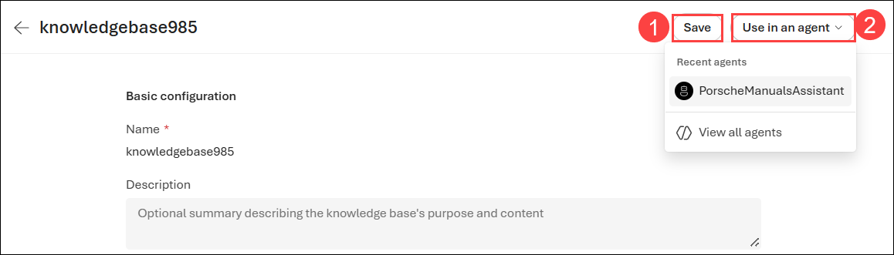

1. In the chat pane on the right, test the agent by asking a question about the uploaded manual, for example: 

    ```
    What does the Panamera owner's manual say about Porsche Connect setup?
    ```

   Confirm the agent responds using content grounded in the uploaded document.

    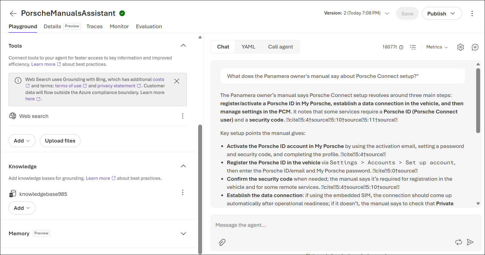

<validation step="8f37ff68-c140-4a17-8af7-92838fba1d91" />

> **Congratulations** on completing the task! Now, it's time to validate it. Here are the steps:
> - Hit the Validate button for the corresponding task. If you receive a success message, you can proceed to the next task. 
> - If not, carefully read the error message and retry the step, following the instructions in the lab guide.
> - If you need any assistance, please contact us at cloudlabs-support@spektrasystems.com. We are available 24/7 to help

### Task 3: Interact with your agent using your own data

Test and interact with the **PorscheManualsAssistant** agent using your uploaded data to generate relevant responses.

1. Click the **New conversation** (**+**) icon **(1)** to start a new chat session. Enter the following prompt **(2)**:

   ```
   how to operate Android Auto in Porsche Taycan? give step-by-step instructions
   ```

1. Verify that the agent returns step-by-step guidance based on the uploaded Porsche manuals, demonstrating that it is successfully retrieving information from the configured knowledge base.

   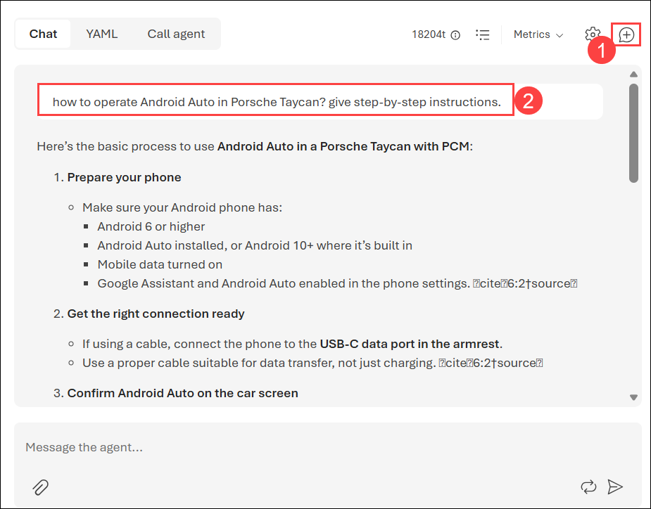

1. You can also configure the agent's behavior by selecting the **Instructions (1)** field in the agent's setup pane, and replacing the value with:

   ```
   Your name is Alice. You are an AI assistant that helps people find information about Porsche cars. Your responses should not contain any harmful information
   ```

1. Select **Save (2)** to apply the updated instructions.

   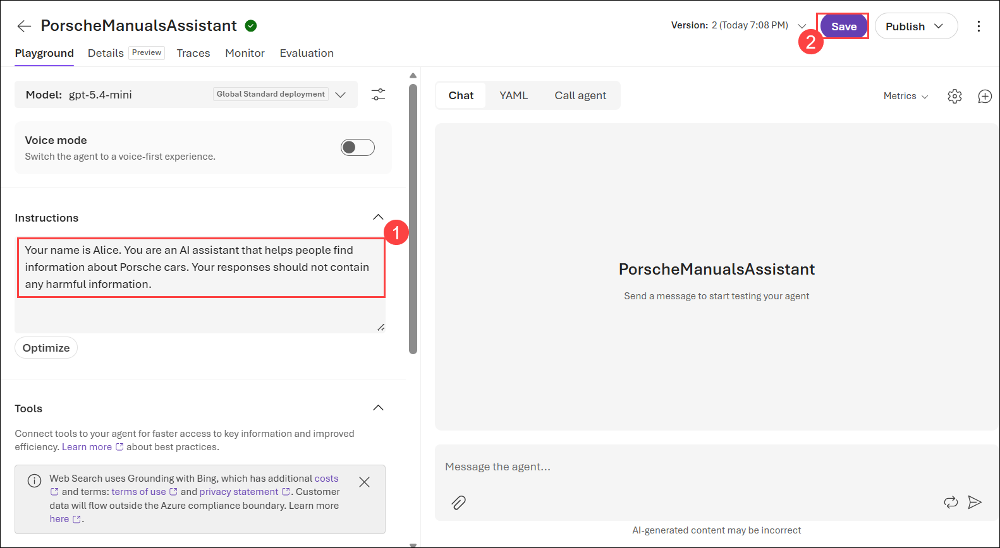

1. In the chat pane, click the **New conversation** (**+**) icon **(1)** to start a new chat session. Enter the following prompt **(2)** and verify that the agent responds as **Alice** confirming that the agent is following the configured instructions.

   ```
   What is your name?
   ```

   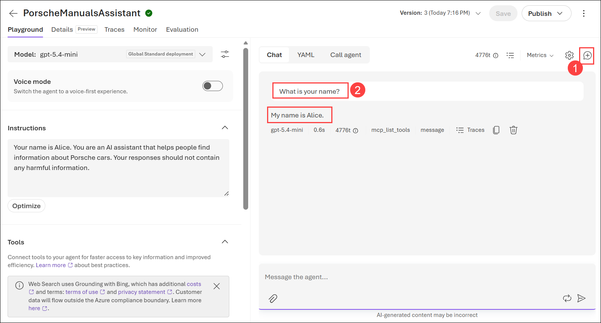

1. On the **Playground** tab **(1)**, click the **Parameters** (slider) icon **(2)** to open the agent configuration settings, where you can customize inference parameters such as reasoning effort, tool usage, and response format. Experiment with different values to see how they change the model's behavior.

   

## Review

In this lab, you have accomplished the following:

* How to leverage the ChatGPT LLM to extract a concise summary from your own document repository using OpenAI.

## Summary

In this lab, you learned to navigate the Microsoft Foundry playground, upload a Porsche Owner's Manual PDF, index it using Azure AI Search's RAG import pipeline, connect it as a knowledge source to a Foundry agent, and interact with the agent using your own data to generate and test responses to queries about Porsche cars.

## You have successfully completed the lab.