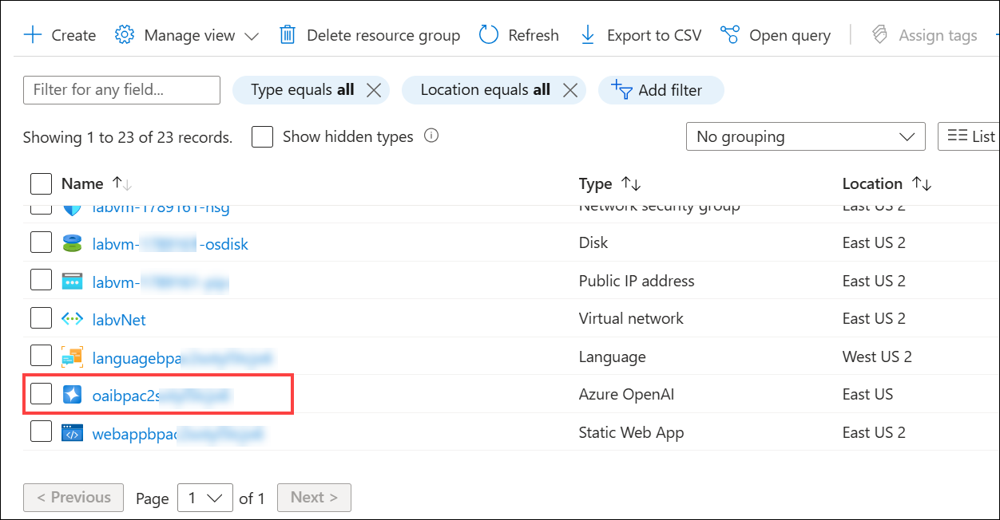
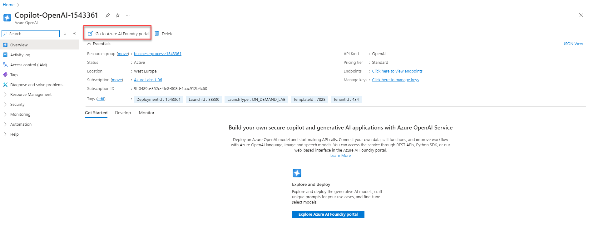

# Lab 02: Use Azure OpenAI with your own data

### Estimated Duration: 120 Minutes

## Overview

In this lab, you will be using your own data with Azure OpenAI Large Language Models (LLM), which will be made searchable using Azure AI Search. You will be using the Porsche Owner's Manual PDF provided under the `C:\Users\Public\Desktop\Data\Lab 2` folder.

## Lab Objectives

In this lab, you will complete the following tasks:

* Task 1: Navigate to Azure OpenAI Playground
* Task 2: Upload your own data
* Task 3: Interact with Azure OpenAI ChatGPT LLM using your own data

## Task 1: Navigate to Azure OpenAI Playground

In this task, you will access the Microsoft Foundry portal through your Azure OpenAI resource. You’ll navigate to the Bring your own data section to prepare for integrating custom documents with a ChatGPT-based interface.

1. Navigate back to the **Resource groups** and select the resource group **business-process-<inject key="Deployment ID" enableCopy="false"/>**.

   

2. On the Resource group page, search, and select the **Azure OpenAI** resource type with the name similar to **oaibpa{suffix}**.

   

3. On the **Overview** tab of **Azure OpenAI Overview** page, click on **Go to Foundry portal**.

   

4. On the **Microsoft Foundry | Azure OpenAI** page, from the left navigation, go to **Home (1)** section, scroll down and click on **Bring your own data (2)**.

   

    > **Note:** If any pop up window appears, click on cancel

## Task 2: Upload your own data

In this task, you will upload a Porsche owner's manual PDF to Azure OpenAI using the Bring your own data feature. You'll configure Azure Blob Storage and AI Search to make the document searchable and ready for integration with the LLM. 

1. On the **Microsoft Foundry | Azure OpenAI** page, select **Chat** **(1)** under **Playgrounds**. Expand **Add your data** **(2)**, then click on **+ Add a data source** **(3)**.

   

1. Provide the following details to configure the data source.
    
    - **Select data source:** Select **Upload files (preview)** **(1)**

    - **Subscription:** Select the Defaul subscription from the drop-down **(2)**

    - **Select Azure Blob storage resource:** Choose the already created storage account **formrecognizer<inject key="Deployment ID">** **(3)**. 
      
    - If prompted with a CORS permission warning, click on **Turn on CORS (4)**.

      

    - **Select Azure AI Search resource:** Select the search service used in the previous lab from the drop-down **bpa{suffix}** **(5)**.

    - **Enter the index name:** Enter the index name as **aoaiworkshop** **(6)**.
    
    - Click on **Next** **(7)**.

       

1. On the **Upload files** page, click on **Browse for a file** **(1)** enter the following `C:\Users\Public\Desktop\Data\Lab 2` **(2)** path and hit enter, select the **Panamera-from-2021-Porsche-Connect-Good-to-know-Owner-s-Manual** **(3)** pdf  file and click on **Open** **(4)**.

   

1. On the **Upload files** page, click **Upload files** **(1)** to add your documents, then click **Next** **(2)** to proceed.

   

1. On the **Data management** page, select **Keyword** **(1)** from the **Search type** dropdown and click on **Next (2)**.

   

1. On the **Data Connection** page, select **API Key (1)** under **Azure resorce authentication type** and click on **Next (2)**.

   

1. On the **Review and finish** page, review the details and click on **Save and close**.

   

## Task 3: Interact with Azure OpenAI ChatGPT LLM using your own data

In this task, you will interact with the Azure OpenAI ChatGPT model using your uploaded Porsche manual data. You’ll test natural language queries, customize the system message, and tweak parameters to observe how the model responds using your indexed content.

1. In the **Setup** pane, wait for the data upload to complete.

   

   

2. Under the **Chat Session** pane, you can start testing out your prompts by entering the query like this.

    ```
    How to operate Android Auto in the Porsche Taycan? give step-by-step instructions
    ```

   

3. You can also configure the responses of your bot by selecting the system message under **Setup**, replacing the value under the **Give the model instructions and context** with `Your name is Alice. You are an AI assistant that helps people find information about Porsche cars. Your responses should not contain any harmful information` **(1)** and click on **Apply changes** **(2)**. Here we have edited the default system message.

   

4. In the **Update system message?** confirmation pop-up, click **Continue**.

   

5. Under the **Chat Session** pane, you can start testing out your prompts by entering the query like this.

    ```
    What are the available functions in the Discover menu item?
    ```
   
    

6. Expand **Parameters** from the left column. You can experiment with different parameter configurations to see how they affect the model's behavior.

   

7. You can try the following query after adjusting the parameters session

   - How can one navigate lists via voice control?
   - What are the settings that can be adjusted under the Settings menu item?
   - How can one report a theft using the Theft Reporting function?
   - What information can be viewed or edited in the My Garage section?
   - What does the Real-time Traffic service provide in the Navigation Plus feature?
   - How can real-time traffic messages be accessed and viewed?
   - What are the general guidelines for using voice control effectively?
   - How can the Charging Planner route be created and customized?
   - What are the available options for interacting with the multimodal map feature during navigation?

## Summary 

In this lab, you have completed the following:

- Navigated to the Azure OpenAI Playground.

- Uploaded custom data.

- Interacted with the Azure OpenAI ChatGPT LLM using your own data.

## You have successfully completed this Hands-on lab.

By completing this lab **Business Automation using Azure OpenAI and Document Intelligence**, you built a complete intelligent, AI-driven document processing and interaction workflow in Azure. You began by provisioning the Azure AI Document Intelligence resource to enable advanced document understanding, followed by training and labeling data to create a domain specific custom model. This model was then integrated into a Business Process Automation (BPA) pipeline for automated document processing, and Azure AI Search was configured to make the extracted information easily discoverable and accessible. Additionally, you enabled a customized AI interaction experience where the Azure OpenAI ChatGPT LLM leverages your own data, ensuring more relevant, accurate, and context specific responses tailored to your unique requirements.