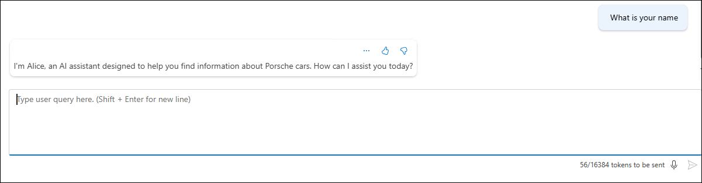

# Lab 02: Use Azure OpenAI with your own data

In this lab, you will be using your own data with Azure OpenAI Large Language Models (LLM), which will be made searchable using Azure AI Search . You will be using the Porche Owner's Manual pdf provided under the `C:\Users\Public\Desktop\Data\Lab 2` folder.

### Lab Objectives

In this lab, you will complete the following tasks:

* Task 1: Navigate to Azure OpenAI Playground
* Task 2: Upload your own data
* Task 3: Interact with Azure OpenAI ChatGPT LLM using your own data

### Task 1: Navigate to Azure OpenAI Playground

1. Navigate back to the Resource groups and select the resource group **business-process-<inject key="Deployment ID" enableCopy="false"/>**.

   

2. On the Resource group, search, and select the **Azure OpenAI** resource type with the name similar to **oaibpa{suffix}**.

   

3. On the **Azure OpenAI Overview** page, click on **Go to Azure AI Foundry portal**.

   

4. On the **Azure OpenAI Studio**, In **Home** scroll down and click on **Bring your own data**.

   

### Task 2: Upload your own data

In this step, we will be using Porche's owner manual for Taycan, Panamera, and Cayenne models.

1. You will be redirected **Chat** under **Playgrounds**. Expand  **> Add your data**, click on **Add a data source** and fill the following details: 
   
    
    - Select data source: **Upload files (preview)** **(1)**

    - Subscription: Select your subscription from the drop-down section **(2)**

    - Select Azure Blob storage resource: Choose the already created storage account **formrecognizer<inject key="Deployment ID">** **(3)**. 
      
      - **Note**: If asked for turn on CORS, click on **Turn on CORS**.

         

    - Select Azure AI Search  resource: Select the search service used in the previous lab from the drop-down **(4)**.

    - Enter the index name: Give an index name as **aoaiworkshop** **(5)**.
    - Click on **Next** **(6).**

       

2. On the **Upload files** page, click on **Browse for a file** **(1)** enter the following `C:\Users\Public\Desktop\Data\Lab 2` **(2)** path and hit enter, select the **Panamera-from-2021-Porsche-Connect-Good-to-know-Owner-s-Manual** **(3)** pdf  file and click on **Open** **(4)** files.

   

3. Click on **Upload files** **(1)**, and click on **Next** **(2)**.

   

4. On the **Data Management** page, from the drop-down select **keyword (1)** as Search type and click on **Next (2)**.

   

5. On the **Data Connection** page, Under Azure resorce authentication type, select **API Key**.

   

6. On the **Review and finish** page, click on **Save and close**.

   


### Task 3: Interact with Azure OpenAI ChatGPT LLM using your own data

1. Under the **Setup** pane, wait until your data upload is finished.

   

   

2. Under the **Chat Session** pane, you can start testing out your prompts by entering the query like this.

    ```
    how to operate Android Auto in Porche Taycan? give step-by-step instructions
    ```

      

3. You can also configure the responses of your bot by selecting the system message under **Setup**, replace the value under the **Give the model instructions and context**
 with `Your name is Alice. You are an AI assistant that helps people find information about Porche cars. Your responses should not contain any harmful information` **(1)** and click on **Apply changes** **(2)**. Here we have edited the default system message.

   

4. On **Update system message?** pop-up, click on **Continue**.

   

5. Under the **Chat Session** pane, you can start testing out your prompts by entering the query like this.

    ```
     What is your name
    ```
   
    

    - **Note:** It might take some time to process the model instructions provided. If you receive prompts like "The requested information is not available in the retrieved data.", please try your query multiple times and refresh the page.

6.Expand **> Parameters** from the left column. You can experiment with different parameter configurations to see how they affect the model's behavior.

   

## Summary 

In this hands-on lab, you will use your own data with Azure OpenAI Large Language Models (LLM) and make it searchable using Azure AI Search. The steps involve configuring and integrating these services to enhance data accessibility and searchability.

## You have successfully completed this lab.

