# Lab 02: Use Microsoft Foundry with your own data

### Estimated Duration: 120 Minutes

## Lab Scenario

Contoso Motors, a global automotive company, wants to improve customer support and knowledge accessibility by using generative AI with its enterprise data. Employees and support teams often spend significant time searching through lengthy vehicle manuals and technical documents to answer customer queries. To streamline this process, Contoso plans to build an AI-powered conversational assistant using Microsoft Foundry, Foundry IQ, Azure AI Search, and Azure OpenAI models.

In this hands-on lab, you will act as a Cloud Consultant and help Contoso upload a Porsche owner's manual, create a knowledge base using the uploaded document, connect the knowledge base to an AI agent, and enable users to interact with the document using natural language queries through the Microsoft Foundry Agent playground.

## Overview

In this lab, you will use your own data with a generative AI model in Microsoft Foundry. You will create a **File knowledge source** using the Porsche Owner's Manual PDF provided under the `C:\Users\Public\Desktop\Data\Lab 2` folder.

The uploaded document will be processed and made available through a **Foundry IQ knowledge base**. You will then connect the knowledge base to a **Foundry Agent** and use the agent playground to ask questions about the Porsche owner's manual.

## Lab Objectives

In this lab, you will complete the following tasks:

* Task 1: Navigate to Microsoft Foundry
* Task 2: Create a File knowledge source and knowledge base
* Task 3: Create and configure a Foundry Agent
* Task 4: Interact with the Foundry Agent using your own data

## Task 1: Navigate to Microsoft Foundry

In this task, you will access the Microsoft Foundry portal through the provisioned Azure OpenAI resource and open the provisioned Foundry project.

1. Navigate back to the **Resource groups** and select the resource group **business-process-<inject key="Deployment ID" enableCopy="false"/>**.

   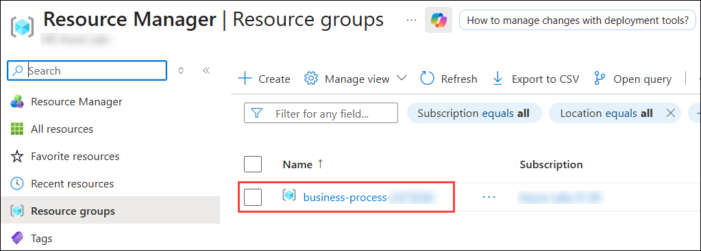

2. On the Resource group page, search for and select the **Foundry** resource with a name similar to **oaibpa{suffix}**.

   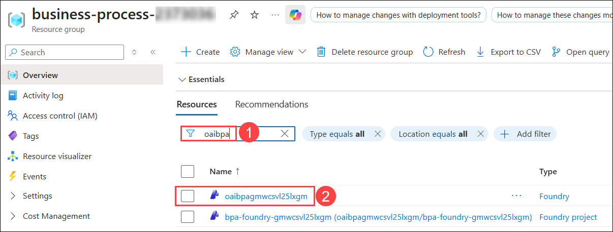

3. On the **Overview** tab of the Foundry resource, select **Go to Foundry portal**.

   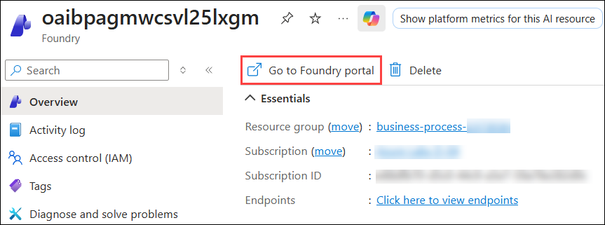

4. On the **Microsoft Foundry** page, verify that the provisioned Foundry project is selected **(1)**. From the top navigation bar, select **Build (2)**.

   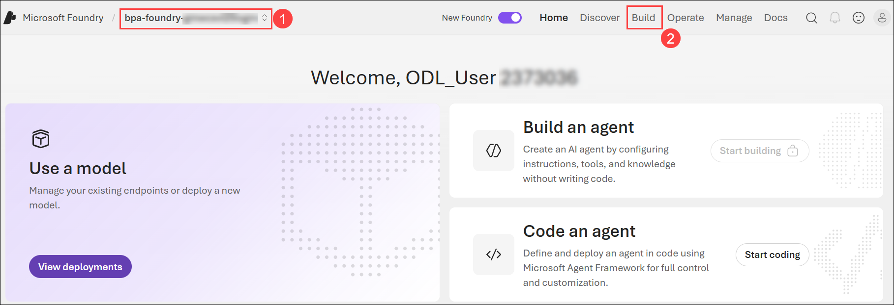

   > **Note:** Ensure that you are working in the Foundry project provisioned for this lab.

## Task 2: Create a File Knowledge Source and Knowledge Base

In this task, you will create a File knowledge source and upload the Porsche owner's manual. You will then create a knowledge base using the uploaded document.

1. From the left navigation pane, select **Knowledge (1)**, select the provisioned **Azure AI Search** resource from the **Foundry IQ resource** drop-down **(2)**, select **API Key  (3)** as the **Auth Type**, and then select **Connect (4)**.

   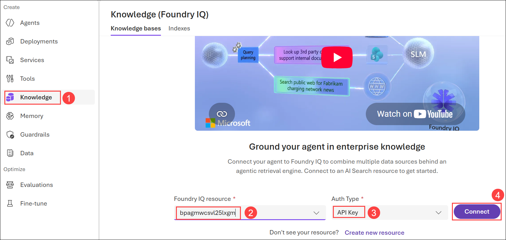

1. On the **Knowledge** page, select **Create a Knowledge base** to create a new knowledge source.

   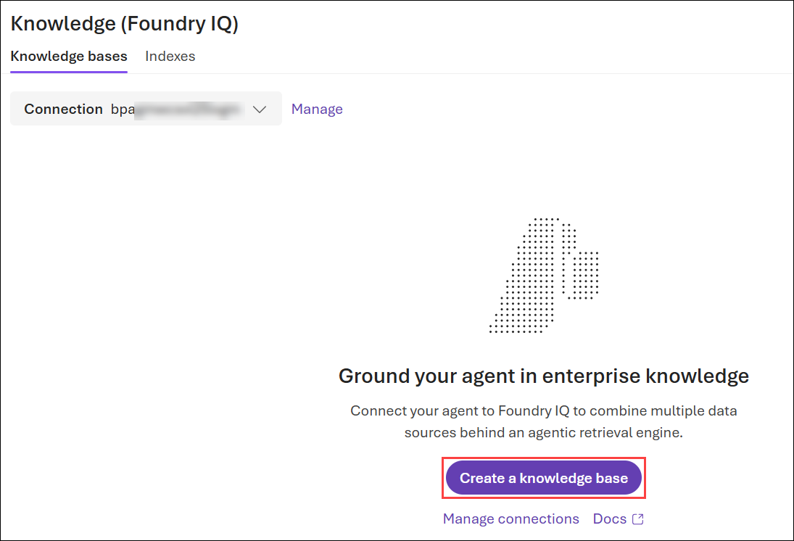

1. On the **Basic configuration** page, enter the following details:

      * In the **Name** field, enter `porsche-manual-source` **(1)**.
      * For **Chat completions model**, select **gpt-5.4-mini (2)**.
      * For **Retrieval reasoning effort**, select **Minimal (3)**.
      * For **Output mode**, select **Extractive data (4)**.
      * Under **Knowledge sources (Foundry IQ)**, select **Upload files (5)**.

         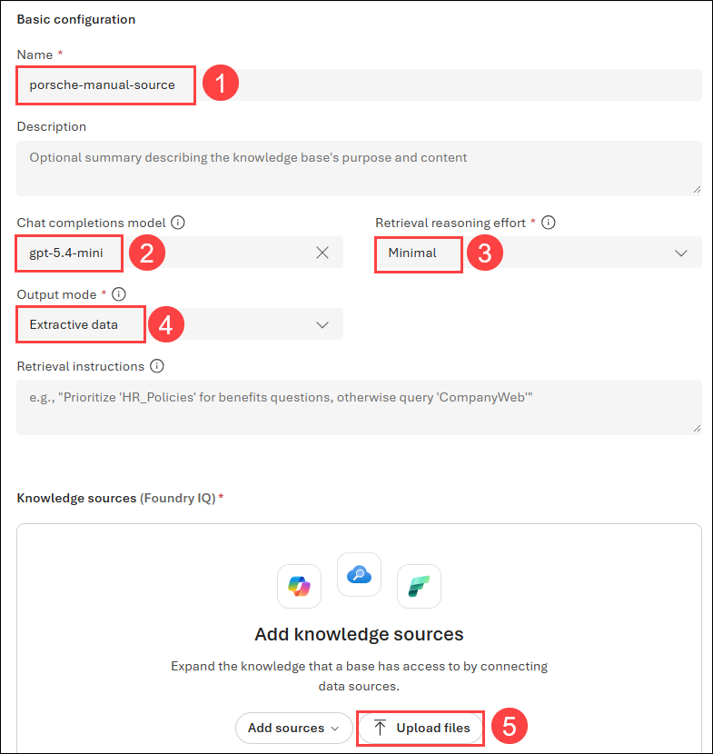

1. On the **Upload files** page, enter the following `C:\Users\Public\Desktop\Data\Lab 2` **(1)** path and hit enter, select the **Panamera-from-2021-Porsche-Connect-Good-to-know-Owner-s-Manual** **(2)** pdf  file and click on **Open** **(3)**.

   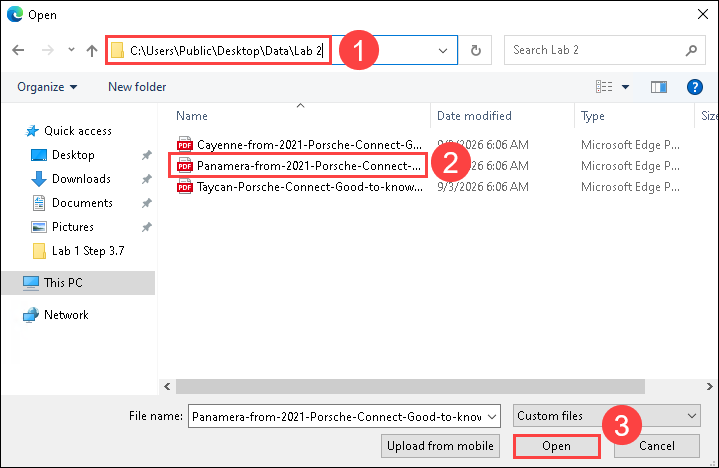

1. On the **Create a knowledge source** page, enter the following details:

   * In the **Name** field, enter `porsche-manual-source`**(1)**.
   * Verify that **text-embedding-ada-002 (2)** is selected as the **Embedding model**.
   * Verify that the uploaded file **Panamera-from-2021-Porsche-Connect-Good-to-know-Owner-s-Manual.pdf (3)** is listed under **Files to upload**. 
   * Select **Create (4)**.

      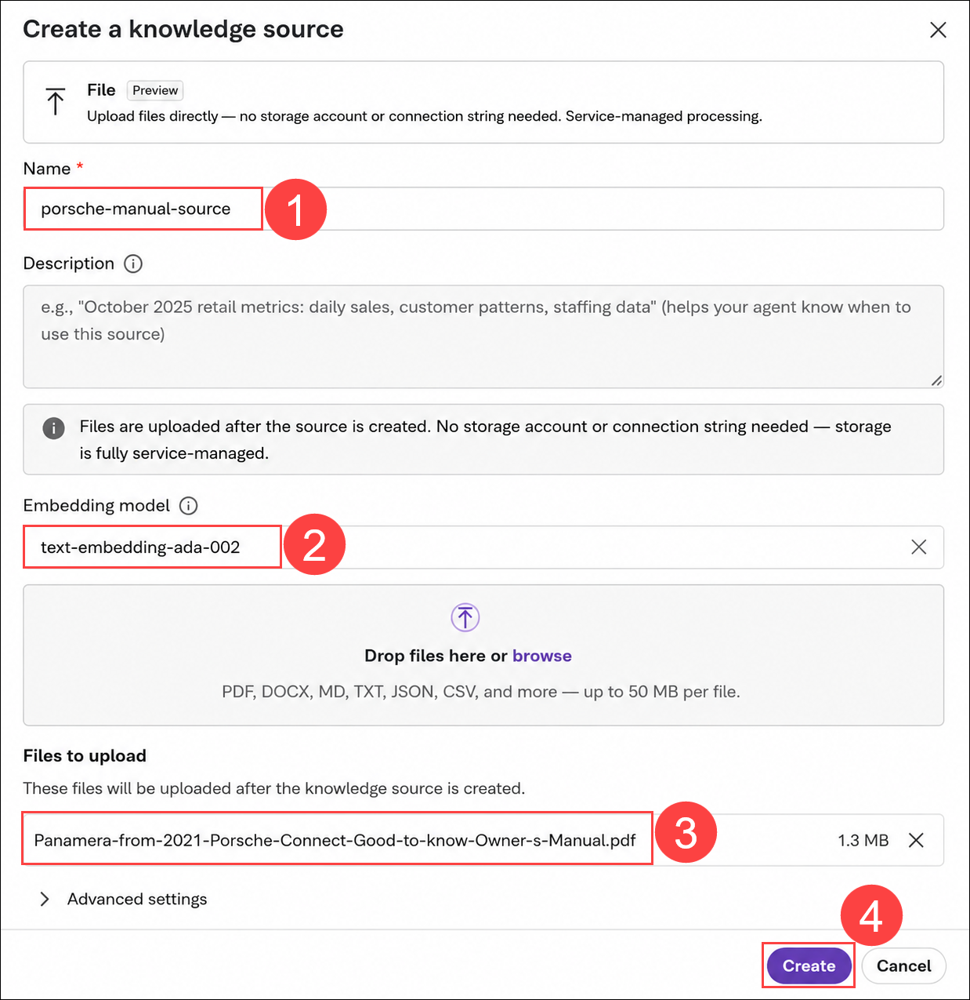

1. On the **Create a new knowledge base** page, verify that the **porsche-manual-source** knowledge source is listed with **File** as the type and **Active** as the status, and then select **Save knowledge base**.

      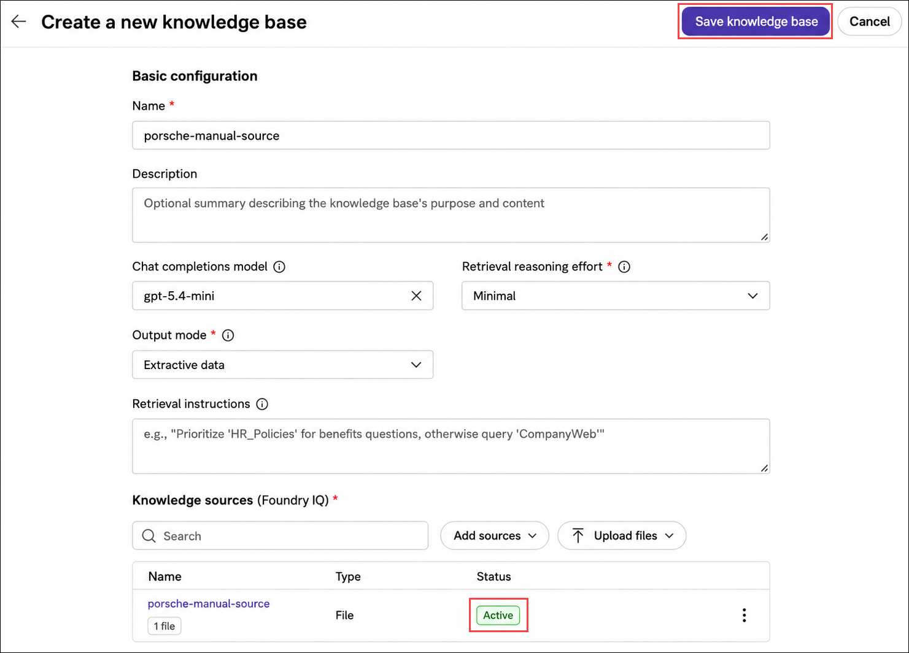

1. Wait for the knowledge base to be created.

1. Go back and verify that the knowledge base status is displayed as **Active**.

   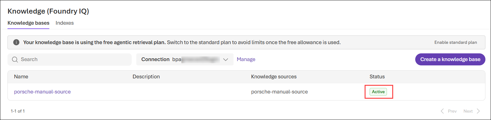

## Task 3: Create and Configure a Foundry Agent

In this task, you will create a Foundry Agent and connect it to the Porsche knowledge base. The agent will use the knowledge base to retrieve relevant information from the Porsche owner's manual and generate responses.

1. From the **Build** page, select **Agents (1)**. Cilck **+ New agent (2)** then, **Build an agent (3)**.

   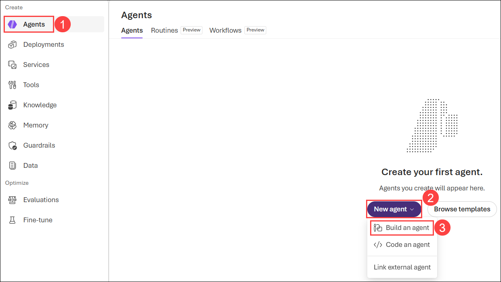 

   
3. Enter the following detail and select **Create and open playground (2)**.

   - **Name:** Enter `porsche-assistant` **(1)**.

      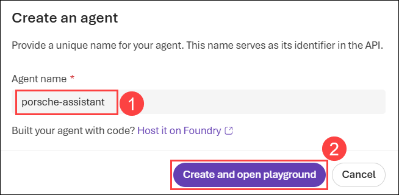 

2. In the agent configuration, scroll down to the **Tools** section and locate **Knowledge** option to add a knowledge source or tool. Select **Add (1)**, and then select **Connect to Foundry IQ (2)**.

   

3. On the **Connect to Foundry IQ** page, verify that the provisioned **Azure AI Search** connection is selected **(1)**, verify that **porsche-manual-source (2)** is selected as the **Knowledge base**, and then select **Connect (3)**.

   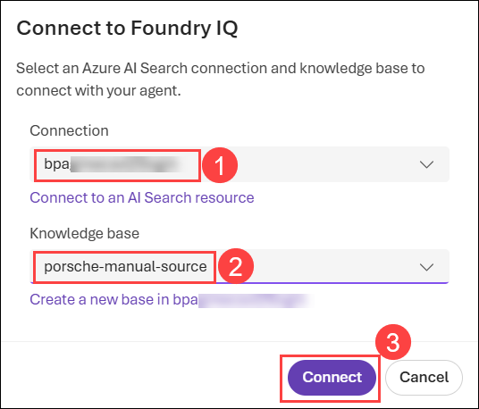

4. Verify that the **porsche-knowledge-base** knowledge base is connected to the agent. Then, **Save** the agent configuration.

   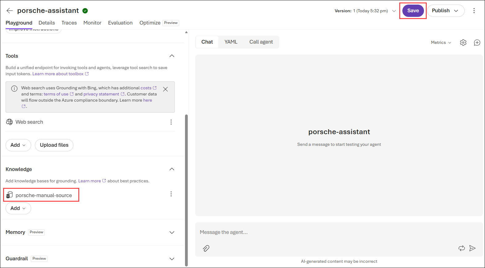


## Task 4: Interact with the Foundry Agent Using Your Own Data

In this task, you will use the Foundry Agent playground to ask questions about the Porsche owner's manual. You will verify that the agent can use the connected knowledge base to provide relevant responses.

1. Open the **Playground** for the **porsche-assistant** agent. Under the **Chat Session** pane, you can start testing out your prompts by entering the query like this.

    ```
    How to operate Android Auto in the Porsche Taycan? give step-by-step instructions
    ```

   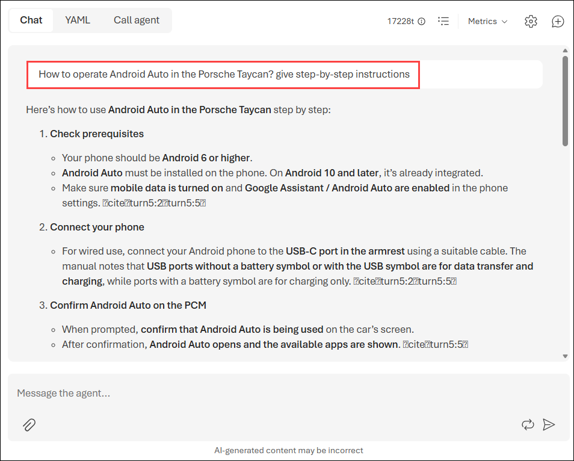

1. You can configure the responses of your agent by updating the **Instructions**. Replace the existing text with `Your name is Alice. You are an AI assistant that helps people find information about Porsche cars. Your responses should not contain any harmful information.` **(1)**. Then **Save (2)** the agent. 

   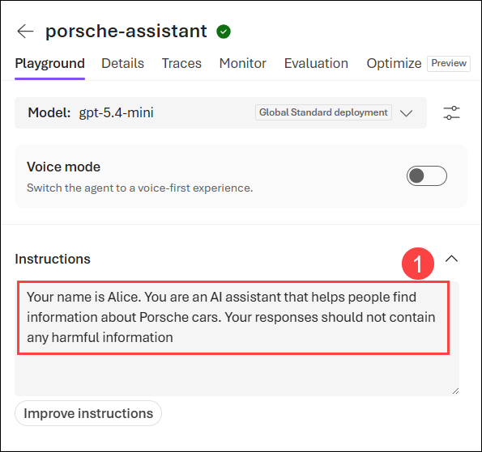

   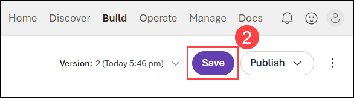

1. Under the **Chat Session** pane, you can start testing out your prompts by entering the query like this.

    ```
    What are the available functions in the Discover menu item?
    ```
   
   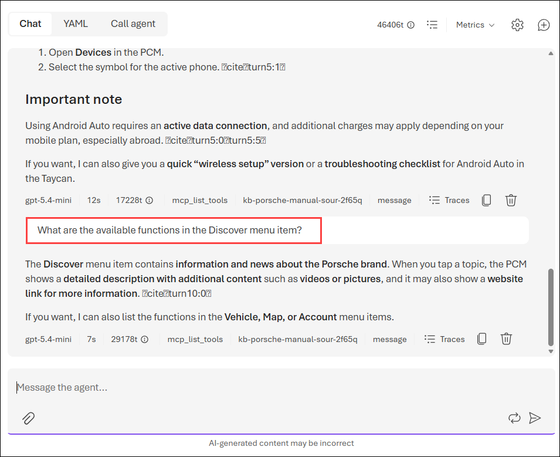

1. In the **Parameters (1)** section, set **Max output tokens** to `2000` **(2)**. You can experiment with different parameter configurations to see how they affect the model's behavior.

   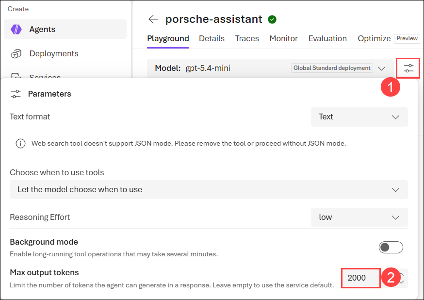

1. You can try the following query after adjusting the parameters session.

   ```
   How can one navigate lists via voice control?
   ```

   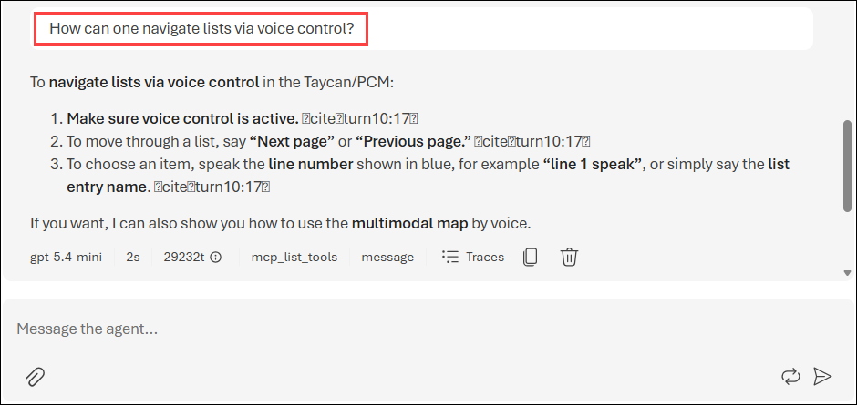
   
## Summary

In this lab, you have completed the following:

- Navigated to the **Microsoft Foundry** portal.

- Created a **File knowledge source** and **knowledge base** using your own data.

- Created and configured a **Foundry Agent** with the knowledge base.

- Interacted with the Foundry Agent using your own data to generate relevant responses.

## You have successfully completed this Hands-on lab.

By completing this lab **Business Automation using Azure OpenAI and Document Intelligence**, you configured an intelligent, AI-driven document interaction workflow using **Microsoft Foundry**. You created a **File knowledge source** using the Porsche manual, configured a **knowledge base** through **Foundry IQ**, and connected it to a **Foundry Agent**. You then configured the agent's instructions and parameters and interacted with the agent using your own data, enabling more relevant and context-specific responses based on the uploaded document.