# Lab 02: Ask an AI agent about the processed invoices

### Estimated Duration: 120 Minutes

## 📘 Lab Scenario

Contoso's invoices are now processed and indexed, but the finance team still has to search the index themselves. In this lab you give them an AI assistant: a Microsoft Foundry agent that uses the Lab 1 search index as its knowledge and answers questions about the invoices in plain language.

## 📖 Overview

You create a Foundry IQ knowledge base with the Lab 1 index as its knowledge source, tune which fields the knowledge source searches and returns, connect the knowledge base to a Foundry agent, and test the agent in the playground.
 
> **Why ground the agent:** A language model on its own knows nothing about Contoso's invoices and may invent an answer. Grounding makes the agent retrieve the relevant invoices first and answer only from them.

## 🎯 Lab Objectives

In this lab, you will complete the following tasks:

- Task 1: Navigate to Microsoft Foundry
- Task 2: Create a knowledge base from the Lab 1 search index
- Task 3: Configure the knowledge source fields
- Task 4: Create a Foundry agent and connect the knowledge base
- Task 5: Ask the agent about the invoices

### Task 1: Navigate to Microsoft Foundry

In this task, you will access the Microsoft Foundry portal through the provisioned Microsoft Foundry resource and open the provisioned Foundry project.

1. Navigate back to the **Resource groups** and select the resource group **business-process-<inject key="Deployment ID" enableCopy="false"/>**.

   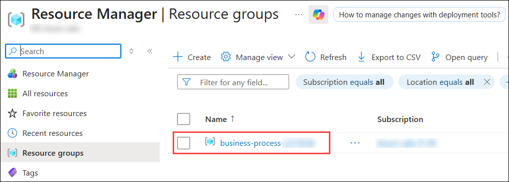

2. On the Resource group page, search for and select the **Microsoft Foundry** resource with a name similar to **oaibpa{suffix}**.

   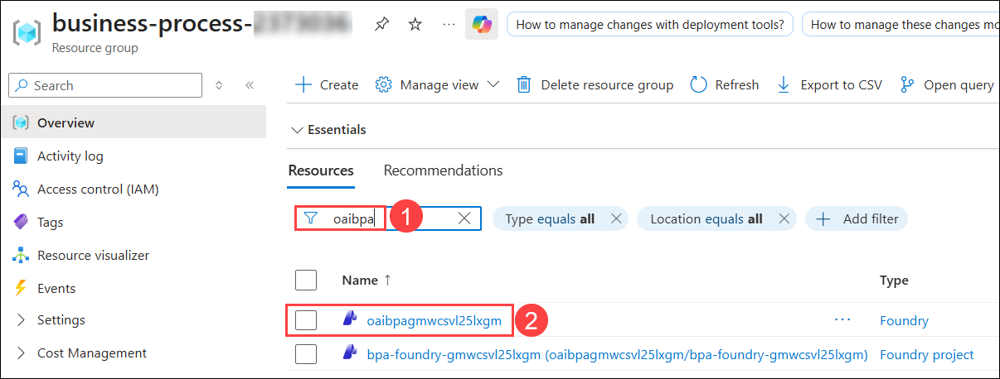

3. On the **Overview** tab of the Foundry resource, select **Go to Foundry portal**.

   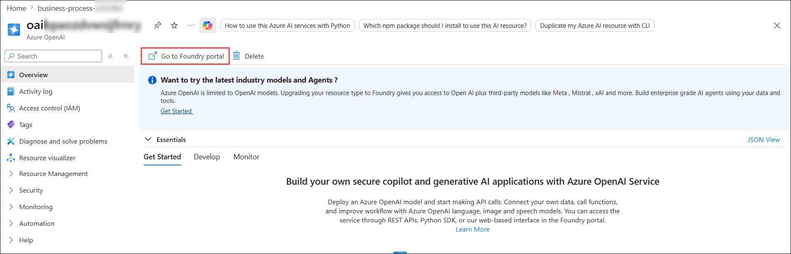

4. On the **Microsoft Foundry** page, verify that the provisioned Foundry project is selected **(1)**. From the top navigation bar, select **Build (2)**.

   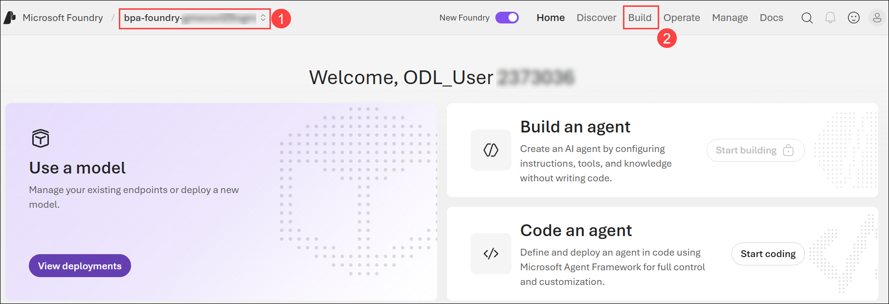

   > **Note:** Ensure that you are working in the Foundry project provisioned for this lab.

### Task 2: Create a knowledge base from the Lab 1 search index

In this task you connect Foundry to the lab's Azure AI Search service and create a knowledge base whose knowledge source is the **azureblob-indexer** index from Lab 1.
 
> **Why:** a knowledge base is what the agent queries. It sends the question to its knowledge sources, ranks what comes back, and returns the most relevant content. The Lab 1 index is its only source here.

1. From the left navigation pane, select **Knowledge (1)**, select the provisioned **Azure AI Search** resource from the **Foundry IQ resource** drop-down **(2)**, select **API Key  (3)** as the **Auth Type**, and then select **Connect (4)**.

   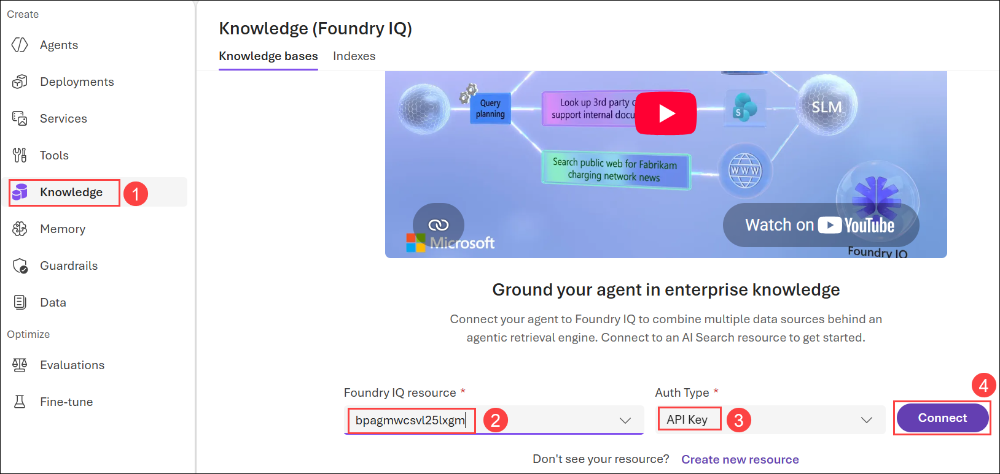

1. On the **Knowledge bases** page, select **Create a knowledge base** to create a new knowledge source.

   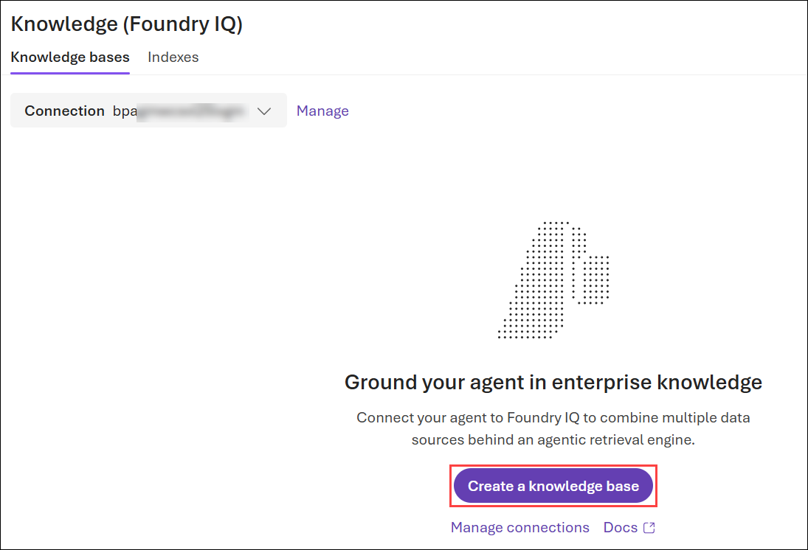

1. On the **Basic configuration** page, enter the following details:

      * In the **Name** field, enter `porsche-manual-source` **(1)**.
      * For **Chat completions model**, select **gpt-5.4-mini (2)**.
      * For **Retrieval reasoning effort**, select **Minimal (3)**.
      * For **Output mode**, select **Extractive data (4)**.

         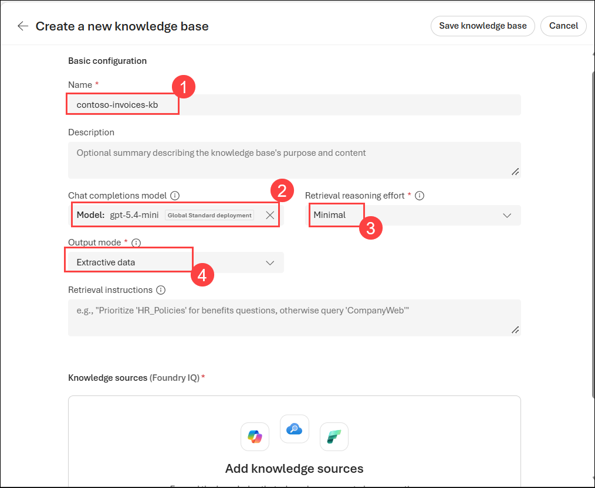

      > **Why Extractive data:** The knowledge base returns the matching invoice text itself, and the agent writes the answer. This keeps answers traceable to the source invoice.

1. Under **Knowledge sources (Foundry IQ)**, select **Add sources (1)**, then **Azure AI Search Index (2)**.

   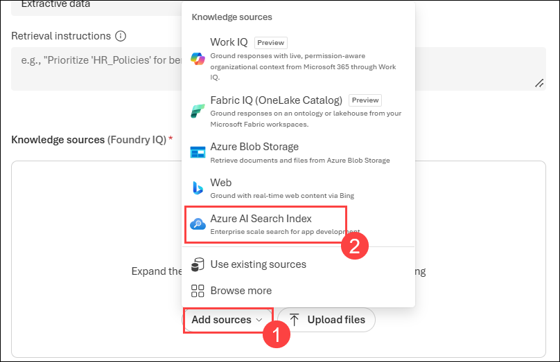

1. On the knowledge source page, enter **Name** `invoice-index-source` **(1)**, select the search index **azureblob-indexer (2)**, and select **Create (3)**.

   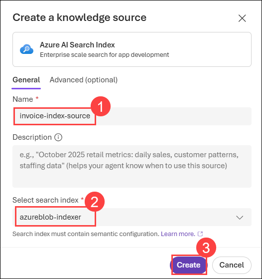

    > **Note:** the page says the index must have a semantic configuration. You set it up in Lab 1, Task 5.

1. Check that **invoice-index-source** is listed with type **Azure AI Search Index** and status **Active**, then select **Save knowledge base**.

   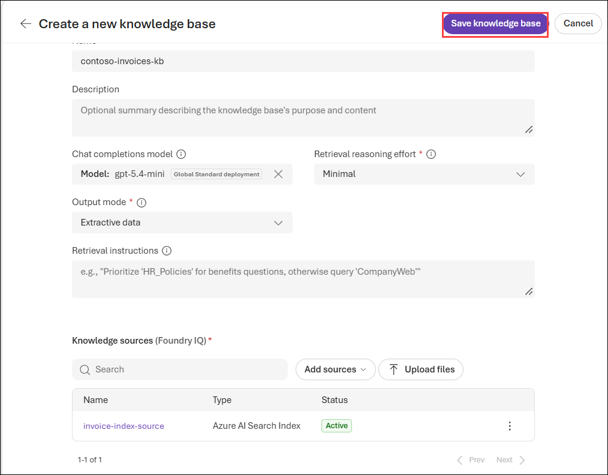

1. Click on **Save**.

   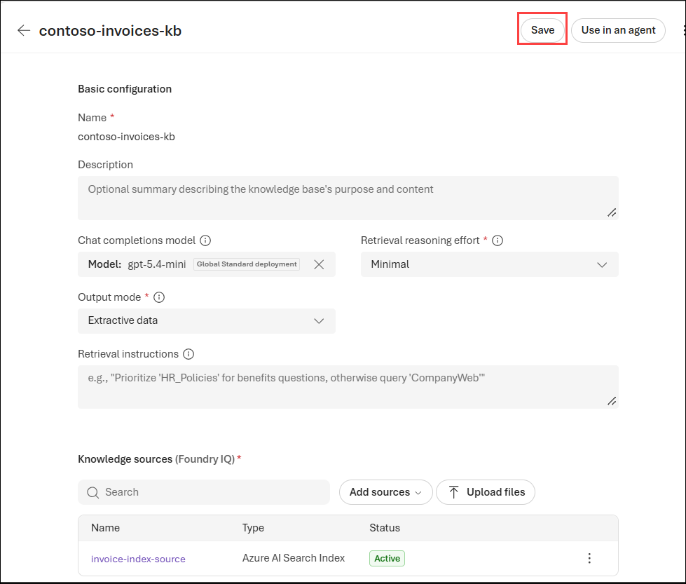

### Task 3: Configure Knowledge Source Fields

In this task, you tell the knowledge source which fields to search, which to return, and which semantic configuration to use. These settings are set in the Azure portal, because the Foundry screen does not show them.
 
> **Why:** without these settings, the knowledge source finds the right invoice but returns only its document ID. The agent then knows a matching invoice exists but cannot read what is on it.
 
1. In the Azure portal, open the search service **bpa{suffix}**.

1. In the left menu, select **Knowledge sources (1)** and open **invoice-index-source (2)**.

   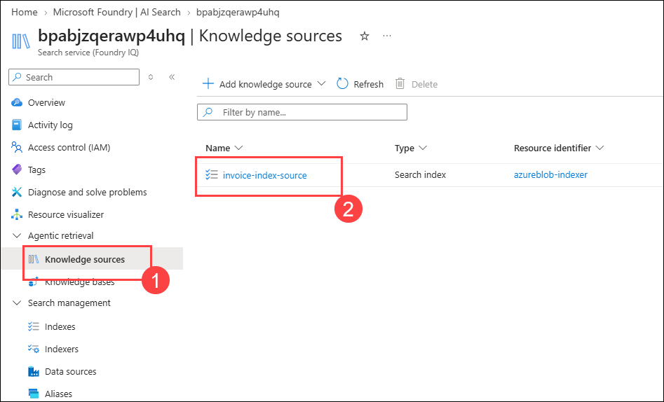

1. Expand **Advanced configurations** and set the following and click on **Save (4)**:

    - **Source data fields:** `content` and `title` **(1)**. These are the fields returned to the agent.
    - **Search fields:** `content` **(2)**. This is the field the question is matched against.
    - **Semantic configuration:** azureblob-indexer-semantic-configuration **(3)**. This ranks results by meaning.

      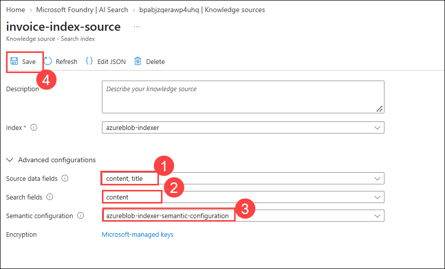

### Task 4: Create a Foundry agent and connect the knowledge base

In this task you create an agent and give it the knowledge base, so it retrieves invoice content before it answers.
 
1. Back to the Foundry portal, from the **Build (1)** page, select **Agents (2)**. Cilck **+ New agent (3)** then, **Build an agent (4)**.

   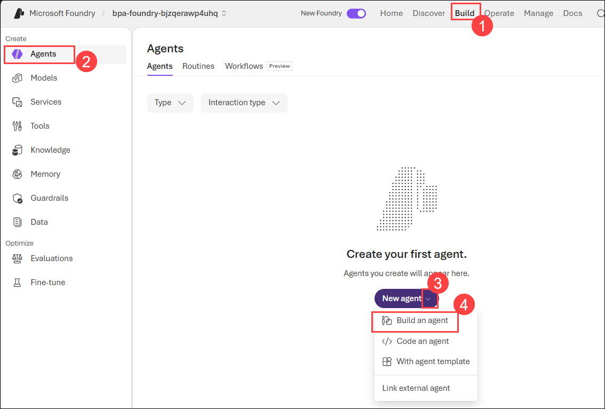 

   
1. Enter **Name** `invoice-assistant` **(1)** and select **Create and open playground (2)**.

      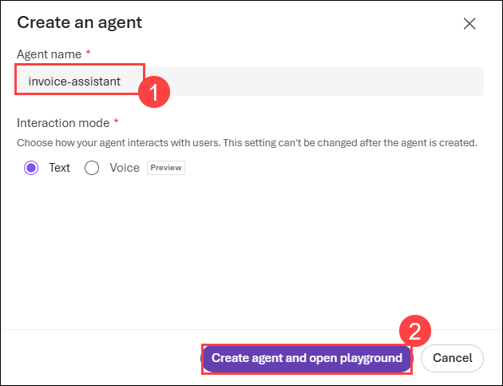 

1. In **Instructions**, replace the existing text with:

   ```
   You are an assistant for the Contoso finance team. Answer questions about Contoso invoices using only the connected knowledge base. Quote invoice numbers, dates and amounts exactly as they appear on the invoice. If the knowledge base has no matching invoice, say so and do not guess.
   ```
 
   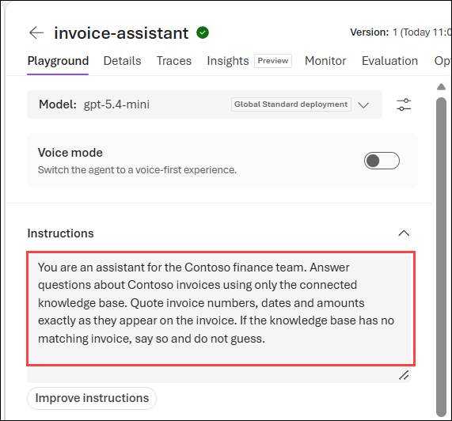

    > **Why:** instructions shape every answer. Telling the agent to use only the knowledge base, and to say when it finds nothing, stops it from inventing invoice numbers or totals.

1. Scroll to **Tools**. If **Web search** is listed, select its ellipsis **(…)** and remove it.

   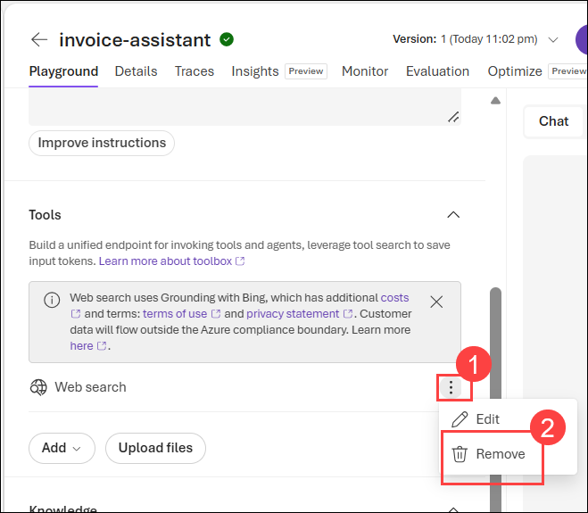

   > **Why:** web search would let the agent answer from the internet. For this lab, every answer should come from Contoso's invoices.

1. In the **Knowledge** section, select **Add (1)**, then **Connect to Foundry IQ (2)**.

   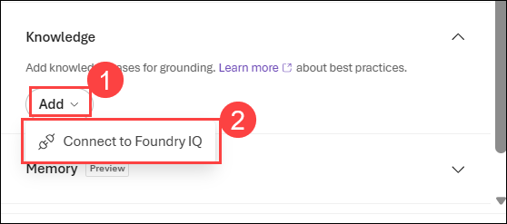

1. On **Connect to Foundry IQ**, check that the provisioned Azure AI Search connection is selected **(1)**, select **contoso-invoices-kb (2)** as the knowledge base, and select **Connect (3)**.

   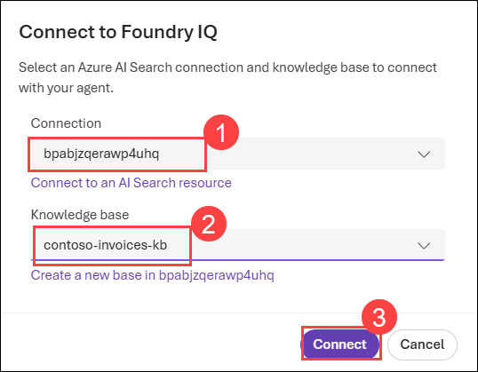

1. Check that **contoso-invoices-kb** appears under **Knowledge**, then select **Save**.

   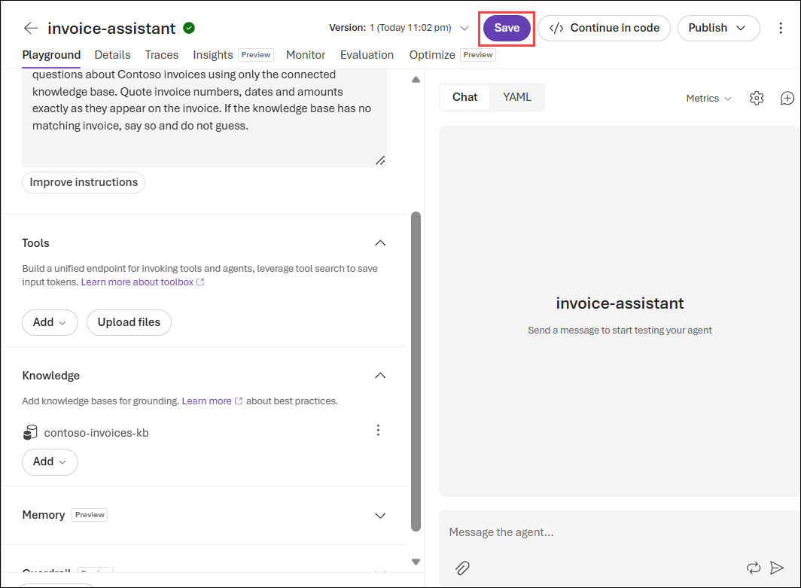


### Task 5: Interact with the Foundry Agent Using Your Own Data

In this task you ask the agent questions in the playground and check its answers against the invoices.
 
1. In the **Chat** pane of the **invoice-assistant** playground, enter:

   ```
   What is the invoice total for invoice INV-2058?
   ```

1. Check the answer and select its citation. The citation links to the invoice in the search index that the answer came from.

   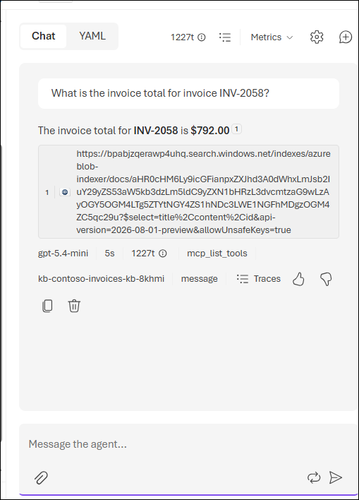

1. Try the following questions and compare the answers with the expected results:

    | Prompt | Expected answer |
    | --- | --- |
    | What was ordered on invoice DE-2026-1193? | Holzdiele ×12 and Montage ×6; total 1.035,30 EURO |
    | Who is the customer on invoice IT-26-0042, and when is it dated? | Giulia Bianchi, 14-01-2026 |
    | How much is the VAT on the Portuguese invoice? | 103,50 € (23%) |
    | What is the amount due on INV-2041, and why is it higher than the total? | $1,779.00; it adds a $250.00 previous unpaid balance to the $1,529.00 total |
    | Summarise the French invoice in English. | Contoso (Paris) to Pierre Lambert, Lyon: potting soil, gravel and fertiliser; total 132,00 € |
    | What is the total on invoice INV-9999? | Not found; the agent should not invent a value |

   > **Note:** The expected answer may or may not match the exact wording of the invoice, but it should be factually correct based on the invoice data.

   > **Why the last prompt:** a grounded agent should admit when the data has no answer. If it invents a total, check that its instructions were saved.

1. Under an answer, select **Traces**, then open the **knowledge_base_retrieve** step. Its output shows the invoice text the knowledge base returned for that question.

    > **Why:** traces show what the agent retrieved before it answered. They are the first place to look when an answer is wrong or empty.
 
## 🧾 Summary

In this lab you:
 
- Opened the Microsoft Foundry portal.
- Created a knowledge base with the Lab 1 search index as its knowledge source.
- Configured the fields the knowledge source searches and returns.
- Created a Foundry agent grounded in the knowledge base.
- Asked the agent about the invoices and checked its answers and traces.

Together, the two labs form one pipeline: invoice images are read by Document Intelligence, indexed by Azure AI Search, and answered by a Foundry agent.

### 🎉 You have successfully completed this Hands-on lab!
