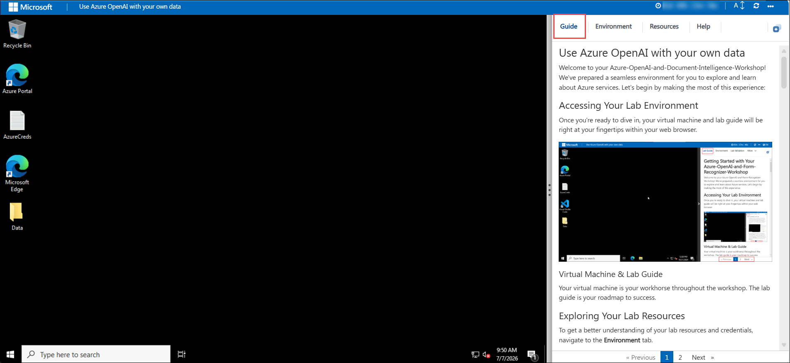
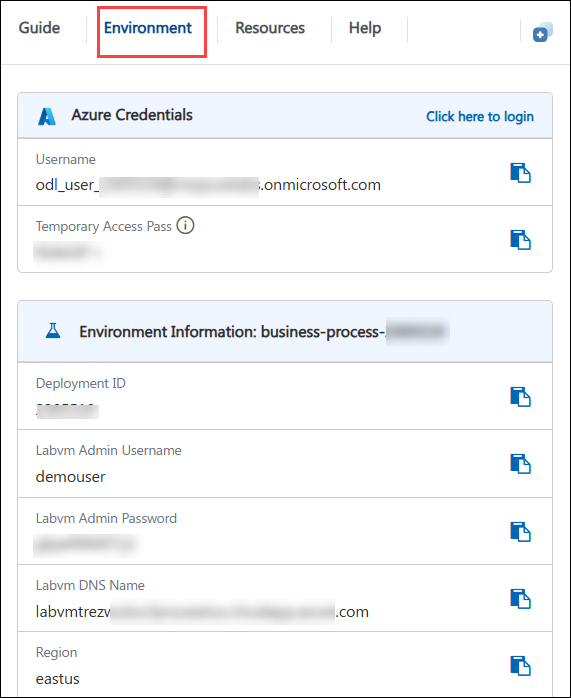
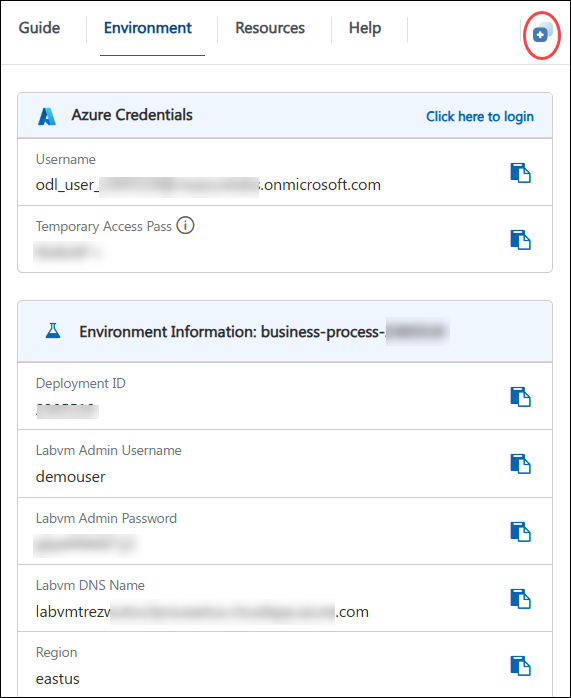
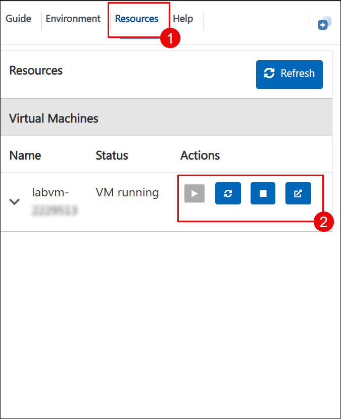
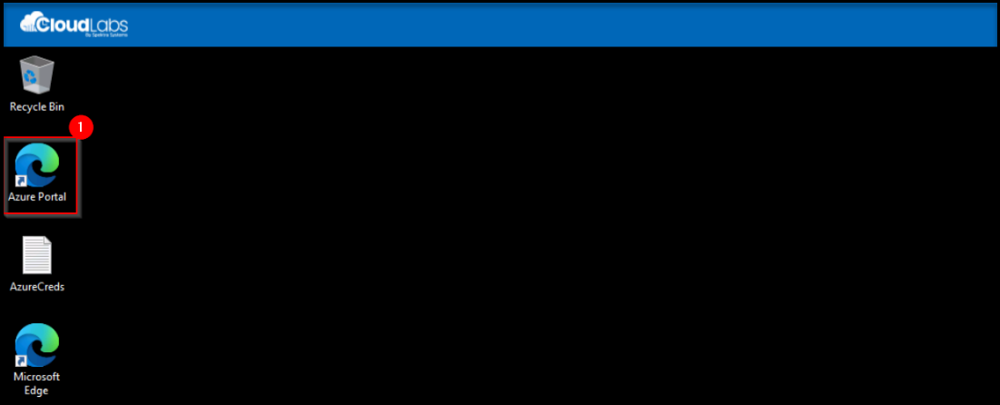
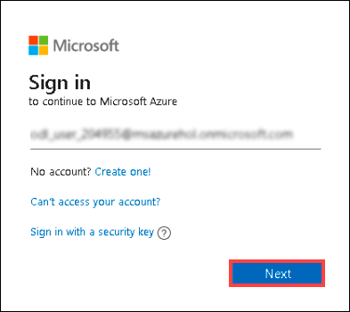
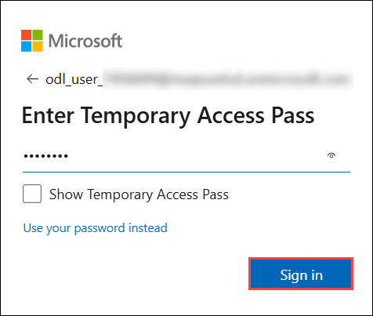

# Use Azure OpenAI with your own data
 
Welcome to your Azure-OpenAI-and-Document-Intelligence-Workshop! We've prepared a seamless environment for you to explore and learn about Azure services. Let's begin by making the most of this experience:
 
## Accessing Your Lab Environment
 
Once you're ready to dive in, your virtual machine and lab guide will be right at your fingertips within your web browser.

  

### Virtual Machine & Lab Guide
 
Your virtual machine is your workhorse throughout the workshop. The lab guide is your roadmap to success.
 
## Exploring Your Lab Resources
 
To get a better understanding of your lab resources and credentials, navigate to the **Environment** tab.
 
  
 
## Utilizing the Split Window Feature
 
For convenience, you can open the lab guide in a separate window by selecting the **Split Window** button from the Top right corner.
 

 
## Managing Your Virtual Machine
 
Feel free to start, stop, or restart your virtual machine as needed from the **Resources** tab. Your experience is in your hands!

 
## Login to Azure Portal and verify the pre-deployed resources

1. Open Azure Portal from the desktop by double-clicking on it.
    
   
   
1. On the **Sign into Microsoft Azure** tab, you will see the login screen, enter the following username, and, then click on **Next**.

   * **Email/Username**: <inject key="AzureAdUserEmail"></inject>

     
   
1. Now enter the following password and click on **Sign in**.
   
   * **Temporary Access Pass**: <inject key="AzureAdUserPassword"></inject>
   
     

1. If you see the pop-up **Stay Signed in?**, click on **No**.

1. If you see the pop-up **You have free Azure Advisor recommendations!**, close the window to continue the lab.

1. If a **Welcome to Microsoft Azure** popup window appears, click **Cancel** to skip the tour.

1. Now you can see Azure Portal Dashboard, click on **Resource groups** from the Navigate panel to see the resource groups.

   
 
1. We have already pre-deployed all the required resources, which you will be using throughout the lab.
 
## Support Contact
 
The CloudLabs support team is available 24/7, 365 days a year, via email and live chat to ensure seamless assistance at any time. We offer dedicated support channels tailored specifically for both learners and instructors, ensuring that all your needs are promptly and efficiently addressed.

Learner Support Contacts:
- Email Support: cloudlabs-support@spektrasystems.com
- Live Chat Support: https://cloudlabs.ai/labs-support

Now, click on **Next** from the lower right corner to move on to the next page.

  

### Happy Learning!!