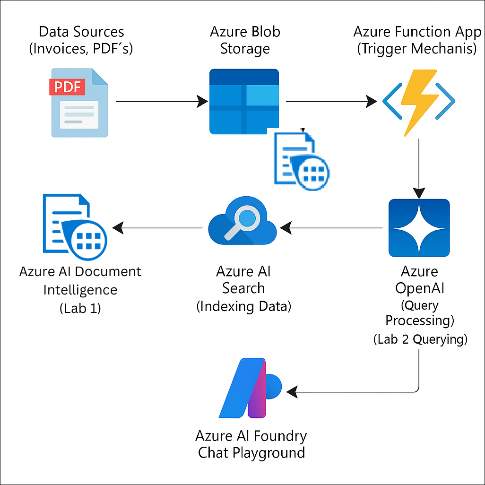
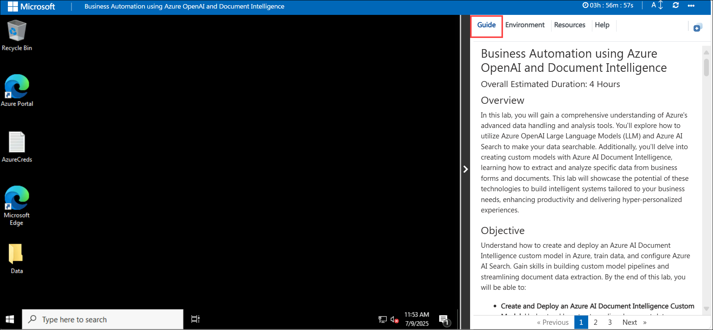
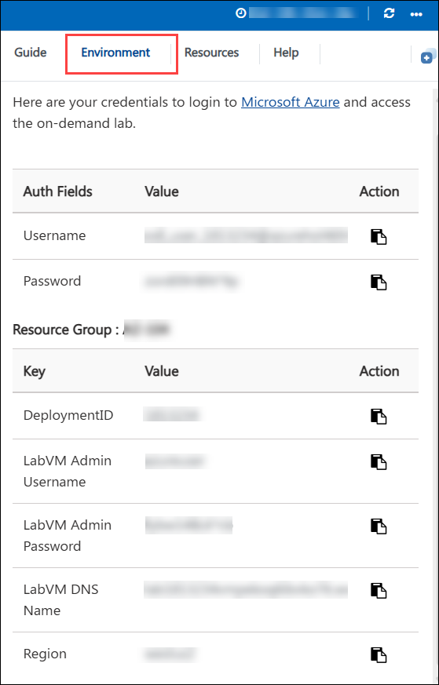
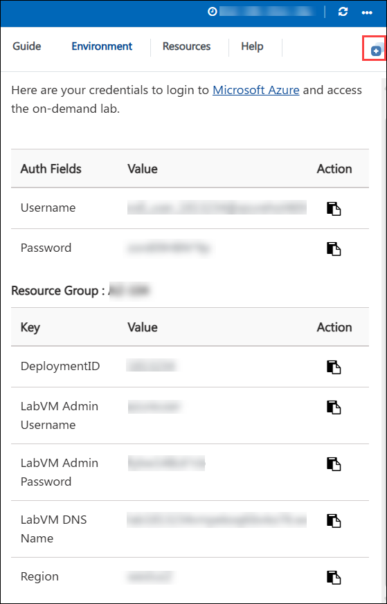
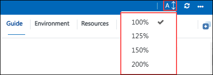
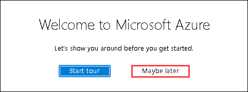
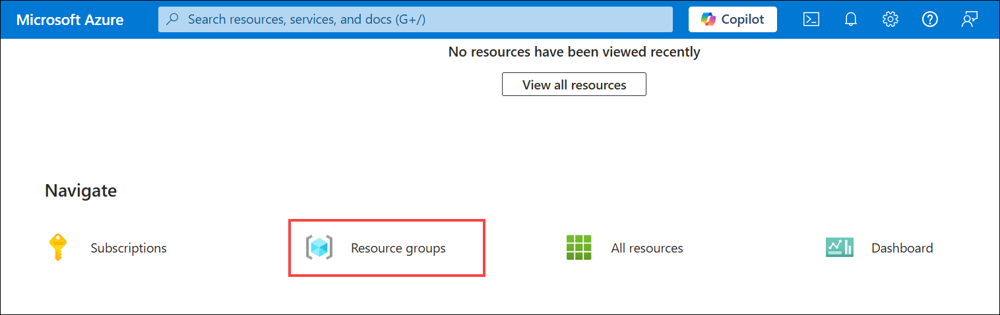
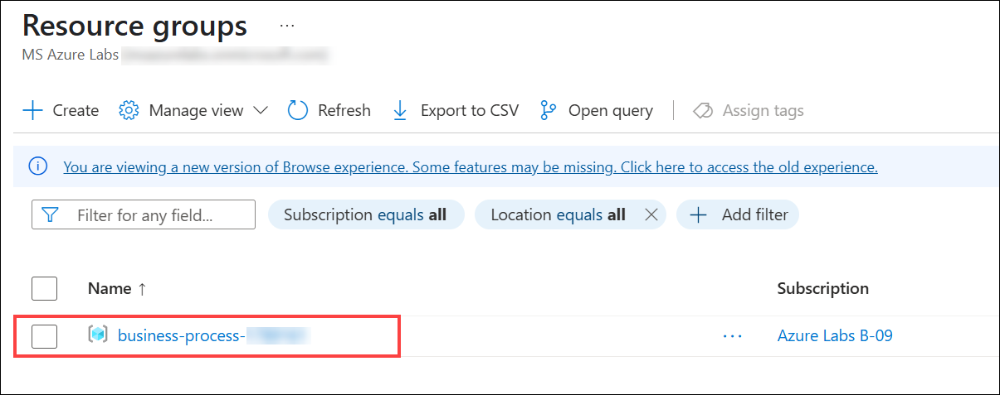
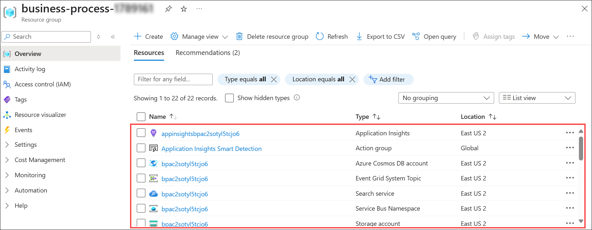

# Business Automation using Azure OpenAI and Document Intelligence
 
### Overall Estimated Duration: 4 Hours

## Overview

In this Hands-on lab, you will gain a comprehensive understanding of Azure's advanced data handling and analysis tools. You'll explore how to utilize Azure OpenAI Large Language Models (LLM) and Azure AI Search to make your data searchable. Additionally, you'll delve into creating custom models with Azure AI Document Intelligence, learning how to extract and analyze specific data from business forms and documents. This lab will showcase the potential of these technologies to build intelligent systems tailored to your business needs, enhancing productivity and delivering hyper-personalized experiences.

## Objective

Understand how to create and deploy an Azure AI Document Intelligence custom model in Azure, train data, and configure Azure AI Search. Gain skills in building custom model pipelines and streamlining document data extraction. By the end of this lab, you will be able to:

- **Create and Deploy an Azure AI Document Intelligence Custom Model:** Understand how to streamline document data extraction and enhance efficient information retrieval by creating an Azure AI Document Intelligence resource, training data, building a custom model pipeline in BPA, and configuring Azure AI Search. 

- **Use Azure OpenAI with your own data:** Understand how to navigate the Azure OpenAI Playground, upload your own data, and interact with ChatGPT LLM to customize responses and gain insights from your data.

## Pre-requisites

- Familiarity with Azure’s suite of AI tools.
- Basic knowledge of BPA and how to build and manage data processing pipelines.

## Architecture

This architecture flow demonstrates how various Azure components work together to handle, process, analyze, and visualize data, providing a comprehensive and intelligent system tailored to business needs. In this lab, you'll first create custom models with Document Intelligence, focusing on extracting and analyzing specific data from business forms and documents. Next, you will leverage Azure's advanced data handling tools by using Azure OpenAI Large Language Models (LLM) in conjunction with Azure AI Search to make your data searchable and accessible. The architecture flow integrates these components to build intelligent systems that enhance productivity and deliver personalized experiences, demonstrating the powerful capabilities of Azure's AI and data analysis technologies tailored to your business needs.

## Architecture Diagram

 

## Explanation of Components

- **Data Sources:** Raw input files like PDFs, images, and text documents.
- **Azure Blob Storage:** Central storage for training data and uploaded content.
- **Azure Function App:** Event-driven trigger for processing or pipeline automation.
- **Document Intelligence:** Custom model to extract structured data from documents (Lab 1).
- **Azure AI Search:** Indexes processed documents for retrieval (Lab 2).
- **Azure OpenAI:** Processes user queries using LLMs with indexed data (Lab 2).
- **Azure AI Foundry Chat Playground:** End-user interface to interact with AI-driven search results.

## Accessing Your Lab Environment
 
Once you're ready to dive in, your virtual machine and **Guide** will be right at your fingertips within your web browser.

 

## Virtual Machine & Lab Guide

Your virtual machine is your workhorse throughout the workshop. The lab guide is your roadmap to success.

## Exploring Your Lab Resources
 
To get the lab environment details, you can select the **Environment** tab. Additionally, the credentials will also be emailed to your registered email address.

 
 
## Utilizing the Split Window Feature
 
For convenience, you can open the lab guide in a separate window by selecting the **Split Window** button from the Top right corner.
 
 
 
## Managing Your Virtual Machine
 
Feel free to **Start, Stop, or Restart (2)** your virtual machine as needed from the **Resources (1)** tab. Your experience is in your hands!

   .png)

## Lab Guide Zoom In/Zoom Out

To adjust the zoom level for the environment page, click the **A↕ : 100%** icon located next to the timer in the lab environment.

  
 
## Let's Get Started with Azure Portal

1. On your virtual machine, click on the **Azure Portal** icon as shown below:
 
   .png)

1. On the **Sign in to Microsoft Azure** tab, you will see the login screen. Enter the following email/username **(1)**, and click on **Next (2)**. 

   * **Email/Username:** <inject key="AzureAdUserEmail"></inject>
   
      
     
1. Now enter the following password **(1)** and click on **Sign in (2)**.
   
   * **Password:** <inject key="AzureAdUserPassword"></inject>
   
      
   
1. If you see the pop-up **Stay signed in?**, select **No**.

   

1. If a **Welcome to Microsoft Azure** popup window appears, select **Maybe later** to skip the tour.

   

1. Now you will see the Azure Portal Dashboard, click on **Resource groups** from the Navigate panel to see the resource groups.

   
   
1. Confirm that you have all resource groups present as shown below.

   
   
1. Verify the resources deployed in the resource group.

   
   
> [!IMPORTANT]
*For a smoother experience during the hands-on lab, it's important to thoroughly review both the instructions and the accompanying notes. This will help you navigate through the tasks with ease and confidence.*

This hands-on lab will guide you in using Azure’s advanced tools, including OpenAI LLM, Azure AI Search, and Azure AI Document Intelligence, to create intelligent systems that enhance productivity and deliver personalized experiences.

## Support Contact
 
The CloudLabs support team is available 24/7, 365 days a year, via email and live chat to ensure seamless assistance at any time. We offer dedicated support channels tailored specifically for both learners and instructors, ensuring that all your needs are promptly and efficiently addressed.

Learner Support Contacts:
 
- Email Support: [cloudlabs-support@spektrasystems.com](mailto:cloudlabs-support@spektrasystems.com)
- Live Chat Support: https://cloudlabs.ai/labs-support

Click **Next** from the bottom right corner to embark on your Lab journey!
 

Now you're all set to explore the powerful world of technology. Feel free to reach out if you have any questions along the way. Enjoy your workshop!

### Happy Learning!!