# Business Automation using Document Intelligence and Microsoft Foundry
 
### Overall Estimated Duration: 4 Hours

## 📘 Lab Scenario

Contoso Ltd. wants to modernize its document processing and information retrieval workflows by using Azure AI services. In this hands-on lab, you will act as a Cloud Consultant and build an intelligent business automation solution using **Azure Document Intelligence**, **Azure AI Search**, and **Microsoft Foundry**. You will train a custom document model, configure document search, create a knowledge source and knowledge base, and configure a Foundry Agent to interact with business data.

## 📋 Lab Overview

In this hands-on lab, you will explore how **Azure Document Intelligence**, **Azure AI Search**, and **Microsoft Foundry** can be used together to process and access business information. You will train a custom document model, build a processing pipeline, configure Azure AI Search for document indexing and retrieval, and use Microsoft Foundry to create a knowledge base and configure a Foundry Agent. Finally, you will interact with the agent using your own data to retrieve relevant information and gain insights.

## 🎯 Lab Objectives

Understand how to build an intelligent business automation solution using Azure Document Intelligence, Azure AI Search, and Microsoft Foundry. Gain hands-on experience in training a custom document model, indexing and searching business data, creating a knowledge source and knowledge base, and configuring a Foundry Agent to interact with your data. By the end of this lab, you will be able to:

- **Create and Deploy an Azure Document Intelligence Custom Model:** Understand how to create an Azure Document Intelligence resource, label and train data, build a custom model pipeline in BPA, configure managed identity access and Azure AI Search and query the search index. 

- **Use Microsoft Foundry with your own data:** Understand how to navigate Microsoft Foundry, create a file-based knowledge source and knowledge base, configure a Foundry Agent, and interact with the agent using your own data to retrieve relevant information and gain insights.

## ⚙️ Pre-requisites

- An active Azure subscription with permissions to create and manage Azure resources.
- An active Microsoft Entra ID account with sufficient permissions to access and configure the required Azure services.
- Basic familiarity with Azure AI services and Microsoft Foundry.
- Basic understanding of document processing and data search concepts.

## 🏗️ Architecture

This architecture flow demonstrates how various Azure components work together to handle, process, analyze, and visualize data, providing a comprehensive and intelligent system tailored to business needs. In this lab, you'll first create custom models with Document Intelligence, focusing on extracting and analyzing specific data from business forms and documents. Next, you will leverage Azure's advanced data handling tools by using Microsoft Foundry Models in conjunction with Azure AI Search to make your data searchable and accessible. The architecture flow integrates these components to build intelligent systems that enhance productivity and deliver personalized experiences, demonstrating the powerful capabilities of Azure's AI and data analysis technologies tailored to your business needs.

## 🖼️ Architecture Diagram

 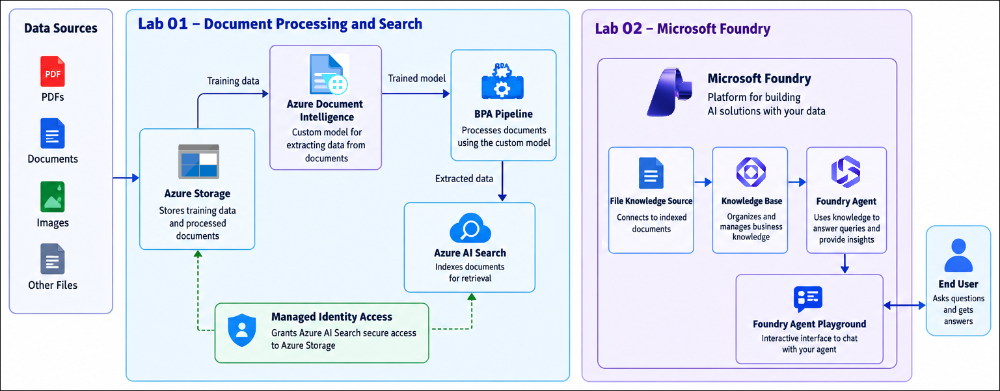

## 🔍 Explanation of Components

- **Data Sources:** Business documents such as PDFs, forms, and other files used for processing and analysis.
- **Azure Storage:** Stores the documents and related data used by the document processing workflow.
- **Azure Document Intelligence:** Custom model used to train and extract structured information from business documents (Lab 1).
- **BPA Custom Model Pipeline:** Processes documents using the trained Document Intelligence custom model (Lab 1).
- **Azure AI Search:** Indexes and makes processed document content searchable for efficient information retrieval (Lab 1).
- **Microsoft Foundry:** Provides the knowledge and agent capabilities used to work with business data (Lab 2).
- **Knowledge Source & Knowledge Base:** Organizes and provides business data as contextual knowledge for the Foundry Agent (Lab 2).
- **Foundry Agent:** Uses the configured knowledge to respond to natural-language queries and retrieve relevant information (Lab 2).
- **Foundry Agent Playground:** Provides an interactive interface for users to communicate with the Foundry Agent and explore information from their data (Lab 2).

# 🚀 Getting Started with the lab

Welcome to you **Business Automation using Document Intelligence and Microsoft Foundry** workshop! We've prepared an immersive environment for you to explore how Azure Document Intelligence, Azure AI Search, and Microsoft Foundry work together to process business documents, make information searchable, and enable AI-powered interactions with your data. Let’s begin!

## Accessing Your Lab Environment
 
Once you're ready to dive in, your virtual machine and **Guide** will be right at your fingertips within your web browser.

 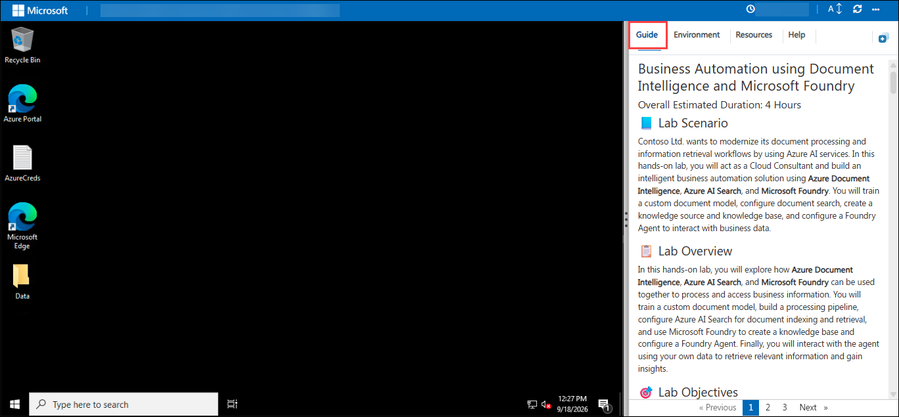

## Virtual Machine & Lab Guide

Your virtual machine is your workhorse throughout the workshop. The lab guide is your roadmap to success.

## Exploring Your Lab Resources
 
To get the lab environment details, you can select the **Environment** tab. Additionally, the credentials will also be emailed to your registered email address.

 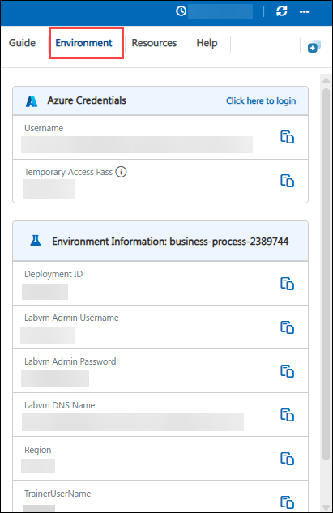
 
## Utilizing the Split Window Feature
 
For convenience, you can open the lab guide in a separate window by selecting the **Split Window** button from the Top right corner.
 
 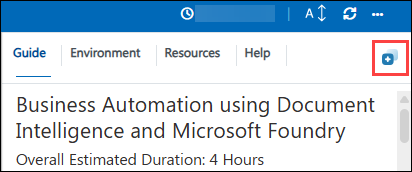
 
## Managing Your Virtual Machine
 
Feel free to **Start, Stop, or Restart (2)** your virtual machine as needed from the **Resources (1)** tab. Your experience is in your hands!

   .png)

## Lab Guide Zoom In/Zoom Out

To adjust the zoom level for the environment page, click the **A↕ : 100%** icon located next to the timer in the lab environment.

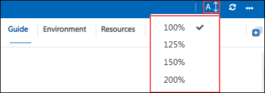  

## Resize the Virtual Machine View

Use the **slider (three vertical dots)** located between the **Virtual Machine** and the **Lab Guide** panes to adjust the display size, allowing you to customize the layout based on your preference.

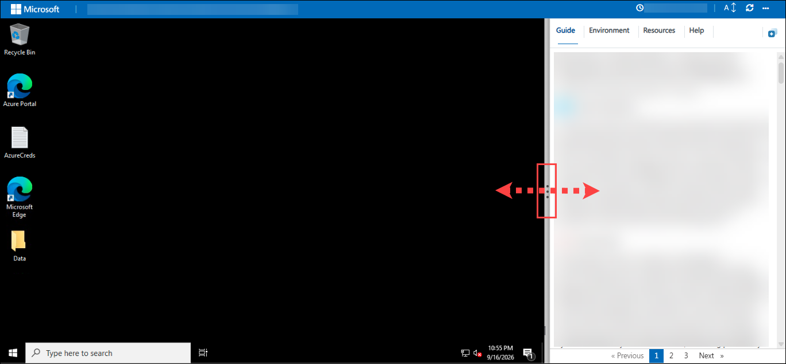
 
## Let's Get Started with Azure Portal

1. On your virtual machine, click on the **Azure Portal** icon as shown below:
 
   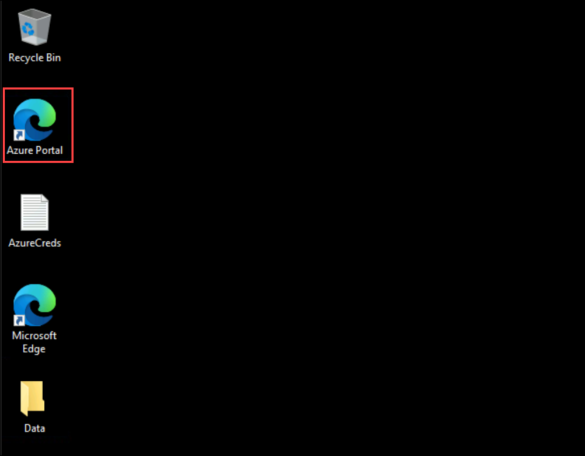

1. On the **Sign in to Microsoft Azure** tab, you will see the login screen. Enter the following email/username, and click on **Next (2)**. 

   * **Email/Username:** <inject key="AzureAdUserEmail"></inject> **(1)**
   
      
     
1. Now enter the following temporary password and click on **Sign in (2)**.
   
   * **Temporary Access Pass:** <inject key="AzureAdUserPassword"></inject> **(1)**
   
      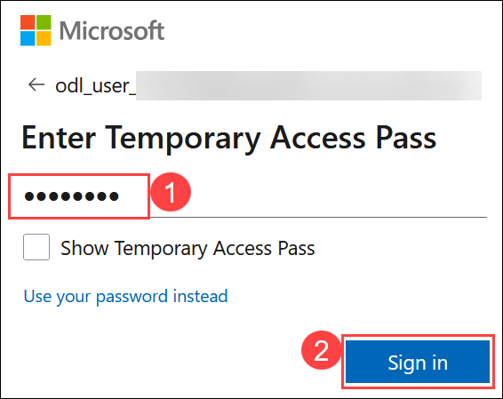
   
1. If you see the pop-up **Stay signed in?**, select **No**.

   

1. If a **Welcome to Microsoft Azure** popup window appears, select **Maybe later** to skip the tour.

   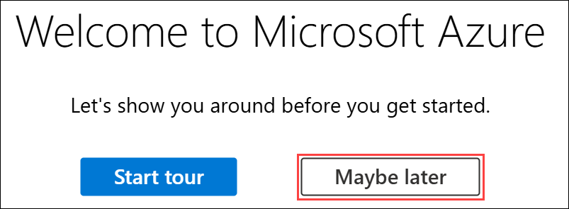

1. Now you will see the Azure Portal Dashboard, click on **Resource groups** from the Navigate panel to see the resource groups.

   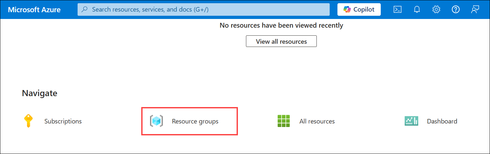
   
1. Confirm that you have the **business-process-<inject key="Deployment ID" enableCopy="false"/>** **(2)** resource group present as shown below.

   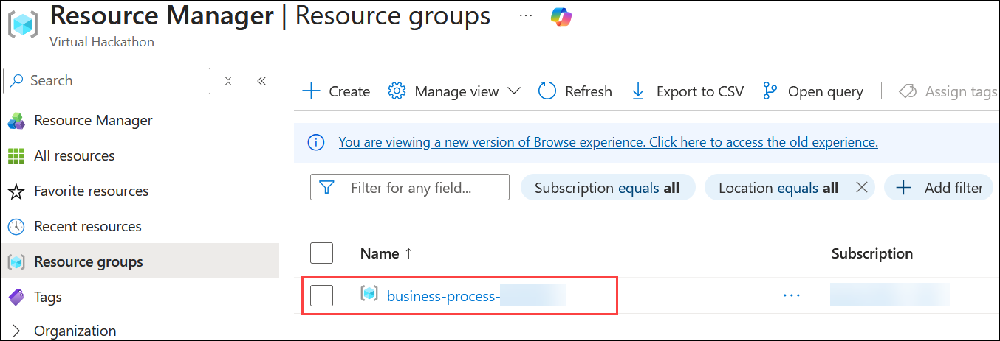
   
1. Verify the resources deployed in the resource group.

   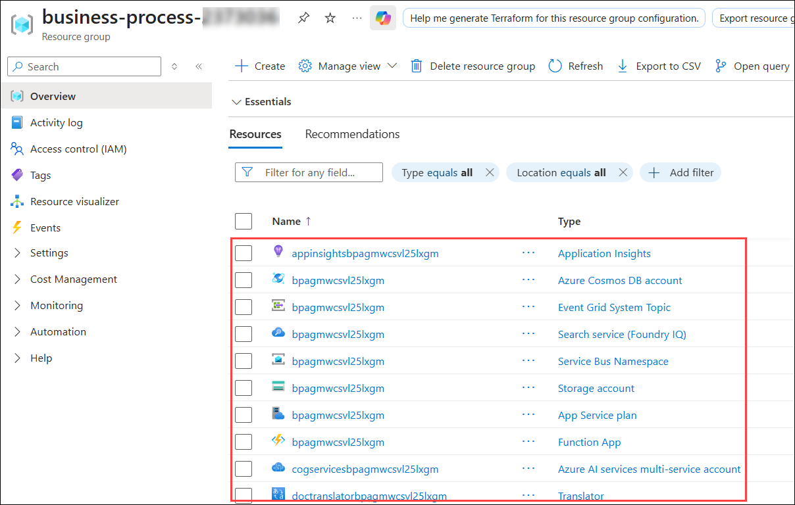
   
   
> **[!IMPORTANT]**
*For a smoother experience during the hands-on lab, it's important to thoroughly review both the instructions and the accompanying notes. This will help you navigate through the tasks with ease and confidence.*

This hands-on lab will guide you in using Azure’s advanced tools, including OpenAI LLM, Azure AI Search, and Azure AI Document Intelligence, to create intelligent systems that enhance productivity and deliver personalized experiences.

## 📞 Support Contact
 
The CloudLabs support team is available 24/7, 365 days a year, via email and live chat to ensure seamless assistance at any time. We offer dedicated support channels tailored specifically for both learners and instructors, ensuring that all your needs are promptly and efficiently addressed.

Learner Support Contacts:
 
- Email Support: [cloudlabs-support@spektrasystems.com](mailto:cloudlabs-support@spektrasystems.com)
- Live Chat Support: https://cloudlabs.ai/labs-support

Now, click on **Next >>** from the lower right corner to move on to the next page.
 

   
### Happy Learning!!
